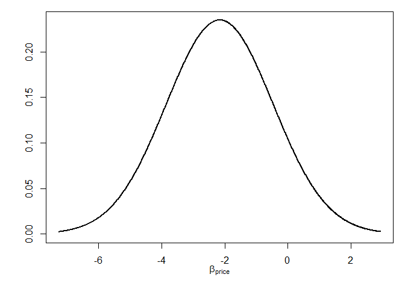

<!-- README.md is generated from README.Rmd. Please edit that file -->

# RprobitB 

<!-- badges: start -->

[](https://www.r-pkg.org/badges/version-last-release/RprobitB)
[](https://cranlogs.r-pkg.org/badges/grand-total/RprobitB)
[](https://github.com/loelschlaeger/RprobitB/actions)
[](https://app.codecov.io/gh/loelschlaeger/RprobitB?branch=main)
<!-- badges: end -->

The goal of RprobitB is to fit mixed probit models to choice data. The
package differs from comparable packages in two ways: Bayesian
estimation and a focus on taste heterogeneity.

## Installation

You can install the released version of RprobitB from
[CRAN](https://CRAN.R-project.org) with:

``` r
install.packages("RprobitB")
```

And the development version from [GitHub](https://github.com/) with:

``` r
# install.packages("devtools")
devtools::install_github("loelschlaeger/RprobitB")
```

## Documentation

The package is documented in several vignettes:

``` r
browseVignettes("RprobitB")
```

## Example

This is a basic example to show how to fit a mixed probit model and make
choice predictions:

``` r
library(RprobitB)
#> Thanks for using RprobitB 1.0.0, happy choice modeling!
#> See https://loelschlaeger.github.io/RprobitB for help.
#> Type 'citation("RprobitB")' for citing this R package.
#> 
#> Attache Paket: 'RprobitB'
#> Die folgenden Objekte sind maskiert von 'package:stats':
#> 
#>     predict, simulate
#> Das folgende Objekt ist maskiert 'package:base':
#> 
#>     transform
data("Train", package = "mlogit")
data = prepare(form = choice ~ price | 0 | time + comfort + change,
               choice_data = Train,
               re = "price",
               standardize = "all",
               test_prop = 0.5)
model = mcmc(data$train)
#> Iteration Info                   ETA (min)
#>         0 started Gibbs sampling          
#>      1000                                1
#>      2000                                1
#>      3000                                1
#>      4000                                1
#>      5000                                1
#>      6000                                1
#>      7000                                1
#>      8000                                1
#>      9000                                1
#>     10000 done, total time: 2 min
summary(model)
#> Probit model 'choice ~ price | 0 | time + comfort + change'.
#> 
#> MCMC settings:
#> - R: 10000 
#> - B: 5000 
#> - Q: 1 
#> 
#> Normalization:
#> - Level: Utility differences with respect to alternative 2.
#> - Scale: Coefficient of the 1. error term variance in Sigma fixed to 1.
#> 
#> Legend of alternatives:
#>   name
#> 1    A
#> 2    B
#> 
#> Legend of linear coefficients:
#>        name    re
#> 1    time_A FALSE
#> 2    time_B FALSE
#> 3 comfort_A FALSE
#> 4 comfort_B FALSE
#> 5  change_A FALSE
#> 6  change_B FALSE
#> 7     price  TRUE
#> 
#> Latent classes: 1 
#> - Update: FALSE 
#> 
#> Parameter statistics:
#>           mean      sd      R^
#>  alpha
#>                               
#>      1   -0.82    0.10    1.00
#>      2   -0.83    0.10    1.00
#>      3   -0.54    0.06    1.00
#>      4   -0.50    0.06    1.00
#>      5   -0.24    0.05    1.00
#>      6   -0.21    0.05    1.01
#> 
#>  s
#>                               
#>      1    1.00    0.00     NaN
#> 
#>  b
#>                               
#>    1.1   -2.14    0.28    1.00
#> 
#>  Omega
#>                               
#>  1.1,1    2.85    0.87    1.00
#> 
#>  Sigma
#>                               
#>    1,1    1.00    0.00    1.00
plot(model, type = "mixture")
```

<!-- -->

``` r
predict(model, data$test)
#>     predicted
#> true   A   B
#>    A 518 219
#>    B 232 505
```
