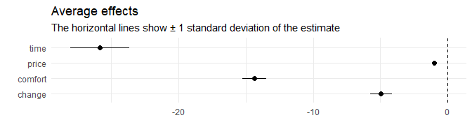

<!-- README.md is generated from README.Rmd. Please edit that file -->

# RprobitB <a href="https://loelschlaeger.de/RprobitB/"></a>

<!-- badges: start -->

[](https://CRAN.R-project.org/package=RprobitB)
[](https://CRAN.R-project.org/package=RprobitB)
[](https://app.codecov.io/gh/loelschlaeger/RprobitB?branch=main)
[](https://github.com/loelschlaeger/RprobitB/actions/workflows/R-CMD-check.yaml)
<!-- badges: end -->

The goal of `{RprobitB}` is to explain choices made by deciders among a
discrete set of alternatives. In a Bayesian way. For example, think of
tourists that want to book a train trip to their holiday destination:
The knowledge why they prefer a certain alternative over another is of
great value for train companies, especially the customer’s willingness
to pay for say a faster or more comfortable trip.

## Installation

You can install the released version of `{RprobitB}` from
[CRAN](https://CRAN.R-project.org) with:

``` r
install.packages("RprobitB")
```

And the development version from [GitHub](https://github.com/) with:

``` r
# install.packages("devtools")
devtools::install_github("loelschlaeger/RprobitB")
```

## Documentation

The package is documented in several vignettes, see
[here](https://loelschlaeger.de/RprobitB/articles/).

## Example

We analyze a data set of 2929 stated choices by 235 Dutch individuals
deciding between two virtual train trip options based on the price, the
travel time, the level of comfort, and the number of changes. The data
is saved in the {mlogit} package. We transform the travel time from
minutes to hours and the travel price from guilders to euros:

``` r
data("Train", package = "mlogit")
Train$price_A <- Train$price_A / 100 * 2.20371
Train$price_B <- Train$price_B / 100 * 2.20371
Train$time_A <- Train$time_A / 60
Train$time_B <- Train$time_B / 60
str(Train)
#> 'data.frame':    2929 obs. of  11 variables:
#>  $ id       : int  1 1 1 1 1 1 1 1 1 1 ...
#>  $ choiceid : int  1 2 3 4 5 6 7 8 9 10 ...
#>  $ choice   : Factor w/ 2 levels "A","B": 1 1 1 2 2 2 2 2 1 1 ...
#>  $ price_A  : num  52.9 52.9 52.9 88.1 52.9 ...
#>  $ time_A   : num  2.5 2.5 1.92 2.17 2.5 ...
#>  $ change_A : num  0 0 0 0 0 0 0 0 0 0 ...
#>  $ comfort_A: num  1 1 1 1 1 0 1 1 0 1 ...
#>  $ price_B  : num  88.1 70.5 88.1 70.5 70.5 ...
#>  $ time_B   : num  2.5 2.17 1.92 2.5 2.5 ...
#>  $ change_B : num  0 0 0 0 0 0 0 0 0 0 ...
#>  $ comfort_B: num  1 1 0 0 0 0 1 0 1 0 ...
```

The following lines fit a probit model that explains the chosen trip
alternatives (`choice`) by their `price`, `time`, number of `change`s,
and level of `comfort` (the lower this value the higher the comfort).
For normalization, the first linear coefficient, the `price`, is fixed
to `-1`, which allows to interpret the other coefficients as monetary
values:

``` r
form <- choice ~ price + time + change + comfort | 0
data <- prepare_data(form, Train)
model <- fit_model(data, scale = "price := -1")
```

The estimated effects can be visualized via:

``` r
plot(coef(model))
```



The results indicate that the deciders value one hour travel time by
about 25€, an additional change by 5€, and a more comfortable class by
15€.

Now assume that a train company wants to anticipate the effect of a
price increase on their market share. By our model, increasing the
ticket price from 100€ to 110€ (ceteris paribus) draws 15% of the
customers to the competitor who does not increase their prices:

``` r
predict(
  model,
  data = data.frame(
    "price_A" = c(100, 110),
    "price_B" = c(100, 100)
  ),
  overview = FALSE
)
#> Checking for missing covariates
#>   id idc    A    B prediction
#> 1  1   1 0.50 0.50          A
#> 2  2   1 0.35 0.65          B
```

However, offering a better comfort class (`0` here is better than `1`)
compensates for the higher price and even results in a gain of 7% market
share:

``` r
predict(
  model,
  data = data.frame(
    "price_A" = c(100, 110),
    "comfort_A" = c(1, 0),
    "price_B" = c(100, 100),
    "comfort_B" = c(1, 1)
  ),
  overview = FALSE
)
#> Checking for missing covariates
#>   id idc    A    B prediction
#> 1  1   1 0.50 0.50          A
#> 2  2   1 0.57 0.43          A
```

This is just the tip of the iceberg: `{RprobitB}` offers tools for
modeling choice behavior heterogeneity, preference-based classification
of deciders, model comparison and more.
