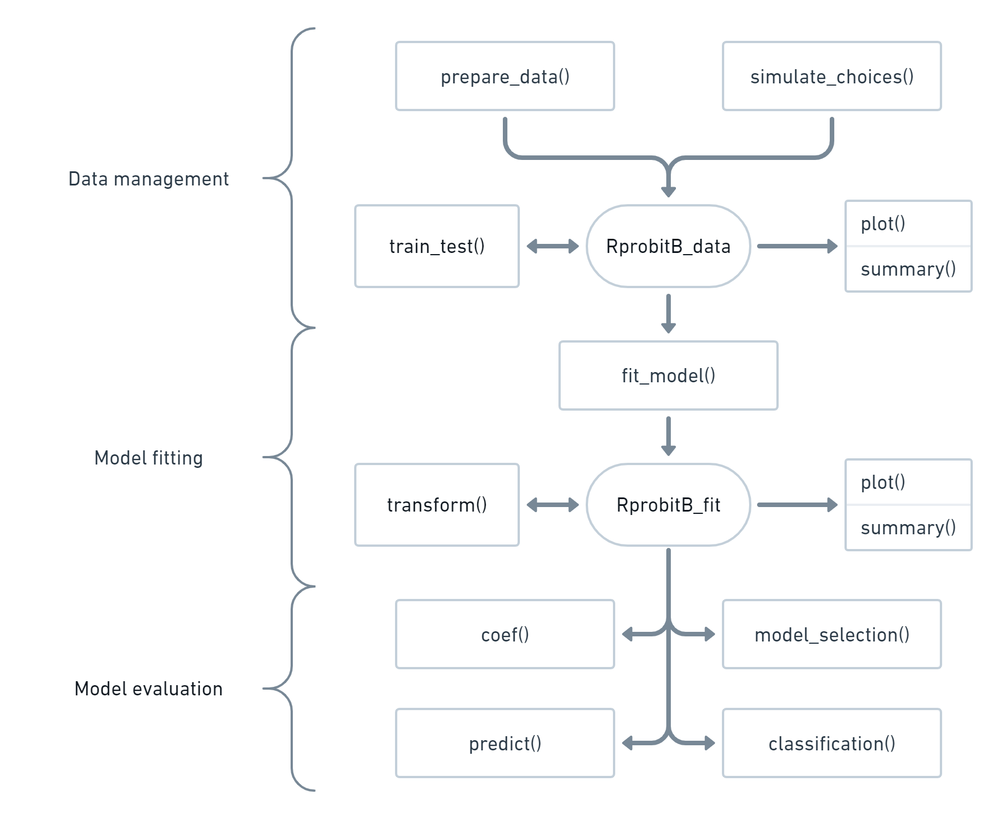

# Introduction

[RprobitB](https://loelschlaeger.de/RprobitB/) implements Bayes
estimation of probit choice models in cross-sectional and panel
settings. The package can analyze binary, multivariate, ordered, and
ranked choices, as well as heterogeneity of choice behavior among
deciders. The main functionality includes model fitting via Gibbs
sampling, tools for convergence diagnostic, choice data simulation,
in-sample and out-of-sample choice prediction, and model selection using
information criteria and Bayes factors. The latent class model extension
facilitates preference-based decider classification, where the number of
latent classes can be inferred via the Dirichlet process or a
weight-based updating heuristic. This allows for flexible modeling of
choice behavior without the need to impose structural constraints. See
[the vignette on the model
definition](https://loelschlaeger.de/RprobitB/articles/v01_model_definition.html)
for details about the probit model.

Working with [RprobitB](https://loelschlaeger.de/RprobitB/) follows a
structured workflow. The main functions fall into three categories: data
management, model fitting, and model evaluation, as illustrated in the
flowchart below. A typical workflow proceeds as follows:

1.  Prepare a choice data set via the
    [`prepare_data()`](https://loelschlaeger.de/RprobitB/reference/prepare_data.md)
    function or simulate data via
    [`simulate_choices()`](https://loelschlaeger.de/RprobitB/reference/simulate_choices.md).
    Both functions return an `RprobitB_data` object that can be fed into
    the estimation routine. The
    [`train_test()`](https://loelschlaeger.de/RprobitB/reference/train_test.md)
    allows to split the data into an estimation and a validation part.
    See [the vignette on choice
    data](https://loelschlaeger.de/RprobitB/articles/v02_choice_data.html)
    for details.

2.  The estimation routine is called
    [`fit_model()`](https://loelschlaeger.de/RprobitB/reference/fit_model.md)
    and returns an `RprobitB_fit` object. The `transform_fit()` function
    allows to change normalization of the model after a model has been
    fitted. The details are documented in the vignettes [on model
    fitting](https://loelschlaeger.de/RprobitB/articles/v03_model_fitting.html)
    and [on modeling
    heterogeneity](https://loelschlaeger.de/RprobitB/articles/v04_modeling_heterogeneity.html).

3.  The `RprobitB_fit` object can be fed into
    [`coef()`](https://rdrr.io/r/stats/coef.html) to show the covariate
    effects on the choices and into
    [`predict()`](https://rdrr.io/r/stats/predict.html) to compute
    choice probabilities and forecast choice behavior if choice
    characteristics would change, see [the vignette on choice
    prediction](https://loelschlaeger.de/RprobitB/articles/v05_choice_prediction.html).
    The
    [`classification()`](https://loelschlaeger.de/RprobitB/reference/classification.md)
    function allows for preference-based decider classification. The
    function
    [`model_selection()`](https://loelschlaeger.de/RprobitB/reference/model_selection.md)
    compares `RprobitB_fit` objects by computing different model
    selection criteria, see [the vignette on model
    selection](https://loelschlaeger.de/RprobitB/articles/v06_model_selection.html).

The flowchart of [RprobitB](https://loelschlaeger.de/RprobitB/).
