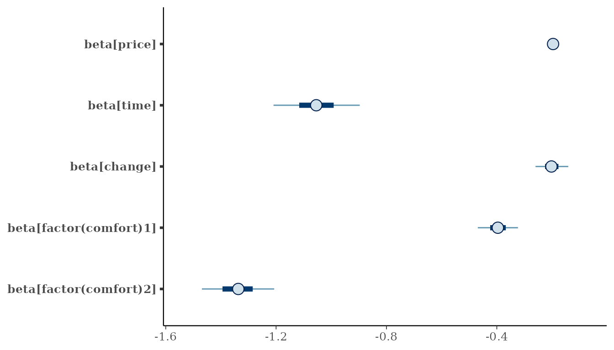
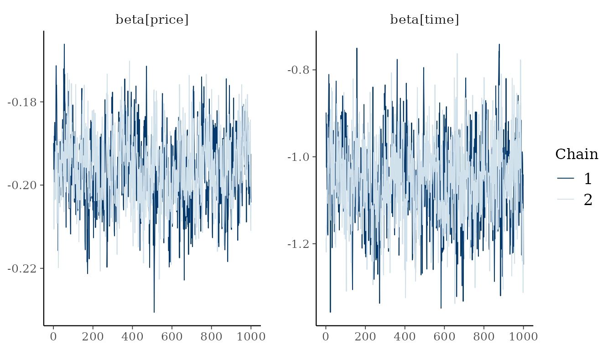
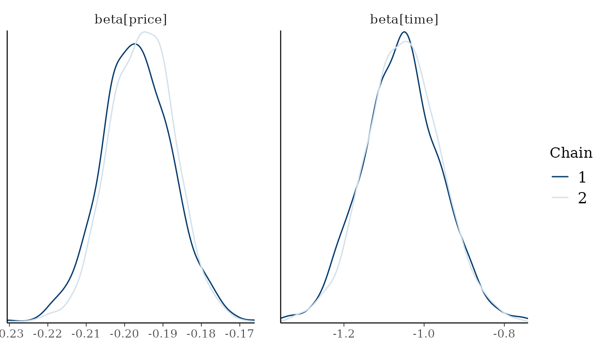
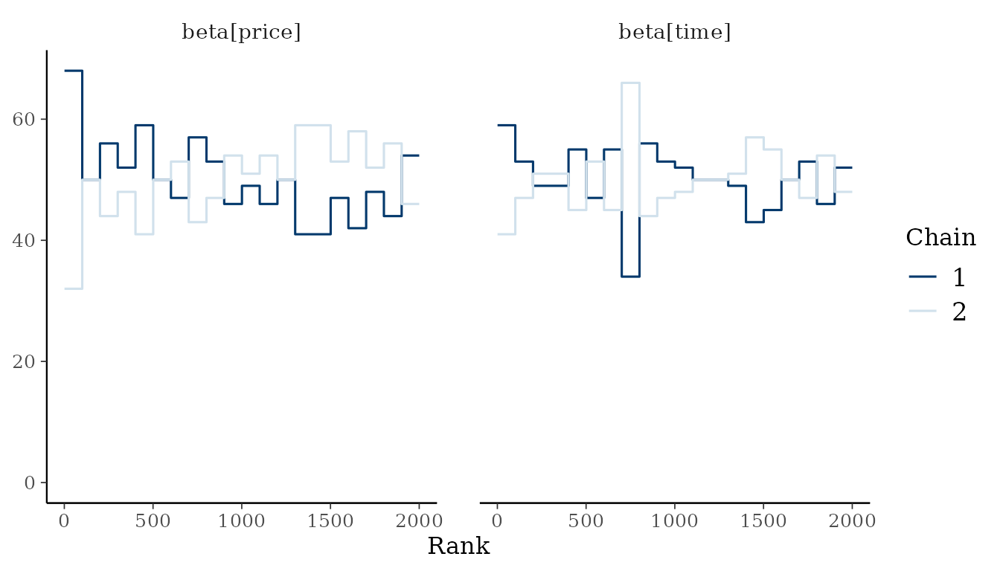
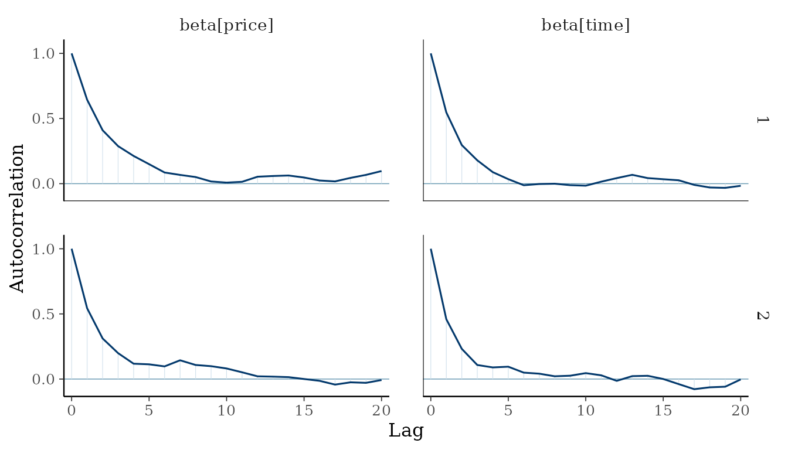
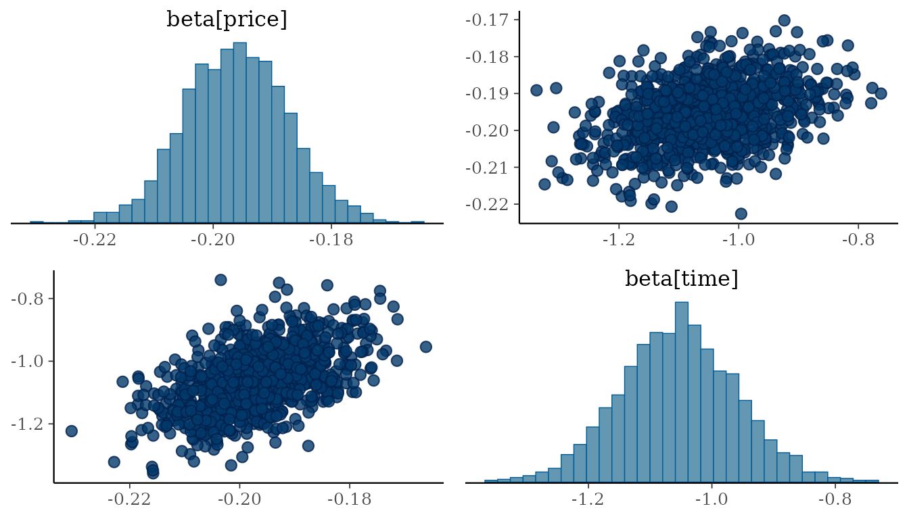

# Get started with RprobitB

Discrete choice models describe how a decider selects one alternative
from a finite set, for example a train connection, an electricity
supplier, or a mode of transport ([Train 2009](#ref-Train2009)). The
probability of each alternative is a function of the attributes of the
alternatives and the characteristics of the decider. The coefficients of
the model quantify the weight of each attribute in the decision, and
ratios of coefficients quantify the trade-offs between attributes.
**RprobitB** estimates discrete choice models in a Bayesian probit
framework. This vignette fits a basic probit model to panel data from a
stated choice experiment and introduces the posterior summaries,
convergence diagnostics, and plots on which every analysis with the
package relies.

## The probit model

Consider $`N`$ deciders $`n = 1, \dots, N`$, each of whom chooses at
$`T_n`$ occasions $`t = 1, \dots, T_n`$ one of $`J`$ alternatives
$`j = 1, \dots, J`$. The probit model is a random utility model: it
assigns to every alternative the latent utility

``` math
U_{ntj} = X_{ntj}^\top \beta_n + \epsilon_{ntj}, \qquad \epsilon_{nt} =
(\epsilon_{nt1}, \dots, \epsilon_{ntJ})^\top \sim \mathrm{N}(0, \Sigma),
```

where $`X_{ntj}`$ is the vector of $`P`$ covariates assigned to
alternative $`j`$ at occasion $`t`$ of decider $`n`$, $`\beta_n`$ is the
vector of the $`P`$ coefficients of decider $`n`$, and
$`\epsilon_{ntj}`$ is an error term. The error vector $`\epsilon_{nt}`$
of an occasion is multivariate normal with mean zero and the
$`J \times J`$ covariance matrix $`\Sigma`$, and it is independent
across deciders and occasions. The decider chooses the alternative with
the largest utility, $`y_{nt} = \operatorname{argmax}_j U_{ntj}`$, and
only this choice $`y_{nt}`$ is observed, not the utilities. The choice
probability of alternative $`j`$ is the probability that its utility
exceeds the utilities of all other alternatives,

``` math
\Pr(y_{nt} = j) = \Pr(U_{ntj} > U_{ntl} \text{ for all } l \neq j),
```

which is a function of the covariates $`X_{nt}`$ of the occasion, the
coefficients $`\beta_n`$, and the covariance matrix $`\Sigma`$. The
choice probabilities are invariant to adding a constant to all utilities
and to multiplying all utilities by a positive number, so neither the
level nor the scale of the utilities is identified. **RprobitB** removes
the level by taking utility differences with respect to a base
alternative and fixes the scale by restricting either one error variance
or one coefficient. These two restrictions are the normalization of the
model. The coefficient vector $`\beta_n`$ is common to all deciders
unless random effects are specified, in which case the coefficients of
every decider are drawn from a population distribution whose parameters
are estimated. The vignette [Model specification and
variants](https://loelschlaeger.de/RprobitB/articles/v02_model_variants.html)
describes the normalization and the prior distribution, and the vignette
[Modeling preference
heterogeneity](https://loelschlaeger.de/RprobitB/articles/v03_heterogeneity.html)
the specification of heterogeneous coefficients. Bayesian estimation of
the multinomial probit model goes back to McCulloch and Rossi
([1994](#ref-McCulloch1994)) and Imai and van Dyk
([2005](#ref-Imai2005a)), and Oelschläger
([2026](#ref-Oelschlaeger2026c)) gives a unified account of the
heterogeneity models that **RprobitB** implements.

## A stated choice experiment on train trips

In 1987, a stated choice experiment commissioned by the Dutch national
railways presented 235 travelers with pairs of hypothetical train trips
and asked which trip of each pair they would choose ([Ben-Akiva et al.
1993](#ref-BenAkiva1993)). The two trips of a pair differ in price,
travel time, number of changes, and comfort class, and every traveler
evaluated about twelve pairs. The **mlogit** package ([Croissant
2020](#ref-Croissant2020)) provides the 2929 choices as the data set
`Train`. The data are in wide format: one row per choice occasion, with
the attributes of trip `A` in the columns ending in `_A` and those of
trip `B` in the columns ending in `_B`. Prices are recorded in cents of
Dutch guilders and travel times in minutes; both are converted to euro
and hours below.

``` r

library(RprobitB)
set.seed(1)
data("Train", package = "mlogit")
Train$price_A <- Train$price_A / 100 / 2.20371
Train$price_B <- Train$price_B / 100 / 2.20371
Train$time_A <- Train$time_A / 60
Train$time_B <- Train$time_B / 60
head(Train)
#>   choiceid id choice  price_A  price_B   time_A   time_B change_A change_B
#> 1        1  1      A 10.89073 18.15121 2.500000 2.500000        0        0
#> 2        2  1      A 10.89073 14.52097 2.500000 2.166667        0        0
#> 3        3  1      A 10.89073 18.15121 1.916667 1.916667        0        0
#> 4        4  1      B 18.15121 14.52097 2.166667 2.500000        0        0
#> 5        5  1      B 10.89073 14.52097 2.500000 2.500000        0        0
#> 6        6  1      B 18.15121 10.89073 1.916667 2.166667        0        0
#>   comfort_A comfort_B
#> 1         1         1
#> 2         1         1
#> 3         1         0
#> 4         1         0
#> 5         1         0
#> 6         0         0
```

The model formula names the response and the covariates:

``` r

formula <- choice ~ price + time + change + factor(comfort) | 0
```

All four covariates are attributes of the trips with one coefficient
common to both alternatives, which places them in the first part of the
formula. The second part takes characteristics of the decider and the
alternative-specific constants; here it contains only the `0` that
removes the constants, which is appropriate because the labels `A` and
`B` of the two trips were assigned arbitrarily and carry no utility of
their own. The comfort class is stored as an integer but is a
categorical variable with three levels; `factor(comfort)` expands it
into dummy variables, as in [`lm()`](https://rdrr.io/r/stats/lm.html).
The arguments `column_decider` and `column_occasion` identify the
traveler and the choice occasion. The vignette [Model specification and
variants](https://loelschlaeger.de/RprobitB/articles/v02_model_variants.html)
describes the three parts of the formula and the further arguments of
[`fit()`](https://loelschlaeger.de/RprobitB/reference/fit.md).

``` r

model <- fit(
  formula = formula,
  data = Train,
  column_decider = "id",
  column_occasion = "choiceid",
  iterations = 2000,
  warmup = 1000,
  chains = 2,
  progress = FALSE
)
model
#> Bayesian probit choice model
#> Formula: choice ~ price + time + change + factor(comfort) | 0 | 0 
#> Data: 235 deciders, 2929 choice occasions
#> Samples: 1000 retained per chain, 2 chains
```

[`fit()`](https://loelschlaeger.de/RprobitB/reference/fit.md) estimates
the model with a Gibbs sampler, a Markov chain Monte Carlo method that
draws the latent utilities and the parameters in turn from their
conditional posterior distributions. The posterior distribution combines
the prior distribution of the parameters, described in the vignette
[Model specification and
variants](https://loelschlaeger.de/RprobitB/articles/v02_model_variants.html),
with the likelihood of the observed choices. A chain of the sampler
consists of `iterations` draws. The first `warmup` of them are
discarded, because the chain first has to move from its starting values
into the region of the posterior, and the remaining draws are retained
as the posterior draws from which every summary below is computed.
Several independent chains, set by `chains`, sample the same posterior
and make it possible to check convergence, that is, whether the retained
draws represent the posterior distribution.

## Posterior summaries

[`summary()`](https://rdrr.io/r/base/summary.html) reports the posterior
mean, mode, and standard deviation of every population-level parameter
together with the convergence diagnostics of the **posterior** package
([Bürkner et al. 2026](#ref-Buerkner2026)).

``` r

summary(model)
#> Bayesian probit choice model
#> Formula: choice ~ price + time + change + factor(comfort) | 0 | 0 
#> Samples: 1000 retained per chain, 2 chains
#> 
#>                variable   mean   mode      sd rhat ess_bulk
#>             beta[price] -0.196 -0.196 0.00873 1.01      349
#>              beta[time] -1.054 -1.047 0.09503 1.00      596
#>            beta[change] -0.201 -0.208 0.03580 1.01      657
#>  beta[factor(comfort)1] -0.396 -0.396 0.04300 1.00      800
#>  beta[factor(comfort)2] -1.338 -1.320 0.07954 1.01      553
```

The coefficients of price, travel time, and number of changes are
negative, as expected: each of these attributes reduces the utility of a
trip. Comfort is a factor whose level `0` denotes the highest class, so
the negative coefficients of the dummies for levels `1` and `2` quantify
the loss of utility in the lower classes. The error variance of the
utility difference, `Sigma[B,B]`, is absent from the table because the
default normalization fixes it to one.

Because of this normalization, the coefficients are measured in units of
the error standard deviation, and their absolute size has no substantive
interpretation. The ratio of two coefficients is invariant to the scale
and answers a substantive question: which price reduction compensates a
traveler for one additional hour of travel time?
[`interpret()`](https://loelschlaeger.de/RprobitB/reference/interpret.md)
computes such ratios for every posterior draw and expresses each effect
in units of a reference effect, here the price:

``` r

compensation <- interpret(model, reference = "price")
compensation
#> 1 `time` compensates -5.38 `price` (95% interval -6.18 to -4.51)
#> 1 `change` compensates -1.03 `price` (95% interval -1.37 to -0.677)
#> 1 `factor(comfort)1` compensates -2.02 `price` (95% interval -2.42 to -1.62)
#> 1 `factor(comfort)2` compensates -6.83 `price` (95% interval -7.6 to -6.09)
```

One additional hour of travel time is compensated by a price that is
about 5.4 euro lower (at 1987 prices), and the lowest comfort class
relative to the highest by a price about 6.8 euro lower.

The last two columns of the summary table are the convergence
diagnostics recommended by Vehtari et al. ([2021](#ref-Vehtari2021)):

- `rhat` compares the variance between the chains with the variance
  within the chains and equals one when all chains sample the same
  distribution.
- `ess_bulk` is the effective sample size for the bulk of the posterior
  distribution, that is, for its central part around the median as
  opposed to its tails. Consecutive draws of a chain are correlated, and
  the effective sample size is the number of independent draws that
  would estimate the posterior mean or median with the same precision. A
  few hundred effective draws suffice for these summaries; the precision
  of extreme quantiles is governed by the tail effective sample size
  instead.

The arguments `probs` and `statistics` select the columns of the table.
`probs` adds posterior quantiles, and `statistics` selects the measures,
among them the tail effective sample size, which governs the precision
of the quantiles, and the Monte Carlo standard error of the mean, which
quantifies the simulation error of the reported posterior mean.
[`?summary.RprobitB_fit`](https://loelschlaeger.de/RprobitB/reference/summary.RprobitB_fit.md)
describes each measure.

``` r

summary(
  model,
  statistics = c("mean", "mcse_mean", "ess_bulk", "ess_tail"),
  probs = c(0.05, 0.95)
)
#> Bayesian probit choice model
#> Formula: choice ~ price + time + change + factor(comfort) | 0 | 0 
#> Samples: 1000 retained per chain, 2 chains
#> 
#>                variable   mean     q5    q95 mcse_mean ess_bulk ess_tail
#>             beta[price] -0.196 -0.210 -0.182  0.000468      349      811
#>              beta[time] -1.054 -1.209 -0.897  0.003890      596      923
#>            beta[change] -0.201 -0.260 -0.141  0.001397      657     1251
#>  beta[factor(comfort)1] -0.396 -0.469 -0.323  0.001520      800     1186
#>  beta[factor(comfort)2] -1.338 -1.469 -1.207  0.003376      553     1056
```

[`coef()`](https://rdrr.io/r/stats/coef.html) and
[`confint()`](https://rdrr.io/r/stats/confint.html) return posterior
means or medians and equal-tailed credible intervals. The bounds of such
an interval are the posterior quantiles at `(1 - level) / 2` and
`(1 + level) / 2`, so that the interval contains the parameter with
posterior probability `level`.

``` r

coef(model)
#>            beta[price]             beta[time]           beta[change] 
#>             -0.1961137             -1.0541476             -0.2013516 
#> beta[factor(comfort)1] beta[factor(comfort)2] 
#>             -0.3961042             -1.3382782
confint(model, level = 0.9)
#>                                5%        95%
#> beta[price]            -0.2101777 -0.1819134
#> beta[time]             -1.2093530 -0.8967781
#> beta[change]           -0.2596503 -0.1410680
#> beta[factor(comfort)1] -0.4688508 -0.3233941
#> beta[factor(comfort)2] -1.4687676 -1.2068223
```

[`vcov()`](https://rdrr.io/r/stats/vcov.html) returns the posterior
covariance matrix of the parameters:

``` r

round(vcov(model), 5)
#>                        beta[price] beta[time] beta[change]
#> beta[price]                0.00008    0.00037      0.00008
#> beta[time]                 0.00037    0.00903      0.00083
#> beta[change]               0.00008    0.00083      0.00128
#> beta[factor(comfort)1]     0.00014    0.00123      0.00024
#> beta[factor(comfort)2]     0.00031    0.00301      0.00061
#>                        beta[factor(comfort)1] beta[factor(comfort)2]
#> beta[price]                           0.00014                0.00031
#> beta[time]                            0.00123                0.00301
#> beta[change]                          0.00024                0.00061
#> beta[factor(comfort)1]                0.00185                0.00216
#> beta[factor(comfort)2]                0.00216                0.00633
```

An interval plot displays the marginal posteriors: the thick bars cover
the central 50% and the thin lines the central 90% of each posterior.

``` r

plot(model, type = "interval")
```



## Graphical convergence diagnostics

[`plot()`](https://rdrr.io/r/graphics/plot.default.html) delegates to
**bayesplot** ([Gabry and Mahr 2025](#ref-Gabry2025)). Trace plots show
the draws of each chain against their index, and density overlays
compare the marginal posteriors of the chains; there are two chains here
because [`fit()`](https://loelschlaeger.de/RprobitB/reference/fit.md)
was called with `chains = 2`. For converged chains, the traces are
stationary without trend, and the densities of the chains coincide.

``` r

plot(model, type = "trace", variables = c("beta[price]", "beta[time]"))
```



``` r

plot(model, type = "density", variables = c("beta[price]", "beta[time]"))
```



Rank plots are a more sensitive check ([Vehtari et al.
2021](#ref-Vehtari2021)). The draws of all chains are pooled and ranked,
and the histogram of the ranks is drawn for every chain. If all chains
sample the same distribution, every chain receives ranks from the whole
range with equal frequency, and the histograms are uniform. A chain that
remains in a subregion of the posterior, for example because it has not
yet left the region of its starting values, receives predominantly small
or large ranks, and its histogram is peaked at one end.

Autocorrelation plots show, for every chain, the correlation between
draws that are $`k`$ iterations apart as a function of the lag $`k`$.
Consecutive draws of a Gibbs sampler are dependent, so a chain carries
less information than the same number of independent draws. The
effective sample size expresses this loss in one number: it is the
number of independent draws that would estimate the posterior mean with
the same precision. In its classical form, it equals
$`S / (1 + 2 \sum_{k \geq 1} \rho_k)`$ for $`S`$ draws with
autocorrelations $`\rho_k`$, so the faster the autocorrelation decays to
zero, the closer the effective sample size is to the number of draws.
`ess_bulk` applies this formula to rank-normalized draws, which makes it
robust to heavy tails ([Vehtari et al. 2021](#ref-Vehtari2021)).

``` r

plot(model, type = "rank", variables = c("beta[price]", "beta[time]"))
```



``` r

plot(model, type = "acf", variables = c("beta[price]", "beta[time]"))
```



Pairs plots show the joint posterior of two parameters and reveal
posterior correlations:

``` r

plot(model, type = "pairs", variables = c("beta[price]", "beta[time]"))
```



## Working with the posterior draws

The retained draws are stored as a `draws_array` of the **posterior**
package with dimensions iteration, chain, and variable, so that all
functions of that package apply to them directly.

``` r

draws <- posterior::as_draws(model)
dim(draws)
#> [1] 1000    2    6
posterior::summarise_draws(draws, "mean", "quantile2")
#> # A tibble: 6 × 4
#>   variable                 mean     q5    q95
#>   <chr>                   <dbl>  <dbl>  <dbl>
#> 1 beta[price]            -0.196 -0.210 -0.182
#> 2 beta[time]             -1.05  -1.21  -0.897
#> 3 beta[change]           -0.201 -0.260 -0.141
#> 4 beta[factor(comfort)1] -0.396 -0.469 -0.323
#> 5 beta[factor(comfort)2] -1.34  -1.47  -1.21 
#> 6 Sigma[B,B]              1      1      1
```

The standard accessor methods are available:
[`formula()`](https://rdrr.io/r/stats/formula.html) returns the fitted
formula, [`model.frame()`](https://rdrr.io/r/stats/model.frame.html) the
data the model was fitted to, and
[`nobs()`](https://rdrr.io/r/stats/nobs.html) the number of independent
units in the likelihood. Here these are the observed choice occasions,
because the model has one coefficient vector for all travelers. With
random effects, and with the latent classes of the vignette [Modeling
preference
heterogeneity](https://loelschlaeger.de/RprobitB/articles/v03_heterogeneity.html),
the choices of a traveler are dependent, and
[`nobs()`](https://rdrr.io/r/stats/nobs.html) counts travelers.

``` r

formula(model)
#> choice ~ price + time + change + factor(comfort) | 0 | 0
nobs(model)
#> [1] 2929
head(model.frame(model))
#>   id choiceid choice  price_A  price_B   time_A   time_B change_A change_B
#> 1  1        1      A 10.89073 18.15121 2.500000 2.500000        0        0
#> 2  1        2      A 10.89073 14.52097 2.500000 2.166667        0        0
#> 3  1        3      A 10.89073 18.15121 1.916667 1.916667        0        0
#> 4  1        4      B 18.15121 14.52097 2.166667 2.500000        0        0
#> 5  1        5      B 10.89073 14.52097 2.500000 2.500000        0        0
#> 6  1        6      B 18.15121 10.89073 1.916667 2.166667        0        0
#>   comfort_A comfort_B
#> 1         1         1
#> 2         1         1
#> 3         1         0
#> 4         1         0
#> 5         1         0
#> 6         0         0
```

## Parallel chains

The chains of a fit are independent of each other, so **RprobitB** can
run them in parallel on several cores, which reduces the computing time
in proportion to the number of chains. The package does not select a
parallel backend itself. The chains run through the **future** framework
([Bengtsson 2021](#ref-Bengtsson2021)), so a plan set before fitting is
used automatically.

``` r

future::plan(future::multisession, workers = 4) # run chains on four cores
parallel_model <- fit(
  formula = formula,
  data = Train,
  column_decider = "id",
  column_occasion = "choiceid"
)
future::plan(future::sequential) # return to sequential evaluation
```

In interactive sessions, all chains report their progress through the
**progressr** package ([Bengtsson 2026](#ref-Bengtsson2026)).

## Further reading

- [Model specification and
  variants](https://loelschlaeger.de/RprobitB/articles/v02_model_variants.html):
  the normalization, the prior distribution, the three covariate types,
  individual choice sets, and ordered and ranked responses.
- [Modeling preference
  heterogeneity](https://loelschlaeger.de/RprobitB/articles/v03_heterogeneity.html):
  random coefficients and latent classes.
- [Posterior
  prediction](https://loelschlaeger.de/RprobitB/articles/v04_prediction.html):
  posterior predictive probabilities for the population and for
  individual deciders, scenarios, out-of-sample prediction, and marginal
  effects.
- [Bayesian model
  evaluation](https://loelschlaeger.de/RprobitB/articles/v05_model_evaluation.html):
  model comparison by WAIC, PSIS-LOO, and Bayes factors.

## References

Ben-Akiva, Moshe, Denis Bolduc, and Mark Bradley. 1993. “Estimation of
Travel Choice Models with Randomly Distributed Values of Time.”
*Transportation Research Record* 1413: 88–97.
<https://trid.trb.org/View/385096>.

Bengtsson, Henrik. 2021. “A Unifying Framework for Parallel and
Distributed Processing in R Using Futures.” *The R Journal* 13 (2):
208–27. <https://doi.org/10.32614/RJ-2021-048>.

Bengtsson, Henrik. 2026. *progressr: An Inclusive, Unifying API for
Progress Updates*. <https://doi.org/10.32614/CRAN.package.progressr>.

Bürkner, Paul-Christian, Jonah Gabry, Matthew Kay, and Aki Vehtari.
2026. *posterior: Tools for Working with Posterior Distributions*.
<https://mc-stan.org/posterior/>.

Croissant, Yves. 2020. “Estimation of Random Utility Models in R: The
mlogit Package.” *Journal of Statistical Software* 95 (11): 1–41.
<https://doi.org/10.18637/jss.v095.i11>.

Gabry, Jonah, and Tristan Mahr. 2025. *bayesplot: Plotting for Bayesian
Models*. <https://mc-stan.org/bayesplot/>.

Imai, Kosuke, and David A. van Dyk. 2005. “A Bayesian Analysis of the
Multinomial Probit Model Using Marginal Data Augmentation.” *Journal of
Econometrics* 124 (2): 311–34.
<https://doi.org/10.1016/j.jeconom.2004.02.002>.

McCulloch, Robert E., and Peter E. Rossi. 1994. “An Exact Likelihood
Analysis of the Multinomial Probit Model.” *Journal of Econometrics* 64
(1-2): 207–40. <https://doi.org/10.1016/0304-4076(94)90064-7>.

Oelschläger, Lennart. 2026. “Overcoming Challenges in Modeling Choice
Behavior Heterogeneity.” PhD thesis, Bielefeld University.
<https://pub.uni-bielefeld.de/record/3014719>.

Train, Kenneth E. 2009. *Discrete Choice Methods with Simulation*. 2nd
ed. Cambridge University Press.
<https://doi.org/10.1017/CBO9780511805271>.

Vehtari, Aki, Andrew Gelman, Daniel Simpson, Bob Carpenter, and
Paul-Christian Bürkner. 2021. “Rank-Normalization, Folding, and
Localization: An Improved $`\widehat{R}`$ for Assessing Convergence of
MCMC.” *Bayesian Analysis* 16 (2): 667–718.
<https://doi.org/10.1214/20-BA1221>.
