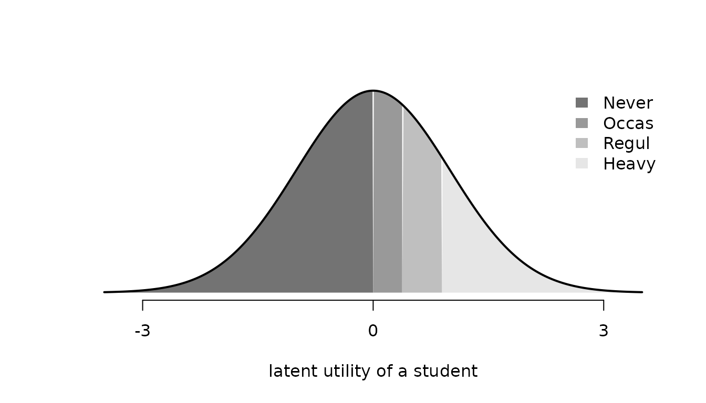

# Model specification and variants

This vignette describes how to specify a probit choice model with
[`fit()`](https://loelschlaeger.de/RprobitB/reference/fit.md). It covers
the normalization of the utility scale and the prior distribution, which
every fit involves, and then the model variants: the three types of
covariates and the alternative-specific constants, choice sets that
differ between occasions, and ordered and ranked responses. Preference
heterogeneity between deciders is the subject of the vignette [Modeling
preference
heterogeneity](https://loelschlaeger.de/RprobitB/articles/v03_heterogeneity.html),
and Oelschläger ([2026](#ref-Oelschlaeger2026c)) gives the
methodological background. From the covariate types onward, each section
first fits the variant to simulated data and then to a data set of the
**AER** package ([Kleiber and Zeileis 2008](#ref-Kleiber2008)), the
**MASS** package ([Venables and Ripley 2002](#ref-VenablesRipley2002)),
or the **mlogit** package ([Croissant 2020](#ref-Croissant2020)).
Without data,
[`fit()`](https://loelschlaeger.de/RprobitB/reference/fit.md) simulates
the requested model before estimating it, and
[`summary()`](https://rdrr.io/r/base/summary.html) prints the true
values in a `dgp` column beside the posterior summaries, converted to
the normalization of the fit.

``` r

library(RprobitB)
set.seed(1)
```

## Normalization

The probit model introduced in the vignette [Get started with
RprobitB](https://loelschlaeger.de/RprobitB/articles/v01_get_started.html)
assigns every alternative $`j`$ at occasion $`t`$ of decider $`n`$ the
latent utility $`U_{ntj} = X_{ntj}^\top \beta_n + \epsilon_{ntj}`$ with
jointly normal errors $`\epsilon_{nt} \sim \mathrm{N}(0, \Sigma)`$, and
the decider chooses the alternative with the largest utility. The choice
probability of an alternative is the probability that its utility
exceeds the utilities of all others. These probabilities are invariant
to adding a constant to all utilities and to multiplying all utilities
by a positive number, so neither the level nor the scale of the
utilities is identified. **RprobitB** therefore works with utility
differences relative to a base alternative, by default the first in
alphabetical order, and fixes one parameter through `scale`:

- `scale = NULL` fixes the error variance of the first utility
  difference to one. This is the default. The covariance matrix of the
  error differences is reported as `Sigma[<alternative>,<alternative>]`,
  with rows and columns named by the alternatives other than the base.
  For three alternatives `A`, `B`, and `C` with base `A`, its entries
  are `Sigma[B,B]`, `Sigma[C,B]`, and `Sigma[C,C]`.
- `scale = c(z = -1)` fixes the coefficient of `z` to `-1` instead, so
  that all other coefficients are measured in units of it. With a price
  coefficient fixed in this way, the other coefficients are
  willingness-to-pay values.

The sampler draws all parameters without restriction and rescales every
retained draw afterwards. Variables that the normalization fixes remain
in the draws but are omitted from
[`summary()`](https://rdrr.io/r/base/summary.html),
[`coef()`](https://rdrr.io/r/stats/coef.html), and
[`vcov()`](https://rdrr.io/r/stats/vcov.html).

The following demonstration shows the effect of the normalization on the
reported values. We simulate data with coefficients `1` for `x` and
`-0.5` for `z` and fit them under the default scale. Simulated
alternatives are labeled with capital letters unless `alternatives`
names them, here `A` and `B`, and `A` is the base.
[`update()`](https://rdrr.io/r/stats/update.html) then refits the same
simulated data with the coefficient of `z` fixed to `-1`, so only the
normalization differs between the two fits.

``` r

scale_default <- fit(
  choice ~ x + z | 0,
  dgp_parameters = list(beta = c(x = 1, z = -0.5)),
  n_deciders = 300,
  chains = 1
)
summary(scale_default)
#> Bayesian probit choice model
#> Formula: choice ~ x + z | 0 | 0 
#> Samples: 500 retained per chain, 1 chain
#>  variable  dgp   mean   mode     sd rhat ess_bulk
#>   beta[x]  1.0  1.124  1.079 0.1055    1     36.2
#>   beta[z] -0.5 -0.617 -0.604 0.0877    1     51.1
scale_z <- update(scale_default, scale = c(z = -1))
summary(scale_z)
#> Bayesian probit choice model
#> Formula: choice ~ x + z | 0 | 0 
#> Samples: 500 retained per chain, 1 chain
#>    variable dgp mean mode    sd rhat ess_bulk
#>     beta[x]   2 1.87 1.80 0.229 1.01      115
#>  Sigma[B,B]   4 2.94 2.33 0.932 1.04       47
```

Under the default scale, the `dgp` column shows the coefficients as
specified. `Sigma[B,B]`, the error variance of the utility difference
between alternative `B` and the base `A`, is fixed to one and therefore
not listed. Under the coefficient normalization, `beta[z]` is fixed to
`-1` instead of its true `-0.5`, so all utilities are multiplied by `2`:
the true `beta[x]` becomes `2` and the true error variance `4`.
[`summary()`](https://rdrr.io/r/base/summary.html) converts the true
values to the normalization of the fit, so the `dgp` column remains
comparable.

The convergence diagnostics of the two tables differ because
[`update()`](https://rdrr.io/r/stats/update.html) runs the sampler again
and because the rescaled variables are different functions of the draws:
`beta[x]` is now a ratio of two coefficients, which mixes differently
than a single coefficient.

## Prior distribution

**RprobitB** estimates every model with a Gibbs sampler, which draws
each block of parameters in turn from its conditional posterior
distribution given the other parameters and the latent utilities. The
prior is conjugate for every block, so each conditional posterior
belongs to the same family as the prior. Fixed coefficients and class
means have normal priors, covariance matrices have inverse Wishart
priors, class weights have a Dirichlet prior, and the log-increments
between ordered thresholds have a normal prior. The section “Prior
distribution” of
[`?fit`](https://loelschlaeger.de/RprobitB/reference/fit.md) lists all
components with their defaults, which are weakly informative for
coefficients and covariances. Single components are overridden through a
named list, and the complete prior of a fit is stored in its `prior`
component. The latent-utility data augmentation of the sampler goes back
to Albert and Chib ([1993](#ref-Albert1993)), and Imai and van Dyk
([2005](#ref-Imai2005a)) developed its marginal augmentation for the
multinomial probit model.

The following demonstration simulates 100 deciders with a true
coefficient of `-1` under the default prior and then refits the same
data under two priors with mean `1`: a moderate one with variance `0.5`
and a tight one with variance `0.01`.

``` r

default_prior <- fit(
  choice ~ x | 0,
  dgp_parameters = list(beta = c(x = -1)),
  chains = 1
)
default_prior$prior
#> $fixed_mean
#> [1] 0
#> 
#> $fixed_covariance
#>      [,1]
#> [1,]   10
#> 
#> $error_covariance_df
#> [1] 3
#> 
#> $error_covariance_scale
#>      [,1]
#> [1,]    1
summary(default_prior)
#> Bayesian probit choice model
#> Formula: choice ~ x | 0 | 0 
#> Samples: 500 retained per chain, 1 chain
#>  variable dgp  mean   mode    sd rhat ess_bulk
#>   beta[x]  -1 -1.02 -0.986 0.163 1.02     46.3
moderate_prior <- update(
  default_prior, prior = list(fixed_mean = 1, fixed_covariance = matrix(0.5))
)
tight_prior <- update(
  default_prior, prior = list(fixed_mean = 1, fixed_covariance = matrix(0.01))
)
data.frame(
  variable = "beta[x]", dgp = -1, default = coef(default_prior),
  moderate = coef(moderate_prior), tight = coef(tight_prior),
  row.names = NULL
)
#>   variable dgp   default   moderate     tight
#> 1  beta[x]  -1 -1.016823 -0.9577477 0.1240365
```

Under the default prior, the posterior mean deviates from the true value
by 0.1 posterior standard deviations. The moderate prior shifts the
posterior mean by about 0.06 towards the prior mean. The tight prior has
a standard deviation of `0.1` around `1` and moves the posterior mean to
0.12. A prior on a coefficient is unproblematic as long as its variance
reflects the actual uncertainty about the coefficient.

## Covariate types and alternative-specific constants

The formula `choice ~ A | B | C` distinguishes three kinds of
covariates: attributes of the alternatives with one shared coefficient
(`A`), characteristics of the decider with alternative-specific
coefficients (`B`), and attributes of the alternatives with
alternative-specific coefficients (`C`). Alternative-specific constants,
one intercept per alternative other than the base that captures the
utility of the alternative beyond its attributes, are included by
default and removed with `0` in the second part. The following
demonstration simulates all three types at once, and
[`summary()`](https://rdrr.io/r/base/summary.html) shows the posterior
summaries beside the normalized true values.

``` r

covariate_types <- fit(
  choice ~ x | z | w,
  n_deciders = 500,
  dgp_parameters = list(beta = c(
    x = 0.5, z_B = -0.5, ASC_B = 0.25, w_A = -0.5, w_B = 0.5
  )),
  chains = 1
)
summary(covariate_types)
#> Bayesian probit choice model
#> Formula: choice ~ x | z | w 
#> Samples: 500 retained per chain, 1 chain
#>     variable   dgp   mean   mode     sd rhat ess_bulk
#>      beta[x]  0.50  0.510  0.512 0.0593 1.01       87
#>    beta[z_B] -0.50 -0.512 -0.527 0.0730 1.01      117
#>  beta[ASC_B]  0.25  0.234  0.236 0.0680 1.01      147
#>    beta[w_A] -0.50 -0.433 -0.427 0.0649 1.00      160
#>    beta[w_B]  0.50  0.306  0.282 0.0702 1.00      146
```

The posterior means of the five coefficients, including the two
alternative-specific coefficients of `w` and the constant of alternative
`B`, deviate from the true values by at most 2.8 posterior standard
deviations, and all five have the sign of the true value. `base` selects
the alternative against which the alternative-specific coefficients are
measured, by default the first in alphabetical order, here `A`.
Switching the base to `B` changes the parameterization, not the model:

``` r

base_b <- update(covariate_types, base = "B")
coef(base_b)[c("beta[x]", "beta[z_A]", "beta[ASC_A]")]
#>     beta[x]   beta[z_A] beta[ASC_A] 
#>   0.5193362   0.5230973  -0.2385689
```

The shared coefficient of `x` differs from the previous fit by only
0.0092, the Monte Carlo error of two separate runs, while the
coefficient of `z` and the constant now describe alternative `A`
relative to `B` and therefore change sign.

In 1987, 210 travelers between Sydney and Melbourne reported which of
four modes they had taken: air, train, bus, or car. The `TravelMode`
data of the **AER** package ([Kleiber and Zeileis
2008](#ref-Kleiber2008)) are in long format with one row per mode and a
`"yes"`/`"no"` indicator of the chosen mode, which
[`fit()`](https://loelschlaeger.de/RprobitB/reference/fit.md) expects as
a logical or `0`/`1` variable. Terminal waiting time (`wait`),
in-vehicle cost (`vcost`), and travel time (`travel`) vary across modes
and enter as type `A`. Household income and the size of the traveling
party describe the traveler and enter as type `B`, with the
alternative-specific constants included by default. Cost and income are
converted from Australian dollars to euro.

``` r

travel_formula <- choice ~ wait + vcost + travel | income + size
```

The first alternative in alphabetical order, `air`, is the base, so the
constants and the coefficients of income and party size describe the
other modes relative to flying. A free error covariance between four
alternatives is weakly identified when every traveler is observed once,
and the sampler mixes slowly for its entries, so the chains run 20000
iterations and retain every twentieth draw.

``` r

data("TravelMode", package = "AER")
TravelMode$choice <- TravelMode$choice == "yes"
TravelMode$vcost <- TravelMode$vcost / 1.6196
TravelMode$income <- TravelMode$income / 1.6196
travel <- fit(
  formula = travel_formula,
  data = TravelMode,
  format = "long",
  column_decider = "individual",
  column_alternative = "mode",
  iterations = 20000,
  warmup = 10000,
  thin = 20,
  chains = 2,
  progress = FALSE
)
summary(travel)
#> Bayesian probit choice model
#> Formula: choice ~ wait + vcost + travel | income + size | 0 
#> Samples: 500 retained per chain, 2 chains
#> 
#>            variable     mean     mode       sd  rhat ess_bulk
#>          beta[wait] -0.04190 -0.04068 0.006463 1.004      366
#>         beta[vcost] -0.00933 -0.00961 0.006023 1.001      871
#>        beta[travel] -0.00228 -0.00207 0.000502 1.005      543
#>    beta[income_bus] -0.01968 -0.01784 0.011561 1.001      664
#>    beta[income_car] -0.00781 -0.00743 0.011476 1.001      747
#>  beta[income_train] -0.05558 -0.05255 0.014245 1.000      560
#>      beta[size_bus]  0.32076  0.34302 0.159507 1.001      620
#>      beta[size_car]  0.44812  0.39388 0.140953 0.999      653
#>    beta[size_train]  0.54106  0.56530 0.162805 1.000      603
#>       beta[ASC_bus] -0.30811 -0.38835 0.494884 1.006      454
#>       beta[ASC_car] -2.39816 -2.37504 0.689873 1.000      378
#>     beta[ASC_train]  0.16482  0.04990 0.468125 1.004      580
#>      Sigma[bus,car]  0.79569  0.72354 0.206590 1.001      299
#>      Sigma[car,car]  1.28001  0.98104 0.506336 1.002      358
#>    Sigma[bus,train]  0.86838  0.87828 0.196564 1.019      322
#>    Sigma[car,train]  0.86047  0.77014 0.354483 1.007      297
#>  Sigma[train,train]  1.35717  1.21939 0.447659 1.004      445
```

At this length, `rhat` is at most 1.006 for the coefficients and 1.019
for the covariance entries, and the smallest bulk effective sample size,
297, belongs to `Sigma[car,train]`. The fit took 3 seconds. The three
attribute coefficients are negative: waiting, cost, and travel time
reduce the utility of a mode. The cost coefficient lies only 1.5
posterior standard deviations from zero, so these data contain little
information about a value of time, and a compensation with the cost as
reference would have an uninformative credible interval. The income and
party size coefficients are alternative-specific and have no direct
interpretation on the utility scale, so `interpret(type = "mea")`
computes marginal effects, the derivatives of the choice probabilities
with respect to a covariate, for a traveler with average covariates:

``` r

mode_effects <- interpret(travel, type = "mea")
mode_effects[mode_effects$covariate == "income", ]
#> Marginal effects at the average covariate values
#> Change in the probability of the alternative per unit of the covariate, with 95% interval 
#>  covariate alternative   at     mean      sd    lower    upper
#>     income         air 21.3  0.00963 0.00351  0.00302  0.01665
#>     income         bus 21.3  0.00134 0.00246 -0.00335  0.00626
#>     income         car 21.3  0.00883 0.00376  0.00166  0.01656
#>     income       train 21.3 -0.01981 0.00444 -0.02911 -0.01176
```

An additional thousand euro of household income lowers the probability
of the train by about 2.0 percentage points and raises that of the plane
by about 1.0 points. The four effects sum to zero because the four
probabilities sum to one.

## Individual choice sets

Not every alternative is available at every occasion: a traveler without
a car cannot drive, and a route without a rail link has no train option.
Unordered choices can therefore be made from occasion-specific subsets
of the alternatives. In long format, an occasion lists only the rows of
its available alternatives, and no further argument is needed. The
sampler imputes the latent utilities of unavailable alternatives without
restriction, so they do not affect the choice, and predictions assign
them probability zero. Ordered and ranked models require complete choice
sets.

Between Montreal and Toronto, travelers can fly, drive, or take the
train, but not all modes are available on every trip. The `ModeCanada`
data of the **mlogit** package cover 4324 trips in this corridor ([Bhat
1995](#ref-Bhat1995)).

``` r

data("ModeCanada", package = "mlogit")
head(ModeCanada)
#> # A tibble: 6 × 11
#>    case alt   choice  dist  cost   ivt   ovt  freq income urban noalt
#>   <int> <fct>  <int> <dbl> <dbl> <dbl> <dbl> <dbl>  <dbl> <dbl> <int>
#> 1     1 train      0    83  28.2    50    66     4     45     0     2
#> 2     1 car        1    83  15.8    61     0     0     45     0     2
#> 3     2 train      0    83  28.2    50    66     4     25     0     2
#> 4     2 car        1    83  15.8    61     0     0     25     0     2
#> 5     3 train      0    83  28.2    50    66     4     70     0     2
#> 6     3 car        1    83  15.8    61     0     0     70     0     2
```

Cost (`cost`), in-vehicle time (`ivt`), out-of-vehicle time (`ovt`), and
service frequency (`freq`) vary across modes; household income and the
number of urban trip endpoints are trip-specific. The data also contain
the bus, which was chosen on only 16 trips, too few to identify its
coefficients and error covariances, so the bus rows and the trips on
which it was chosen are removed. Cost and income are converted from
Canadian dollars to euro, and trips with a single remaining alternative
are dropped.

``` r

ModeCanada$cost <- ModeCanada$cost / 1.6151
ModeCanada$income <- ModeCanada$income / 1.6151
bus_trips <- ModeCanada$case[ModeCanada$alt == "bus" & ModeCanada$choice == 1]
canada_data <- ModeCanada[
  ModeCanada$alt != "bus" & !(ModeCanada$case %in% bus_trips),
]
set_size <- table(canada_data$case)
canada_data <- canada_data[set_size[as.character(canada_data$case)] > 1, ]
table(table(canada_data$case))
#> 
#>    2    3 
#>  713 3593
```

The choice sets are read from the rows of each trip. Every trip is one
decider, and the model has the same structure as the travel mode model
above: three attributes of type `A`, two trip characteristics of type
`B`, and the constants, all relative to `air`.

``` r

canada <- fit(
  choice ~ cost + ivt + ovt + freq | income + urban,
  data = canada_data,
  format = "long",
  column_decider = "case",
  column_alternative = "alt",
  iterations = 20000,
  warmup = 10000,
  thin = 10,
  chains = 2,
  progress = FALSE
)
summary(canada)
#> Bayesian probit choice model
#> Formula: choice ~ cost + ivt + ovt + freq | income + urban | 0 
#> Samples: 1000 retained per chain, 2 chains
#> 
#>            variable     mean     mode       sd rhat ess_bulk
#>          beta[cost] -0.03984 -0.04029 0.003431 1.06     40.8
#>           beta[ivt] -0.00525 -0.00516 0.000411 1.01    299.0
#>           beta[ovt] -0.01652 -0.01653 0.001180 1.00    611.6
#>          beta[freq]  0.04246  0.04245 0.002401 1.00   1072.3
#>    beta[income_car] -0.02041 -0.01987 0.002796 1.01    594.5
#>  beta[income_train] -0.03635 -0.03641 0.003607 1.01    436.9
#>     beta[urban_car] -0.26051 -0.24476 0.050660 1.00    806.9
#>   beta[urban_train]  0.13590  0.14618 0.058486 1.00    569.0
#>       beta[ASC_car] -0.58504 -0.54078 0.283682 1.07     37.9
#>     beta[ASC_train] -0.25283 -0.26986 0.287186 1.08     23.4
#>    Sigma[car,train]  0.56636  0.56680 0.099594 1.07     41.8
#>  Sigma[train,train]  1.40236  1.34601 0.225902 1.01    166.5
```

The largest `rhat` is 1.080, and the smallest bulk effective sample
size, 23, belongs to `beta[ASC_train]`. A minute out of the vehicle
reduces the utility about 3.2 times as much as a minute in it, with a
95% credible interval from 2.6 to 3.8, and the income coefficients of
car and train are negative: a higher income increases the probability of
flying.

## Ordered responses

Some responses are ordered levels, not choices between alternatives:
never, occasionally, regularly, heavily. An ordered model has one latent
utility per occasion and compares it with increasing thresholds `gamma`;
the level is the interval into which the utility falls. `alternatives`
gives the response levels in increasing order. Latent-variable data
augmentation provides a direct Bayesian treatment of ordered probit
models ([Albert and Chib 1993](#ref-Albert1993)). The following
demonstration estimates a simulated three-category model and reports the
coefficient and the free threshold beside their true values.

``` r

ordered_sim <- fit(
  choice ~ x | 0,
  alternatives = c("low", "middle", "high"),
  choice_type = "ordered",
  n_deciders = 500,
  dgp_parameters = list(beta = c(x = 1), gamma = c(0, 1)),
  chains = 1
)
summary(ordered_sim)
#> Bayesian probit choice model
#> Formula: choice ~ x | 0 | 0 
#> Samples: 500 retained per chain, 1 chain
#>  variable dgp  mean  mode     sd rhat ess_bulk
#>   beta[x]   1 1.067 1.091 0.0768 1.04     74.7
#>  gamma[2]   1 0.926 0.891 0.0624 1.05    144.1
```

The posterior means of the coefficient and of the threshold between the
middle and the high category deviate from their true values by at most
0.07.

The `survey` data of the **MASS** package ([Venables and Ripley
2002](#ref-VenablesRipley2002)) come from 237 statistics students at the
University of Adelaide who reported how often they smoke, together with
their age and how much they exercise. The smoking level `Smoke` is
stored as a factor whose levels are in alphabetical order;
`alternatives` puts them in their natural order from never to heavy. The
other survey questions are not used;
[`fit()`](https://loelschlaeger.de/RprobitB/reference/fit.md) ignores
their missing values.

``` r

data("survey", package = "MASS")
levels(survey$Smoke)
#> [1] "Heavy" "Never" "Occas" "Regul"
smoking_levels <- c("Never", "Occas", "Regul", "Heavy")
smoking <- fit(
  Smoke ~ Age + Exer | 0,
  data = survey,
  alternatives = smoking_levels,
  choice_type = "ordered",
  column_decider = NULL,
  chains = 1
)
summary(smoking)
#> Bayesian probit choice model
#> Formula: Smoke ~ Age + Exer | 0 | 0 
#> Samples: 500 retained per chain, 1 chain
#>        variable    mean   mode     sd rhat ess_bulk
#>       beta[Age] -0.0286 -0.028 0.0058    1      144
#>  beta[ExerNone] -0.1815 -0.127 0.2977    1      219
#>  beta[ExerSome] -0.4658 -0.480 0.1888    1      114
#>        gamma[2]  0.3777  0.401 0.0824    1      108
#>        gamma[3]  0.8967  0.837 0.1332    1      155
```

The first threshold is fixed to zero and the error variance to one; the
remaining thresholds `gamma[2]` and `gamma[3]` are estimated. Each
student has one latent utility, normally distributed around its
systematic part, and the thresholds partition it into the four levels.
The area under the density between two thresholds is the probability of
that level. The figure shows the density of a student whose systematic
utility is zero.

``` r

thresholds <- coef(smoking)[c("gamma[2]", "gamma[3]")]
cuts <- c(-Inf, 0, thresholds, Inf)
shades <- grey(seq(0.45, 0.9, length.out = length(smoking_levels)))
utility <- seq(-3.5, 3.5, length.out = 400)
plot(
  utility, dnorm(utility),
  type = "n", axes = FALSE, ylab = "",
  xlab = "latent utility of a student"
)
for (k in seq_along(smoking_levels)) {
  inside <- utility >= cuts[k] & utility <= cuts[k + 1]
  polygon(
    c(max(cuts[k], -3.5), utility[inside], min(cuts[k + 1], 3.5)),
    c(0, dnorm(utility[inside]), 0),
    col = shades[k], border = NA
  )
}
lines(utility, dnorm(utility), lwd = 2)
axis(1, at = c(-3, 0, 3))
legend(
  "topright", legend = smoking_levels, fill = shades, border = NA, bty = "n"
)
```



The occasional and the regular level together occupy an interval of
width 0.9 to the right of the first threshold, and the two outer levels
the unbounded intervals beyond. A covariate shifts the density along the
utility axis, so one coefficient per covariate describes its effect on
all four levels. The factor `Exer` enters through its dummy variables
relative to the students who exercise frequently. The posterior
probability that the age coefficient is negative is 1.00: older students
report smoking less. With 47 smokers among the 236 students who answered
the question, the data contain little information about the exercise
contrasts. What does the age coefficient mean for the probabilities of
the levels? `interpret(type = "ame")` differentiates the probability of
each level with respect to age and averages the derivatives over the
students; the vignette [Posterior
prediction](https://loelschlaeger.de/RprobitB/articles/v04_prediction.html)
explains marginal effects in more detail:

``` r

age_effects <- interpret(smoking, type = "ame")
age_effects
#> Average marginal effects on the choice probabilities
#> Change in the probability of the alternative per unit of the covariate, with 95% interval 
#>  covariate alternative     mean       sd    lower    upper
#>        Age       Never  0.00817 0.001405  0.00529  0.01078
#>        Age       Occas -0.00234 0.000657 -0.00370 -0.00118
#>        Age       Regul -0.00285 0.000693 -0.00430 -0.00162
#>        Age       Heavy -0.00297 0.000760 -0.00453 -0.00162
```

One more year of age raises the probability of never smoking by about
0.8 percentage points and lowers the probabilities of the other three
levels.

## Ranked responses

Ranked data record the complete order of the alternatives. In wide
format, the response columns combine the response name with each
alternative, for example `rank_Xbox`. The model is the same probit model
as for unordered choices, but the likelihood uses the full ordering of
the utilities. The following demonstration simulates rankings of three
alternatives and compares the coefficient and the free covariance
parameters with the true values.

``` r

ranked_sim <- fit(
  rank ~ x | 0,
  choice_type = "ranked",
  n_deciders = 300,
  dgp_parameters = list(
    beta = c(x = 1),
    Sigma = rbind(c(0, 0, 0), c(0, 1, 0.2), c(0, 0.2, 1))
  ),
  chains = 1
)
ranked_summary <- summary(
  ranked_sim, variables = c("beta[x]", "Sigma[C,B]", "Sigma[C,C]")
)
ranked_summary
#> Bayesian probit choice model
#> Formula: rank ~ x | 0 | 0 
#> Samples: 500 retained per chain, 1 chain
#>    variable dgp  mean  mode     sd rhat ess_bulk
#>     beta[x] 1.0 1.227 1.225 0.0945 1.04     33.7
#>  Sigma[C,B] 0.2 0.179 0.145 0.1598 1.02     52.0
#>  Sigma[C,C] 1.0 1.644 1.607 0.3746 1.00     60.3
```

A full ranking contains more information than a single choice. The
posterior means of the coefficient, the covariance, and the variance
deviate from their true values by 2.4, 0.1, and 1.7 posterior standard
deviations.

The `Game` data of the **mlogit** package contain complete rankings of
six gaming platforms by 91 Dutch respondents, together with whether they
own each platform (`own`), their age, and their weekly gaming hours; the
source study develops a rank-ordered choice model for these data ([Fok
et al. 2012](#ref-Fok2012)). The ranks are stored in the columns
`ch.Xbox`, `ch.PlayStation`, and so on, so the response in the formula
is `ch` and `delimiter = "."` separates it from the alternative.

``` r

data("Game", package = "mlogit")
gaming <- fit(
  ch ~ own | age + hours,
  data = Game,
  alternatives = c(
    "Xbox", "PlayStation", "PSPortable", "GameCube", "GameBoy", "PC"
  ),
  choice_type = "ranked",
  delimiter = ".",
  column_decider = NULL,
  iterations = 2000,
  warmup = 1000,
  chains = 2,
  progress = FALSE
)
coef(gaming)[1:6]
#>             beta[own]    beta[age.GameCube]          beta[age.PC] 
#>          0.8614642753          0.0071039586          0.0633536522 
#> beta[age.PlayStation]  beta[age.PSPortable]        beta[age.Xbox] 
#>          0.0324054727          0.0006079602          0.0225638508
```

The coefficient of `own` is positive: owning a platform raises its rank.
The alternative-specific constants and the coefficients of `age` and
`hours` are relative to the base alternative `GameBoy`, the first
platform in alphabetical order, regardless of the order in
`alternatives`. Which platform gains from additional gaming hours? For a
ranked model, the marginal effects of
[`interpret()`](https://loelschlaeger.de/RprobitB/reference/interpret.md)
refer to the probability of being ranked first, here for a respondent of
average age who plays the average number of hours:

``` r

platform_effects <- interpret(gaming, type = "mea")
platform_effects[platform_effects$covariate == "hours", ]
#> Marginal effects at the average covariate values
#> Change in the probability of the alternative per unit of the covariate, with 95% interval 
#>  covariate alternative   at     mean      sd    lower     upper
#>      hours     GameBoy 3.88 -0.00213 0.00132 -0.00542 -0.000292
#>      hours    GameCube 3.88 -0.00557 0.00386 -0.01375  0.001710
#>      hours          PC 3.88  0.03477 0.01172  0.01299  0.059899
#>      hours PlayStation 3.88 -0.00435 0.00761 -0.01968  0.010315
#>      hours  PSPortable 3.88 -0.00898 0.00375 -0.01727 -0.002997
#>      hours        Xbox 3.88 -0.01374 0.00760 -0.03012  0.000192
```

Heavy gamers prefer the PC: every additional weekly hour raises the
probability of ranking it first by about 3.5 percentage points and
lowers the probabilities of the other platforms by the same amount in
total.

## Further reading

The vignette [Modeling preference
heterogeneity](https://loelschlaeger.de/RprobitB/articles/v03_heterogeneity.html)
covers coefficients that differ between deciders. The vignette
[Posterior
prediction](https://loelschlaeger.de/RprobitB/articles/v04_prediction.html)
computes predictions and marginal effects from a fitted model, and the
vignette [Bayesian model
evaluation](https://loelschlaeger.de/RprobitB/articles/v05_model_evaluation.html)
compares competing specifications.

## References

Albert, James H., and Siddhartha Chib. 1993. “Bayesian Analysis of
Binary and Polychotomous Response Data.” *Journal of the American
Statistical Association* 88 (422): 669–79.
<https://doi.org/10.1080/01621459.1993.10476321>.

Bhat, Chandra R. 1995. “A Heteroscedastic Extreme Value Model of
Intercity Travel Mode Choice.” *Transportation Research Part B:
Methodological* 29 (6): 471–83.
<https://doi.org/10.1016/0191-2615(95)00015-6>.

Croissant, Yves. 2020. “Estimation of Random Utility Models in R: The
mlogit Package.” *Journal of Statistical Software* 95 (11): 1–41.
<https://doi.org/10.18637/jss.v095.i11>.

Fok, Dennis, Richard Paap, and Bram van Dijk. 2012. “A Rank-Ordered
Logit Model with Unobserved Heterogeneity in Ranking Capabilities.”
*Journal of Applied Econometrics* 27 (5): 831–46.
<https://doi.org/10.1002/jae.1223>.

Imai, Kosuke, and David A. van Dyk. 2005. “A Bayesian Analysis of the
Multinomial Probit Model Using Marginal Data Augmentation.” *Journal of
Econometrics* 124 (2): 311–34.
<https://doi.org/10.1016/j.jeconom.2004.02.002>.

Kleiber, Christian, and Achim Zeileis. 2008. *Applied Econometrics with
R*. Springer. <https://doi.org/10.1007/978-0-387-77318-6>.

Oelschläger, Lennart. 2026. “Overcoming Challenges in Modeling Choice
Behavior Heterogeneity.” PhD thesis, Bielefeld University.
<https://pub.uni-bielefeld.de/record/3014719>.

Venables, William N., and Brian D. Ripley. 2002. *Modern Applied
Statistics with s*. 4th ed. Springer.
