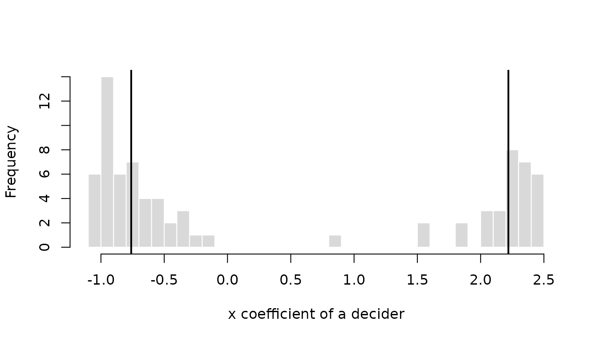
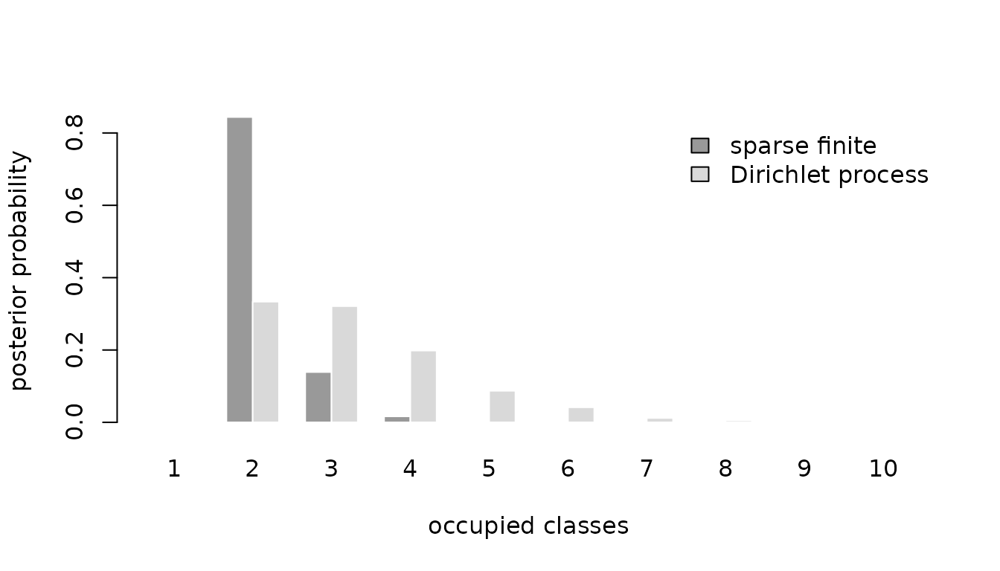

# Modeling preference heterogeneity

A model with fixed coefficients says that everyone weighs price, time,
and comfort in the same way. That is rarely true. Some travelers watch
the fare, others the clock; some households would pay a premium for a
local electricity supplier, others would not. This vignette covers the
two ways **RprobitB** ([Oelschläger and Bauer
2026](#ref-Oelschlaeger2026d)) lets preferences differ between deciders:
random coefficients, which spread them continuously over the population,
and latent classes, which sort deciders into groups. Both are requested
through an argument of
[`fit()`](https://loelschlaeger.de/RprobitB/reference/fit.md), as are
the specification choices of
[`vignette("v02_model_variants")`](https://loelschlaeger.de/RprobitB/articles/v02_model_variants.md),
and both build on the fixed-coefficient model of
[`vignette("v01_get_started")`](https://loelschlaeger.de/RprobitB/articles/v01_get_started.md).
Oelschläger ([2026b](#ref-Oelschlaeger2026c)) treats the methodological
background.

Each section first estimates the variant on simulated data and compares
the estimates with the parameters that generated them, then applies it
to empirical data from the **mlogit** package ([Croissant
2020](#ref-Croissant2020)) and the **choicedata** package ([Oelschläger
2026a](#ref-Oelschlaeger2026a)). Panel data are essential here: the
population distribution of a coefficient is learned from deciders
observed repeatedly, so all simulations use several choices per decider.

``` r

library(RprobitB)
set.seed(1)
```

## Random coefficients

Terms named in `random_effects` receive a coefficient of their own for
every decider, drawn from a population distribution that the sampler
estimates along with everything else. Such hierarchical models capture
continuous preference heterogeneity and allow inference about the
coefficients of individual deciders ([Allenby and Rossi
1998](#ref-Allenby1998)).

An unnamed vector requests correlated normal effects. A named vector
selects the mixing distribution of each term, written as
`"<covariate>" = "<distribution>"`, where `"ASC"` names the
alternative-specific constants:

| Value    | Distribution            | Coefficient |
|:---------|:------------------------|:------------|
| `"cn"`   | correlated normal       | any sign    |
| `"n"`    | uncorrelated normal     | any sign    |
| `"cln"`  | correlated log-normal   | positive    |
| `"ln"`   | uncorrelated log-normal | positive    |
| `"cln-"` | correlated log-normal   | negative    |
| `"ln-"`  | uncorrelated log-normal | negative    |

Two choices are behind these six values. The first is the shape of the
distribution. A normal coefficient may take any value, which is the
natural choice for an attribute that some deciders like and others
dislike. A log-normal coefficient is the exponential of a normal
variable and is therefore always positive, or, with the trailing minus,
always negative. Use it when theory fixes the sign: a higher price
should not raise the utility of any decider, however price-insensitive
they are. Log-normal effects are estimated on the latent normal scale,
so `mu`, `Omega`, and the individual draws refer to the normal variable
whose exponential enters the utility.

The second choice is whether an effect is correlated with the other
correlated effects. Deciders who care about travel time may also care
about comfort, and the `c` prefix lets the model learn that.
Uncorrelated effects keep their own variance but no covariance with
anything else, which shows up as zeros in the covariance matrix `Omega`.

The proof of concept combines both choices. The price coefficient is
negative log-normal and therefore uncorrelated, while travel time and
comfort receive correlated normal effects with a positive covariance.

``` r

mixing <- fit(
  choice ~ price + time + comfort | 0,
  random_effects = c(price = "ln-", time = "cn", comfort = "cn"),
  n_deciders = 400,
  n_occasions = 12,
  dgp_parameters = list(
    beta = c(price = -1, time = -0.8, comfort = 0.5),
    Omega = rbind(c(0.25, 0, 0), c(0, 0.4, 0.2), c(0, 0.2, 0.3))
  ),
  iterations = 2000,
  warmup = 1000,
  chains = 2,
  save_individual_draws = TRUE
)
summary(mixing)
#> Bayesian probit choice model
#> Formula: choice ~ price + time + comfort | 0 | 0 
#> Samples: 1000 retained per chain, 2 chains
#> 
#>                variable   dgp   mean   mode     sd rhat ess_bulk
#>               mu[price] -1.00 -0.983 -0.976 0.0590 1.09    18.34
#>                mu[time] -0.80 -0.799 -0.798 0.0529 1.15     9.39
#>             mu[comfort]  0.50  0.522  0.522 0.0444 1.08    21.13
#>      Omega[price,price]  0.25  0.349  0.308 0.0883 1.46     4.10
#>        Omega[time,time]  0.40  0.472  0.446 0.0737 1.33     5.06
#>     Omega[time,comfort]  0.20  0.208  0.209 0.0365 1.03    74.59
#>  Omega[comfort,comfort]  0.30  0.367  0.348 0.0548 1.22     7.29
```

The `dgp` column shows what the three specifications produce. All three
means are recovered, and for the price coefficient `mu[price]` is the
mean of the latent normal variable, so the coefficient entering the
utility is minus its exponential and stays negative for every decider.
The covariance matrix mirrors the specification: `time` and `comfort`
share the estimated covariance `Omega[time,comfort]`, while `price` has
no covariance entry with either of them, because an uncorrelated effect
has none to estimate.

[`interpret()`](https://loelschlaeger.de/RprobitB/reference/interpret.md)
turns such coefficients into trade-offs. For a random effect it uses the
coefficient of the median decider, for the log-normal price therefore
minus the exponential of `mu[price]`:

``` r

interpret(mixing, reference = "price")
#> 1 `time` compensates -2.14 `price` (95% interval -2.48 to -1.83)
#> 1 `comfort` compensates 1.4 `price` (95% interval 1.14 to 1.66)
```

The `dgp_parameters` put the latent mean of the price effect at `-1`, so
the median price coefficient is `-exp(-1)`, about `-0.37`. One unit of
time is therefore worth -2.17 units of price and one unit of comfort
1.36, which the intervals cover.

Individual coefficients are what the panel buys.
`coef(level = "individual")` returns the posterior mean coefficient of
every decider, on the latent normal scale for log-normal effects.

``` r

head(coef(mixing, level = "individual"))
#>        price       time    comfort
#> 1 -0.8163486 -0.3926287  1.1094096
#> 2 -1.0311631  0.4183956  0.3786188
#> 3 -1.1071621 -1.1925806  0.3301504
#> 4 -1.2367155 -1.5643469 -0.3534857
#> 5 -0.5936260 -0.3103094  0.7787451
#> 6 -1.0373844 -1.5510612  0.4398722
```

Their spread is the estimated heterogeneity. Turning the latent price
values into coefficients shows that every decider dislikes a higher
price, and that the tenth percentile reacts almost twice as strongly as
the ninetieth.

``` r

individual <- coef(mixing, level = "individual")
round(quantile(-exp(individual[, "price"]), c(0.1, 0.5, 0.9)), 2)
#>   10%   50%   90% 
#> -0.54 -0.36 -0.27
```

A picture says it faster. The histogram shows the price coefficient of
each of the 400 deciders, with the three quantiles above marked. Every
decider sits on the negative side, which is what the log-normal
specification enforces, and the tail to the left holds those who react
most strongly to a higher price.

``` r

price <- -exp(individual[, "price"])
hist(
  price,
  breaks = 30, col = "grey85", border = "white",
  main = "", xlab = "price coefficient of a decider"
)
abline(v = quantile(price, c(0.1, 0.5, 0.9)), lwd = 2)
```


### How much is a local electricity supplier worth?

The `Electricity` data of the **mlogit** package ([Croissant
2020](#ref-Croissant2020)) come from a stated choice experiment in which
361 US households chose 8 to 12 times among four hypothetical suppliers
that differ in price (`pf`), contract length (`cl`), whether the
supplier is local (`loc`) or well-known (`wk`), and whether it offers
time-of-day (`tod`) or seasonal (`seas`) rates ([Huber and Train
2001](#ref-Huber2001)). Huber and Train ([2001](#ref-Huber2001)) used
these data to check whether hierarchical Bayesian and classical
estimates of individual preferences agree, and found that they largely
do. The attribute columns end in the supplier number without a
delimiter, `pf1` to `pf4`, so an underscore is inserted first, and the
choice occasions of a household are numbered in the order of the rows.

Contract length and locality receive correlated normal random
coefficients, the other three attributes one coefficient for everyone.
Keeping the number of random coefficients small is deliberate: each one
adds a row and a column to every covariance draw, and the chains below
have to be long enough that the result can be believed rather than
merely displayed. Fixing the price coefficient to `-1` identifies the
scale and puts every other coefficient in cents per kWh, that is,
expresses it directly as a willingness to pay. All six attributes have
to enter the model: suppliers with time-of-day or seasonal rates carry a
price of zero in these data, so leaving their dummies out would hand
their missing price level to the price coefficient and turn it positive.

``` r

data("Electricity", package = "mlogit")
names(Electricity) <- sub("([a-z]+)([1-4])$", "\\1_\\2", names(Electricity))
Electricity$occasion <- ave(Electricity$id, Electricity$id, FUN = seq_along)
electricity <- fit(
  choice ~ pf + cl + loc + wk + tod + seas | 0,
  data = Electricity,
  random_effects = c("cl", "loc"),
  column_decider = "id",
  column_occasion = "occasion",
  scale = c(pf = -1),
  iterations = 3000,
  warmup = 1500,
  thin = 2,
  chains = 2,
  save_individual_draws = TRUE,
  progress = FALSE
)
summary(electricity)
#> Bayesian probit choice model
#> Formula: choice ~ pf + cl + loc + wk + tod + seas | 0 | 0 
#> Samples: 750 retained per chain, 2 chains
#> 
#>        variable    mean    mode     sd rhat ess_bulk
#>        beta[wk]  1.5224  1.5259 0.0754 1.01    295.9
#>       beta[tod] -8.7348 -8.7287 0.0765 1.01    200.5
#>      beta[seas] -9.2978 -9.2676 0.0840 1.02    216.6
#>          mu[cl] -0.2165 -0.2152 0.0274 1.01    723.4
#>         mu[loc]  2.0493  2.0366 0.1259 1.00    372.2
#>    Omega[cl,cl]  0.1886  0.1839 0.0223 1.00    359.5
#>   Omega[cl,loc]  0.0459  0.0402 0.0508 1.00    295.8
#>  Omega[loc,loc]  2.2652  2.1807 0.3320 1.00    326.6
#>      Sigma[2,2]  7.0883  7.0644 0.7139 1.03     52.8
#>      Sigma[2,3]  2.8021  2.6859 0.5159 1.04     43.3
#>      Sigma[3,3]  5.8244  5.7776 0.6674 1.00     99.8
#>      Sigma[2,4]  3.3193  3.1529 0.4972 1.12     18.0
#>      Sigma[3,4]  2.7979  2.6260 0.4605 1.03     59.3
#>      Sigma[4,4]  6.5651  6.3676 0.7563 1.11     16.1
```

The four supplier attributes other than price and contract length are
dummy variables. Households dislike long contracts and prefer local and
well-known suppliers, the three signs that the original analysis reports
as well. Because the price coefficient is fixed,
[`interpret()`](https://loelschlaeger.de/RprobitB/reference/interpret.md)
reads the means directly as willingness to pay in cents per kWh and
attaches credible intervals:

``` r

interpret(electricity, effects = c("cl", "loc", "wk"))
#> 1 `cl` compensates -0.217 `pf` (95% interval -0.271 to -0.164)
#> 1 `loc` compensates 2.05 `pf` (95% interval 1.81 to 2.3)
#> 1 `wk` compensates 1.52 `pf` (95% interval 1.38 to 1.67)
```

On average, households would accept a price about 2 cents per kWh higher
for a local supplier, and every additional year of contract length would
have to be compensated by a price about 0.22 cents lower. The
`Omega[...]` variables describe how widely these valuations differ
between households: the standard deviation of the locality premium is
1.5 cents, so the households disagree about it by more than its average
size.

A word on cost. This fit takes a few seconds because it draws one
coefficient pair per household in every iteration. Doubling the
households roughly doubles the time, and each further random coefficient
adds a row and a column to every covariance draw. The five-attribute
model on all 361 households that the original study used is a matter of
minutes rather than seconds, and it needs far more than four thousand
iterations before its covariance entries settle down.

## Latent classes

A single normal distribution is a strong assumption about how
preferences are spread across a population. Perhaps there are commuters
and leisure travelers, or households that care about price and
households that care about service. `latent_class_effects` names the
effects that differ between `classes` latent classes. For a random
effect this replaces its normal distribution by a finite mixture of
normals, which yields the latent-class mixed multinomial probit model of
Oelschläger and Bauer ([2021](#ref-Oelschlaeger2021)); Oelschläger
([2026b](#ref-Oelschlaeger2026c)) places it among the broader challenges
of modeling choice-behavior heterogeneity. Random effects that are not
named keep one distribution for all deciders, and a named coefficient
that is not random gets one value per class without varying within it,
which a later subsection shows. Three different questions call for three
different specifications:

- `class_update = "fixed"` when exactly $`K`$ substantively meaningful
  classes are assumed;
- `class_update = "sparse"` when `classes` is a deliberately generous
  upper bound and redundant classes should empty out;
- `class_update = "dirichlet_process"` for a Dirichlet-process mixture
  whose number of occupied classes is itself random.

These models answer different questions, so pick one when you design the
study rather than after seeing the class-specific results. A fourth
option, `class_update = "weight_based"`, reproduces the
split/remove/merge heuristic of earlier **RprobitB** versions; it is a
search procedure, not another Bayesian model.

All four updates are demonstrated on one simulated data set with two
classes. The fixed-class fit simulates it; the other three are refits of
it through [`update()`](https://rdrr.io/r/stats/update.html), which
reuses its simulated data and replaces only the arguments that are
named, so that all updates are judged on identical observations. The
empirical application is shown for the fixed update.

### A fixed number of classes

For `class_update = "fixed"`, `classes = K` fixes the number of classes
and every class stays occupied, which is the direct specification for a
filled $`K`$-class model chosen a priori. If classes should instead be
allowed to empty, that is the question the sparse finite mixture below
answers.

The fixed model uses
$`(w_1,\ldots,w_K)\sim\operatorname{Dirichlet}(\delta,\ldots,\delta)`$.
Its default `class_concentration = 1` is uniform on the weight simplex;
$`\delta < 1`$ favors unequal weights near its boundary and
$`\delta > 1`$ shrinks weights toward $`1/K`$. This prior remains
influential when the likelihood separates the classes only weakly. It
can be fixed to another positive scalar or given a gamma hyperprior
with, for example,
`prior = list(class_concentration = c(shape = 2, rate = 2))`. Report the
choice and check sensitivity whenever class sizes drive the
interpretation.

Which class is called the first one is arbitrary: swapping the labels
leaves the likelihood unchanged, so the sampler may swap them mid-run
and a posterior mean would average over both meanings. Ordering the
classes by one parameter, say by decreasing weight, does not reliably
repair this ([Stephens 2000](#ref-Stephens2000)). **RprobitB** instead
leaves the sampler free and relabels the retained draws afterwards. It
reads off a representative grouping of the deciders from the posterior
co-clustering matrix ([Dahl 2006](#ref-Dahl2006)), matches every draw’s
allocation to it ([Papastamoulis and Iliopoulos
2010](#ref-Papastamoulis2010)), and permutes weights, means,
covariances, and allocations accordingly. Sorting the relabeled weights
at the end is a naming convention, not the thing that identifies the
classes.

The proof of concept uses eight occasions per decider and two
well-separated classes: a majority whose coefficient is centered at `-1`
and a minority centered at `2`. These conditions are deliberately
favorable, because class-specific distributions are hard to learn from
short panels. Two chains of four thousand iterations are long enough
here that the diagnostics in the summary can be taken at face value.

``` r

mixture <- fit(
  choice ~ x | 0,
  random_effects = "x",
  latent_class_effects = "x",
  classes = 2,
  n_deciders = 80,
  n_occasions = 8,
  save_individual_draws = TRUE,
  dgp_parameters = list(
    beta = list(c(x = -1), c(x = 2)),
    Omega = list(matrix(0.2), matrix(0.2)),
    weights = c(0.6, 0.4)
  ),
  iterations = 4000,
  warmup = 2000,
  chains = 2,
  progress = FALSE
)
summary(mixture, variables = c(
  "weight[1]", "weight[2]", "mu[x,1]", "mu[x,2]",
  "Omega[x,x,1]", "Omega[x,x,2]"
))
#> Bayesian probit choice model
#> Formula: choice ~ x | 0 | 0 
#> Samples: 2000 retained per chain, 2 chains
#> 
#>      variable  dgp   mean   mode     sd rhat ess_bulk
#>     weight[1]  0.6  0.607  0.618 0.0601 1.00    398.3
#>     weight[2]  0.4  0.393  0.382 0.0601 1.00    398.3
#>       mu[x,1] -1.0 -0.761 -0.736 0.1087 1.00    335.4
#>       mu[x,2]  2.0  2.219  2.221 0.3363 1.03     56.1
#>  Omega[x,x,1]  0.2  0.201  0.141 0.0982 1.01    156.1
#>  Omega[x,x,2]  0.2  0.410  0.190 0.4110 1.01     46.7
```

The relabeled weights and means can be read class by class. The class
near `-1` holds about half of these 80 deciders, a little less than its
population weight of `0.6`, and the class near `2` the rest. The class
variances are the least precise entries, but `rhat` stays at the
threshold and the effective sample sizes are in the hundreds, so the
table describes the posterior rather than one chain’s wanderings. That
check is worth repeating for every mixture fit, because relabeling
cannot repair poor mixing or weak class separation.

The three updates below relabel their draws in the same way, so their
summaries carry class-specific weights and means as well. Where the
number of classes varies, a class exists only in part of the draws, and
the `occupied` column reports that share. Classes that no decider ever
occupies are left out, which is why the class indices in the tables
below may skip a number. The refits on shared data have no `dgp` column,
so a small helper compares them with the stored truth: the most probable
number of occupied classes, and, after assigning every decider to the
true class whose mean is closer to their posterior mean coefficient, the
share of deciders in the second class and the average coefficient in
each class. The true weight is the population weight; the realized share
among 80 simulated deciders differs from it by sampling variation.

``` r

truth <- mixture$simulation$dgp_parameters
class_means <- c(truth$beta[[1]][["x"]], truth$beta[[2]][["x"]])
recover_classes <- function(x) {
  occupancy <- latent_class_diagnostics(x)$occupancy
  individual <- coef(x, level = "individual")[, "x"]
  upper <- individual > mean(class_means)
  data.frame(
    variable = c("n_classes", "weight[2]", "mu[x,1]", "mu[x,2]"),
    dgp = c(length(truth$weights), truth$weights[2], class_means),
    estimate = c(
      occupancy$n_classes[which.max(occupancy$probability)],
      mean(upper), mean(individual[!upper]), mean(individual[upper])
    )
  )
}
recover_classes(mixture)
#>    variable  dgp   estimate
#> 1 n_classes  2.0  2.0000000
#> 2 weight[2]  0.4  0.4000000
#> 3   mu[x,1] -1.0 -0.7740019
#> 4   mu[x,2]  2.0  2.1637702
```

The two classes are visible in the individual coefficients. Each decider
contributes one value, and the two estimated class means mark where the
mixture places its classes.

``` r

individual_x <- coef(mixture, level = "individual")[, "x"]
hist(
  individual_x,
  breaks = 30, col = "grey85", border = "white",
  main = "", xlab = "x coefficient of a decider"
)
abline(v = coef(mixture)[c("mu[x,1]", "mu[x,2]")], lwd = 2)
```



Two clearly separated groups of deciders, one on either side of zero,
and almost nobody in between: that is the pattern a mixture is meant to
find. A single normal distribution would have to put most of its mass
where no decider actually is.

The label-invariant co-clustering matrix and the allocation uncertainty
are available regardless of class names:

``` r

class_diagnostics <- latent_class_diagnostics(mixture)
class_diagnostics$occupancy
#>   n_classes probability
#> 1         2           1
class_diagnostics$membership[1:6, ]
#>   class_1 class_2
#> 1 0.99500 0.00500
#> 2 0.99750 0.00250
#> 3 0.99625 0.00375
#> 4 0.99350 0.00650
#> 5 0.00025 0.99975
#> 6 0.99700 0.00300
class_diagnostics$co_clustering[1:6, 1:6]
#>         1       2       3       4       5       6
#> 1 1.00000 0.99400 0.99275 0.99050 0.00525 0.99250
#> 2 0.99400 1.00000 0.99425 0.99250 0.00275 0.99500
#> 3 0.99275 0.99425 1.00000 0.99125 0.00400 0.99425
#> 4 0.99050 0.99250 0.99125 1.00000 0.00675 0.99100
#> 5 0.00525 0.00275 0.00400 0.00675 1.00000 0.00325
#> 6 0.99250 0.99500 0.99425 0.99100 0.00325 1.00000
```

Asking for two filled classes is not evidence that two meaningful
populations exist. When $`K`$ is not fixed by the research design, fit
each candidate value to the same data and compare the decider-level
predictive accuracy. The `loo` package ([Vehtari et al.
2026](#ref-Vehtari2026)) supplies the comparison and
[`WAIC()`](https://loelschlaeger.de/RprobitB/reference/WAIC.md) is the
less diagnostic alternative;
[`vignette("v05_model_evaluation")`](https://loelschlaeger.de/RprobitB/articles/v05_model_evaluation.md)
covers both. Standard [`AIC()`](https://rdrr.io/r/stats/AIC.html) and
[`BIC()`](https://rdrr.io/r/stats/AIC.html) also work, because
[`logLik()`](https://rdrr.io/r/stats/logLik.html) returns a proper
`logLik` object, but their asymptotic justification is fragile for
mixtures, so PSIS-LOO is preferred.

``` r

models_by_K <- lapply(1:3, function(K) {
  class_effects <- if (K > 1) "x" else character()
  update(
    mixture, classes = K, latent_class_effects = class_effects,
    iterations = 2000, warmup = 1000, thin = 20
  )
})
loo::loo_compare(
  lapply(models_by_K, loo, ghk_draws = 50, progress = FALSE)
)
#> Warning: Some Pareto k diagnostic values are too high. See help('pareto-k-diagnostic') for details.
#> Warning: Some Pareto k diagnostic values are too high. See help('pareto-k-diagnostic') for details.
#> Warning: Some Pareto k diagnostic values are too high. See help('pareto-k-diagnostic') for details.
#>   model elpd_diff se_diff p_worse diag_diff      diag_elpd
#>  model2       0.0     0.0      NA           1 k_psis > 0.5
#>  model3      -0.5     0.5    0.88   N < 100 1 k_psis > 0.5
#>  model1     -11.3     3.5    1.00   N < 100 3 k_psis > 0.5
#> 
#> Diagnostic flags present.
#> See ?`loo-glossary` (sections `diag_diff` and `diag_elpd`)
#> or https://mc-stan.org/loo/reference/loo-glossary.html.
```

The two-class model wins over the one-class model by several standard
errors, and the third class buys nothing: its expected predictive
accuracy is within noise of the second. That is the answer one hopes for
from data that were generated with two classes. The three fits are
thinned and use fewer GHK draws than the default, because each
[`loo()`](https://loelschlaeger.de/RprobitB/reference/loo.RprobitB_fit.md)
call evaluates the panel likelihood of every decider under every
retained draw.

An empirical application of the fixed update follows in the next
subsection, where the train travelers of
[`vignette("v01_get_started")`](https://loelschlaeger.de/RprobitB/articles/v01_get_started.md)
split into two classes with different values of time.

### Coefficients that differ only between classes

The mixture above lets the coefficient vary within a class as well:
every decider has their own `x` coefficient, drawn from the normal
distribution of their class. The classical latent class model is
stricter. All members of a class share the same coefficient, so the
heterogeneity lives entirely in the class membership ([Kamakura and
Russell 1989](#ref-Kamakura1989); [Greene and Hensher
2003](#ref-Greene2003)), which market research knows as segmentation.

**RprobitB** fits this model when a covariate in `latent_class_effects`
has no random effect: its fixed coefficient then takes one value per
class, reported as `beta[<effect>,<class>]`. Random and class-specific
effects share the class allocation, so a model may have classes that
differ in their price coefficient while the time coefficient varies
normally within each class, either with the same distribution in every
class or, if `time` is named in both arguments, with class-specific
distributions.

The proof of concept simulates two classes of travelers, a majority with
a price coefficient of `-2` and a minority with `-0.5`, who value time
equally.

``` r

class_specific <- fit(
  choice ~ price + time | 0,
  latent_class_effects = "price",
  classes = 2,
  n_deciders = 300,
  n_occasions = 10,
  dgp_parameters = list(
    beta = list(c(price = -2, time = 1), c(price = -0.5, time = 1)),
    weights = c(0.6, 0.4)
  ),
  chains = 1
)
summary(class_specific)
#> Bayesian probit choice model
#> Formula: choice ~ price + time | 0 | 0 
#> Samples: 500 retained per chain, 1 chain
#>       variable  dgp   mean   mode     sd rhat ess_bulk
#>     beta[time]  1.0  0.972  0.978 0.0365 1.02    28.49
#>      weight[1]  0.6  0.615  0.614 0.0364 1.04    85.30
#>      weight[2]  0.4  0.385  0.386 0.0364 1.04    85.30
#>  beta[price,1] -2.0 -2.035 -2.065 0.0947 1.24     4.27
#>  beta[price,2] -0.5 -0.455 -0.453 0.0454 1.15     6.96
```

The estimated class weights of 0.61 and 0.39 and the class-specific
price coefficients of -2.03 and -0.46 are close to the values used for
the simulation, and the common time coefficient is estimated from all
deciders at once. Since every class has its own price coefficient,
[`interpret()`](https://loelschlaeger.de/RprobitB/reference/interpret.md)
reports one willingness to pay per class:

``` r

interpret(class_specific, reference = "price")
#> Class 1: 1 `time` compensates 0.478 `price` (95% interval 0.443 to 0.522)
#> Class 2: 1 `time` compensates 2.16 `price` (95% interval 1.74 to 2.65)
```

Back to the train travelers of
[`vignette("v01_get_started")`](https://loelschlaeger.de/RprobitB/articles/v01_get_started.md):
do all of them trade time against money at the same rate, or are there
classes with different values of time? The fit below uses the first 100
travelers, keeps the price normalization, and gives the time coefficient
two class-specific values, so that each class has its own value of an
hour of travel time, while the remaining coefficients are common.

``` r

data("Train", package = "mlogit")
Train$price_A <- Train$price_A / 100 / 2.20371
Train$price_B <- Train$price_B / 100 / 2.20371
Train$time_A <- Train$time_A / 60
Train$time_B <- Train$time_B / 60
train_small <- Train[Train$id %in% unique(Train$id)[1:100], ]
train_classes <- fit(
  choice ~ price + time + change + factor(comfort) | 0,
  data = train_small,
  latent_class_effects = "time",
  classes = 2,
  column_decider = "id",
  column_occasion = "choiceid",
  scale = c(price = -1),
  iterations = 2500,
  warmup = 1250,
  chains = 2,
  progress = FALSE
)
summary(train_classes, variables = c(
  "weight[1]", "weight[2]", "beta[time,1]", "beta[time,2]"
))
#> Bayesian probit choice model
#> Formula: choice ~ price + time + change + factor(comfort) | 0 | 0 
#> Samples: 1250 retained per chain, 2 chains
#> 
#>      variable    mean    mode     sd rhat ess_bulk
#>     weight[1]   0.862   0.882 0.0577 1.01     86.4
#>     weight[2]   0.138   0.118 0.0577 1.01     86.4
#>  beta[time,1]  -3.465  -3.536 0.6788 1.02    113.7
#>  beta[time,2] -20.444 -19.017 5.3399 1.04     52.1
```

With the price coefficient fixed at `-1`, the class-specific time
coefficients are values of travel time in euro per hour, which
[`interpret()`](https://loelschlaeger.de/RprobitB/reference/interpret.md)
reports class by class:

``` r

time_by_class <- interpret(train_classes, effects = "time")
time_by_class
#> Class 1: 1 `time` compensates -3.47 `price` (95% interval -4.74 to -2.15)
#> Class 2: 1 `time` compensates -20.4 `price` (95% interval -36.1 to -13.2)
```

The larger class of 86 percent of the travelers values an hour at 3.5
euro, the smaller class at 20.4 euro. The small class takes the faster
trip almost regardless of its price, a pattern that a single normal
distribution of the time coefficient would blur into a heavy tail. The
diagnostics of both weights and both time coefficients are sound, so
this is a result rather than a demonstration.

### Weight-based class updates

The weight-based update of Oelschläger and Bauer
([2021](#ref-Oelschlaeger2021)) is kept for backward compatibility and
for reproducing earlier **RprobitB** analyses; Oelschläger
([2026b](#ref-Oelschlaeger2026c)) discusses its broader context. Every
`buffer` warmup iterations, the heuristic attempts at most one
operation, in this order:

1.  remove the smallest class if its weight is below `epsmin`;
2.  split the largest class if its weight is above `epsmax`;
3.  merge the closest pair if the Euclidean distance of their means is
    below `deltamin`.

After a split, the new means are displaced by `deltashift` times the
leading within-class standard deviation. The original defaults are
`buffer = 50`, `epsmin = 0.01`, `epsmax = 0.7`, `deltamin = 0.1`, and
`deltashift = 0.5`; override them with `weight_based_control`.
`max_classes` bounds the splitting.

These dimension changes have no Metropolis-Hastings acceptance step and
correspond to no prior on the class count. Updates stop after warmup, so
the retained draws condition on whatever dimension each chain selected.
The reported `n_classes` is accordingly a heuristic result, not a
posterior distribution. There is no universally valid calibration of the
five constants: any use should report them and repeat the analysis over
substantively plausible settings. For inferential claims, prefer the
fixed, sparse finite, or Dirichlet-process specifications.

The proof of concept keeps the update defaults, and a second run
tightens two of the five constants through `weight_based_control`: it
checks more often and refuses to split a class before its weight passes
0.8.

``` r

weight_based <- update(mixture, class_update = "weight_based")
recover_classes(weight_based)
#>    variable  dgp   estimate
#> 1 n_classes  2.0  2.0000000
#> 2 weight[2]  0.4  0.4000000
#> 3   mu[x,1] -1.0 -0.7775812
#> 4   mu[x,2]  2.0  2.0861235
tuned <- update(
  mixture,
  class_update = "weight_based",
  weight_based_control = list(buffer = 25, epsmax = 0.8)
)
recover_classes(tuned)
#>    variable  dgp  estimate
#> 1 n_classes  2.0  2.000000
#> 2 weight[2]  0.4  0.400000
#> 3   mu[x,1] -1.0 -0.769339
#> 4   mu[x,2]  2.0  2.167189
```

The heuristic keeps both classes, and the share and the class means come
out as in the table of the fixed fit. That is what it was designed for;
the caveats above concern what its result means, not whether it can find
two well-separated classes.

### Sparse finite mixtures

A sparse finite mixture fixes a generous upper bound $`K`$, permits
empty classes, and places a symmetric Dirichlet prior

``` math
(w_1,\ldots,w_K) \mid e_0 \sim \operatorname{Dirichlet}(e_0,\ldots,e_0)
```

on the weights. A small $`e_0`$ favors emptying redundant classes. Under
regularity conditions, overfitted classes empty asymptotically when the
Dirichlet parameter is below half the dimension of a class-specific
parameter ([Rousseau and Mengersen 2011](#ref-Rousseau2011)). This
result motivates sparsity but does not make the prior harmless: both
$`K`$ and $`e_0`$ affect the posterior of the occupied count
([Frühwirth-Schnatter and Malsiner-Walli
2019](#ref-FruehwirthSchnatter2019)).

Before looking at the data, the expected number of occupied classes
after $`N`$ deciders under a fixed $`e_0`$ is

``` math
K\left[1-
\frac{\Gamma(Ke_0)\,\Gamma((K-1)e_0+N)}
     {\Gamma((K-1)e_0)\,\Gamma(Ke_0+N)}\right].
```

The expression makes $`e_0`$ readable as a statement about class counts
instead of an arbitrary small number. Evaluated at the prior mean
$`e_0 = 0.005`$ of the default hyperprior below, with $`K = 6`$ and the
80 deciders of the simulated data, it gives about 1.1 occupied classes:
the prior leans firmly towards simplicity. For a gamma hyperprior, draw
plausible values of $`e_0`$, evaluate the expression, and inspect the
implied distribution before fitting.

Unlike the threshold-based updater, `class_update = "sparse"` uses the
finite-mixture posterior itself to empty classes. The default
`class_concentration = c(shape = 1, rate = 200)` puts the gamma
hyperprior $`e_0\sim\operatorname{Gamma}(1,200)`$ on the shape-rate
scale used by R. The concentration is updated from its full conditional
with a fixed log-random-walk Metropolis-Hastings step. Its proposal
scale affects the sampling efficiency, not the posterior target; `rhat`
and the effective sample size diagnose that step like any other scalar
posterior variable.

The proof of concept offers six classes to the two-class data.

``` r

sparse <- update(mixture, classes = 6, class_update = "sparse")
summary(sparse)
#> Bayesian probit choice model
#> Formula: choice ~ x | 0 | 0 
#> Samples: 2000 retained per chain, 2 chains
#> 
#>             variable occupied    mean     mode      sd rhat ess_bulk
#>            weight[1]   1.0000  0.6052  0.60309 0.06094 1.02   153.05
#>            weight[2]   1.0000  0.3897  0.39594 0.06006 1.01   463.12
#>            weight[3]   0.0777  0.0293  0.01278 0.02906   NA       NA
#>            weight[4]   0.0437  0.0229  0.00876 0.02191   NA       NA
#>            weight[5]   0.0385  0.0251  0.00825 0.02953   NA       NA
#>            weight[6]   0.0135  0.0238  0.00673 0.02227   NA       NA
#>              mu[x,1]   1.0000 -0.7565 -0.75269 0.11194 1.01   320.44
#>              mu[x,2]   1.0000  2.1569  2.05099 0.31389 1.01    85.14
#>              mu[x,3]   0.0777 -3.3113 -4.99881 3.27128   NA       NA
#>              mu[x,4]   0.0437 -4.5646 -5.92321 2.85016   NA       NA
#>              mu[x,5]   0.0385 -2.4835 -4.92683 2.74781   NA       NA
#>              mu[x,6]   0.0135  0.5556  1.49981 1.82207   NA       NA
#>         Omega[x,x,1]   1.0000  0.2038  0.15520 0.12780 1.01   113.73
#>         Omega[x,x,2]   1.0000  0.4386  0.19973 0.42241 1.05    41.13
#>         Omega[x,x,3]   0.0777  1.2866  0.27913 2.86642   NA       NA
#>         Omega[x,x,4]   0.0437  2.3528  0.36528 4.62401   NA       NA
#>         Omega[x,x,5]   0.0385  0.6045  0.26114 0.60467   NA       NA
#>         Omega[x,x,6]   0.0135  0.4845  0.33944 0.41081   NA       NA
#>  class_concentration   1.0000  0.0104  0.00536 0.00623 1.03    85.69
#>            n_classes   1.0000  2.1735  2.00000 0.42361 1.26     6.49
latent_class_diagnostics(sparse)$occupancy
#>   n_classes probability
#> 1         2      0.8440
#> 2         3      0.1390
#> 3         4      0.0165
#> 4         5      0.0005
recover_classes(sparse)
#>    variable  dgp   estimate
#> 1 n_classes  2.0  2.0000000
#> 2 weight[2]  0.4  0.4000000
#> 3   mu[x,1] -1.0 -0.7905144
#> 4   mu[x,2]  2.0  2.1060220
```

Despite the prior’s preference for a single class, the occupied count
concentrates on two, and the class structure is recovered as by the
fixed model. The concentration parameter is the slowest-mixing quantity,
as its effective sample size shows. A sensitivity analysis should be run
with longer chains until both `n_classes` and `class_concentration` mix
satisfactorily.

For a sensitivity analysis, vary the upper bound and the concentration
prior, then compare occupancy, co-clustering, predictive accuracy, and
the substantive conclusions. A useful less-sparse alternative is
$`e_0\sim\operatorname{Gamma}(2,4K)`$, whose expected total mass
$`K e_0`$ matches the default DP precision below ([Frühwirth-Schnatter
and Malsiner-Walli 2019](#ref-FruehwirthSchnatter2019)).

``` r

sparse_less <- update(
  mixture,
  classes = 6,
  class_update = "sparse",
  prior = list(class_concentration = c(shape = 2, rate = 24))
)
latent_class_diagnostics(sparse_less)$occupancy
#>   n_classes probability
#> 1         2     0.41825
#> 2         3     0.35425
#> 3         4     0.17250
#> 4         5     0.05000
#> 5         6     0.00500
recover_classes(sparse_less)
#>    variable  dgp   estimate
#> 1 n_classes  2.0  2.0000000
#> 2 weight[2]  0.4  0.4000000
#> 3   mu[x,1] -1.0 -0.7746666
#> 4   mu[x,2]  2.0  2.2480394
```

Six classes on offer and a prior that resists emptying them: the
occupied count now spreads from two to five instead of concentrating on
two. The class means are still recovered, because the extra classes hold
few deciders, but the answer to the question how many classes there are
has changed with the prior. That is exactly what a sensitivity analysis
is for, and it is the reason to report the concentration prior alongside
the occupancy table rather than the table alone.

### Dirichlet-process mixtures

For `class_update = "dirichlet_process"`, the precision $`\alpha`$
controls the prior tendency to open new classes. The default
$`\alpha\sim\operatorname{Gamma}(2,4)`$ has mean 0.5; a larger
$`\alpha`$ generally favors more occupied classes. Conditional on a
fixed $`\alpha`$, the Chinese-restaurant-process prior expects
$`\sum_{i=1}^{N}\alpha/(\alpha+i-1)`$ occupied classes after $`N`$
deciders, which for $`\alpha = 0.5`$ and 80 deciders is about 3.2. Use
this quantity to translate beliefs about plausible class counts into
candidate values or gamma hyperpriors. **RprobitB** updates $`\alpha`$
with the beta-gamma augmentation of Escobar and West
([1995](#ref-Escobar1995)) and the allocations with the
auxiliary-parameter algorithm of Neal ([2000](#ref-Neal2000)), using ten
auxiliary classes per reassignment; this choice affects computation and
mixing, not the posterior target. `max_classes` is a computational cap,
not the inferred count: if posterior mass reaches the cap, refit with a
larger value.

The proof of concept lets the process decide how many classes the
two-class data need.

``` r

dynamic <- update(
  mixture, class_update = "dirichlet_process", iterations = 2500,
  warmup = 1250
)
#> Warning: The retained draws reach the maximum of 10 latent classes.
#> ℹ Increase `max_classes` and refit to check the bound.
summary(dynamic)
#> Bayesian probit choice model
#> Formula: choice ~ x | 0 | 0 
#> Samples: 1250 retained per chain, 2 chains
#> 
#>             variable occupied    mean    mode      sd rhat ess_bulk
#>            weight[1]   1.0000  0.5755  0.5998 0.06900 1.08     89.6
#>            weight[2]   1.0000  0.3426  0.3936 0.06616 1.08     22.4
#>            weight[3]   0.6664  0.0859  0.0211 0.06990   NA       NA
#>            weight[4]   0.3452  0.0486  0.0152 0.04889   NA       NA
#>            weight[5]   0.1468  0.0386  0.0130 0.04354   NA       NA
#>            weight[6]   0.0596  0.0303  0.0133 0.02723   NA       NA
#>            weight[7]   0.0180  0.0194  0.0126 0.00981   NA       NA
#>            weight[8]   0.0060  0.0158  0.0125 0.00742   NA       NA
#>            weight[9]   0.0008  0.0125  0.0125 0.00000   NA       NA
#>           weight[10]   0.0004  0.0125  0.0125      NA   NA       NA
#>              mu[x,1]   1.0000 -0.7774 -0.7718 0.12929 1.01    218.1
#>              mu[x,2]   1.0000  2.2453  2.0450 0.48657 1.05     19.8
#>              mu[x,3]   0.6664  1.3931  1.9046 2.03380   NA       NA
#>              mu[x,4]   0.3452  0.9453 -0.3744 2.00520   NA       NA
#>              mu[x,5]   0.1468  1.3063 -0.4964 2.19466   NA       NA
#>              mu[x,6]   0.0596  0.9675  1.0852 1.96649   NA       NA
#>              mu[x,7]   0.0180  1.4371  1.8935 2.33256   NA       NA
#>              mu[x,8]   0.0060  1.3424  0.5347 2.34234   NA       NA
#>              mu[x,9]   0.0008  0.1415 -0.4154 0.79075   NA       NA
#>             mu[x,10]   0.0004 -2.5077 -2.5077      NA   NA       NA
#>         Omega[x,x,1]   1.0000  0.1916  0.1377 0.10038 1.03     86.4
#>         Omega[x,x,2]   1.0000  0.4715  0.1846 0.60096 1.04     85.2
#>         Omega[x,x,3]   0.6664  0.6610  0.2078 0.96489   NA       NA
#>         Omega[x,x,4]   0.3452  0.7436  0.2636 1.10819   NA       NA
#>         Omega[x,x,5]   0.1468  0.8780  0.2897 1.30039   NA       NA
#>         Omega[x,x,6]   0.0596  1.0189  0.2729 2.22782   NA       NA
#>         Omega[x,x,7]   0.0180  1.0172  0.4340 1.21229   NA       NA
#>         Omega[x,x,8]   0.0060  0.9291  0.2962 1.19804   NA       NA
#>         Omega[x,x,9]   0.0008  0.1284  0.1726 0.06282   NA       NA
#>        Omega[x,x,10]   0.0004  0.5693  0.5693      NA   NA       NA
#>  class_concentration   1.0000  0.5097  0.3384 0.29316 1.01    276.8
#>            n_classes   1.0000  3.2432  2.0000 1.24606 1.03     46.2
latent_class_diagnostics(dynamic)$occupancy
#>   n_classes probability
#> 1         2      0.3336
#> 2         3      0.3212
#> 3         4      0.1984
#> 4         5      0.0872
#> 5         6      0.0416
#> 6         7      0.0120
#> 7         8      0.0052
#> 8         9      0.0004
#> 9        10      0.0004
recover_classes(dynamic)
#>    variable  dgp   estimate
#> 1 n_classes  2.0  2.0000000
#> 2 weight[2]  0.4  0.4000000
#> 3   mu[x,1] -1.0 -0.7829333
#> 4   mu[x,2]  2.0  2.2380596
```

`max_classes` caps how many classes the sampler may open. The cap is a
computational limit, not an estimate, and **RprobitB** says so when the
draws reach it:

``` r

capped <- update(dynamic, max_classes = 3)
#> Warning: The retained draws reach the maximum of 3 latent classes.
#> ℹ Increase `max_classes` and refit to check the bound.
latent_class_diagnostics(capped)$occupancy
#>   n_classes probability
#> 1         2       0.518
#> 2         3       0.482
```

The warning is the signal to refit with a larger cap before reading the
occupancy table.

The occupancy distribution is wider than under the sparse finite prior
and keeps a substantial share of its mass on three or more classes. That
is the prior at work: for a data set of this size it expects about three
occupied classes, and 80 deciders do not overrule it completely. The
label-invariant comparison nevertheless recovers the two true groups,
because any superfluous class holds only a few deciders. Whether the
occupancy table can be trusted is decided by the `rhat` and the
effective sample size of the occupied count. Both are acceptable here,
though the effective sample size of `n_classes` is the smallest in the
table: enough for the broad shape of the distribution, not for its third
decimal. The run stays below the cap, so the remaining step is a
sensitivity analysis over the prior on $`\alpha`$. Material mass at the
cap would be a different matter: increase `max_classes` before
interpreting the result.

The two priors can be compared directly by the posterior of the occupied
count. The sparse finite prior concentrates on the two classes that the
data contain, the Dirichlet process spreads its mass wider and keeps
classes that hold only a few deciders.

``` r

occupancy_shares <- function(x, bound) {
  occupancy <- latent_class_diagnostics(x)$occupancy
  shares <- stats::setNames(numeric(bound), seq_len(bound))
  shares[occupancy$n_classes] <- occupancy$probability
  shares
}
bound <- max(
  latent_class_diagnostics(sparse)$occupancy$n_classes,
  latent_class_diagnostics(dynamic)$occupancy$n_classes
)
barplot(
  rbind(
    "sparse finite" = occupancy_shares(sparse, bound),
    "Dirichlet process" = occupancy_shares(dynamic, bound)
  ),
  beside = TRUE, col = c("grey60", "grey85"), border = "white",
  xlab = "occupied classes", ylab = "posterior probability", legend.text = TRUE,
  args.legend = list(x = "topright", bty = "n")
)
```



The occupied class count, the concentration, and the co-clustering
probabilities do not refer to class labels at all and are therefore the
safest summaries here. The relabeled class-specific parameters come with
their `occupied` share: a class that exists in only a small fraction of
the draws describes a handful of deciders, not a group in the
population. Read the two together, and treat classes with a small share
as sampling noise rather than as findings.

The prior on $`\alpha`$ belongs in the reported analysis. For example,
$`\alpha\sim\operatorname{Gamma}(1,200/K)`$ has the same prior mean as
$`K e_0`$ under the default sparse finite prior. Comparing this matched
DP fit with a sparse finite fit helps separate the effect of the mixing
model from that of the concentration prior ([Frühwirth-Schnatter and
Malsiner-Walli 2019](#ref-FruehwirthSchnatter2019)). In every case,
report the prior, the posterior of `class_concentration`, the occupancy
distribution, whether the cap was reached, and the sensitivity to
defensible alternatives.

## Ordered and ranked responses

Both mechanisms work for ordered and ranked responses as well. What they
need is a panel: a population distribution is learned from deciders
observed repeatedly, and the ordered and ranked data sets of the
previous vignettes record one response per decider. The demonstration
therefore uses a simulated panel of rankings, 100 deciders who order
three alternatives five times each, whose coefficient varies normally
around `-1`.

``` r

ranked_random <- fit(
  rank ~ x | 0,
  choice_type = "ranked",
  random_effects = "x",
  n_deciders = 100,
  n_occasions = 5,
  n_alternatives = 3,
  dgp_parameters = list(beta = c(x = -1), Omega = matrix(0.3)),
  iterations = 4000,
  warmup = 2000,
  chains = 2,
  progress = FALSE
)
summary(ranked_random)
#> Bayesian probit choice model
#> Formula: rank ~ x | 0 | 0 
#> Samples: 2000 retained per chain, 2 chains
#> 
#>    variable   dgp   mean   mode     sd rhat ess_bulk
#>       mu[x] -1.00 -1.080 -1.070 0.0998 1.00      247
#>  Omega[x,x]  0.30  0.339  0.295 0.1029 1.01      184
#>  Sigma[B,C]  1.19  0.952  0.983 0.1827 1.00      443
#>  Sigma[C,C]  5.27  4.768  4.406 0.9124 1.00      317
```

The population mean and its variance are recovered next to their true
values, and a full ranking of three alternatives per occasion carries
enough information to do so from a hundred deciders. Latent classes are
requested the same way, with `latent_class_effects` and `classes`, and
everything this vignette says about relabeling, occupancy, and the
concentration priors applies unchanged.

Ordered responses accept the same arguments. Here a hundred deciders
rate something on a three-point scale eight times each, again with a
coefficient that varies normally around `-1`.

``` r

ordered_random <- fit(
  choice ~ x | 0,
  alternatives = c("low", "middle", "high"),
  choice_type = "ordered",
  random_effects = "x",
  n_deciders = 100,
  n_occasions = 8,
  dgp_parameters = list(
    beta = c(x = -1), Omega = matrix(0.3), gamma = c(0, 1)
  ),
  iterations = 4000,
  warmup = 2000,
  chains = 2,
  progress = FALSE
)
summary(ordered_random)
#> Bayesian probit choice model
#> Formula: choice ~ x | 0 | 0 
#> Samples: 2000 retained per chain, 2 chains
#> 
#>    variable  dgp   mean   mode     sd rhat ess_bulk
#>       mu[x] -1.0 -1.060 -1.044 0.0956 1.01      320
#>  Omega[x,x]  0.3  0.363  0.319 0.1079 1.02      189
#>    gamma[2]  1.0  1.097  1.119 0.0597 1.01      404
```

The threshold `gamma[2]` is estimated alongside the population mean and
its variance, and its diagnostics are worth a look: the thresholds are
the one block of an ordered model that no Gibbs step can draw in closed
form, so they are updated by a random walk whose step size is tuned
during warmup. That tuning is what keeps the `gamma` rows mixing once
random coefficients enter, and a long panel makes the thresholds easier
still to pin down. Read their `rhat` and effective sample size the way
[`vignette("v01_get_started")`](https://loelschlaeger.de/RprobitB/articles/v01_get_started.md)
reads any diagnostic.

## Where to go next

Heterogeneity pays off in prediction: with individual coefficients in
hand, `predict(type = "conditional")` in
[`vignette("v04_prediction")`](https://loelschlaeger.de/RprobitB/articles/v04_prediction.md)
tailors the choice probabilities to each decider that took part in the
fit. Deciding how many classes the data support, or whether random
coefficients are worth their price at all, is the business of
[`vignette("v05_model_evaluation")`](https://loelschlaeger.de/RprobitB/articles/v05_model_evaluation.md).

## References

Allenby, Greg M., and Peter E. Rossi. 1998. “Marketing Models of
Consumer Heterogeneity.” *Journal of Econometrics* 89 (1-2): 57–78.
<https://doi.org/10.1016/S0304-4076(98)00055-4>.

Croissant, Yves. 2020. “Estimation of Random Utility Models in R: The
mlogit Package.” *Journal of Statistical Software* 95 (11): 1–41.
<https://doi.org/10.18637/jss.v095.i11>.

Dahl, David B. 2006. “Model-Based Clustering for Expression Data via a
Dirichlet Process Mixture Model.” In *Bayesian Inference for Gene
Expression and Proteomics*, edited by Kim-Anh Do, Peter Müller, and
Marina Vannucci. Cambridge University Press.
<https://doi.org/10.1017/CBO9780511584589.011>.

Escobar, Michael D., and Mike West. 1995. “Bayesian Density Estimation
and Inference Using Mixtures.” *Journal of the American Statistical
Association* 90 (430): 577–88.
<https://doi.org/10.1080/01621459.1995.10476550>.

Frühwirth-Schnatter, Sylvia, and Gertraud Malsiner-Walli. 2019. “From
Here to Infinity: Sparse Finite Versus Dirichlet Process Mixtures in
Model-Based Clustering.” *Advances in Data Analysis and Classification*
13 (1): 33–64. <https://doi.org/10.1007/s11634-018-0329-y>.

Greene, William H., and David A. Hensher. 2003. “A Latent Class Model
for Discrete Choice Analysis: Contrasts with Mixed Logit.”
*Transportation Research Part B: Methodological* 37 (8): 681–98.
<https://doi.org/10.1016/S0191-2615(02)00046-2>.

Huber, Joel, and Kenneth Train. 2001. “On the Similarity of Classical
and Bayesian Estimates of Individual Mean Partworths.” *Marketing
Letters* 12 (3): 259–69. <https://doi.org/10.1023/A:1011120928698>.

Kamakura, Wagner A., and Gary J. Russell. 1989. “A Probabilistic Choice
Model for Market Segmentation and Elasticity Structure.” *Journal of
Marketing Research* 26 (4): 379–90.

Neal, Radford M. 2000. “Markov Chain Sampling Methods for Dirichlet
Process Mixture Models.” *Journal of Computational and Graphical
Statistics* 9 (2): 249–65.
<https://doi.org/10.1080/10618600.2000.10474879>.

Oelschläger, Lennart. 2026a. *choicedata: Working with Choice Data*.
<https://github.com/loelschlaeger/choicedata>.

Oelschläger, Lennart. 2026b. “Overcoming Challenges in Modeling Choice
Behavior Heterogeneity.” PhD thesis, Bielefeld University.
<https://pub.uni-bielefeld.de/record/3014719>.

Oelschläger, Lennart, and Dietmar Bauer. 2021. “Bayes Estimation of
Latent Class Mixed Multinomial Probit Models.” *Proceedings of the 100th
Annual Meeting of the Transportation Research Board* (Washington, DC).
<https://trid.trb.org/view/1759753>.

Oelschläger, Lennart, and Dietmar Bauer. 2026. *RprobitB: Bayesian
Probit Choice Modeling*. <https://CRAN.R-project.org/package=RprobitB>.

Papastamoulis, Panagiotis, and George Iliopoulos. 2010. “An Artificial
Allocations Based Solution to the Label Switching Problem in Bayesian
Analysis of Mixtures of Distributions.” *Journal of Computational and
Graphical Statistics* 19 (2): 313–31.
<https://doi.org/10.1198/jcgs.2010.09008>.

Rousseau, Judith, and Kerrie Mengersen. 2011. “Asymptotic Behaviour of
the Posterior Distribution in Overfitted Mixture Models.” *Journal of
the Royal Statistical Society: Series B (Statistical Methodology)* 73
(5): 689–710. <https://doi.org/10.1111/j.1467-9868.2011.00781.x>.

Stephens, Matthew. 2000. “Dealing with Label Switching in Mixture
Models.” *Journal of the Royal Statistical Society: Series B
(Statistical Methodology)* 62 (4): 795–809.
<https://doi.org/10.1111/1467-9868.00265>.

Vehtari, Aki, Jonah Gabry, Måns Magnusson, et al. 2026. *loo: Efficient
Leave-One-Out Cross-Validation and WAIC for Bayesian Models*.
<https://mc-stan.org/loo/>.
