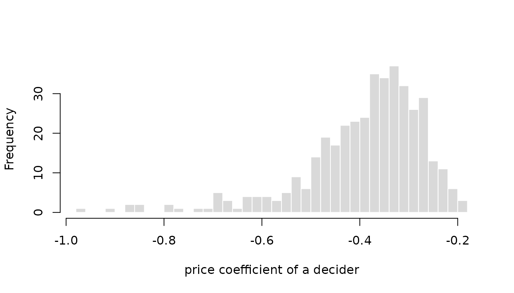

# Modeling preference heterogeneity

The probit model assigns alternative $`j`$ at occasion $`t`$ of decider
$`n`$ the latent utility
$`U_{ntj} = X_{ntj}^\top \beta_n + \epsilon_{ntj}`$ with the coefficient
vector $`\beta_n`$. A model with fixed coefficients sets
$`\beta_n = \beta`$ for all deciders and thereby assumes that all
deciders weigh price, time, and comfort in the same way. This is rarely
true: some travelers react mainly to the fare, others to travel time,
and some households would pay a premium for a local electricity supplier
while others would not. **RprobitB** lets coefficients differ between
deciders in two ways, which can be combined: random coefficients follow
a continuous distribution over the population, and latent classes divide
the deciders into groups. Both are requested through arguments of
[`fit()`](https://loelschlaeger.de/RprobitB/reference/fit.md).
Oelschläger ([2026](#ref-Oelschlaeger2026c)) treats the methodological
background. Each variant is first estimated on simulated data, where the
estimates can be compared with the parameters that generated them, and
then applied to data of the **mlogit** package ([Croissant
2020](#ref-Croissant2020)).

``` r

library(RprobitB)
set.seed(1)
```

## Random coefficients

Each term named in `random_effects` receives a separate coefficient for
every decider, drawn from a population distribution whose parameters the
sampler estimates together with the other parameters. Such hierarchical
models capture continuous preference heterogeneity and allow inference
about the coefficients of individual deciders ([Allenby and Rossi
1998](#ref-Allenby1998)). The population distribution is normal on a
latent scale: the random coefficients of decider $`n`$ are
$`\beta_n \sim \mathrm{N}(\mu, \Omega)`$ with the mean vector $`\mu`$
and the covariance matrix $`\Omega`$, reported as `mu[<effect>]` and
`Omega[<effect>,<effect>]`. The mixing distribution of an effect decides
how its latent normal variable enters the utility. An unnamed vector
requests correlated normal effects. A named vector selects the mixing
distribution of each term as `"<covariate>" = "<distribution>"`, where
`"ASC"` names the alternative-specific constants:

| Value    | Distribution            | Coefficient |
|:---------|:------------------------|:------------|
| `"cn"`   | correlated normal       | any sign    |
| `"n"`    | uncorrelated normal     | any sign    |
| `"cln"`  | correlated log-normal   | positive    |
| `"ln"`   | uncorrelated log-normal | positive    |
| `"cln-"` | correlated log-normal   | negative    |
| `"ln-"`  | uncorrelated log-normal | negative    |

The six values combine two choices. The first is the shape of the
distribution. A normal coefficient can take any value, which suits an
attribute that some deciders like and others dislike. A log-normal
coefficient is the exponential of a normal variable and therefore always
positive, or, with the trailing minus, always negative. It suits an
attribute whose sign is fixed by theory: a higher price does not raise
the utility of any decider. Log-normal effects are estimated on the
latent normal scale, so `mu`, `Omega`, and the individual draws refer to
the normal variable whose exponential enters the utility. The second
choice is whether an effect is correlated with the other correlated
effects. Deciders who value travel time may also value comfort, and the
`c` prefix adds the covariance between such effects to the model. An
uncorrelated effect has its own variance but no covariance with any
other effect, which appears as zeros in `Omega`.

The following demonstration combines both choices. The price coefficient
is negative log-normal and uncorrelated. Travel time and comfort receive
correlated normal effects with a positive covariance.

``` r

mixing <- fit(
  choice ~ price + time + comfort | 0,
  random_effects = c(price = "ln-", time = "cn", comfort = "cn"),
  n_deciders = 400,
  n_occasions = 12,
  dgp_parameters = list(
    beta = c(price = -1, time = -0.8, comfort = 0.5),
    Omega = rbind(c(0.25, 0, 0), c(0, 0.4, 0.2), c(0, 0.2, 0.3))
  ),
  iterations = 2000,
  warmup = 1000,
  chains = 2,
  save_individual_draws = TRUE
)
summary(mixing)
#> Bayesian probit choice model
#> Formula: choice ~ price + time + comfort | 0 | 0 
#> Samples: 1000 retained per chain, 2 chains
#> 
#>                variable   dgp   mean   mode     sd rhat ess_bulk
#>               mu[price] -1.00 -0.983 -0.976 0.0590 1.09    18.34
#>                mu[time] -0.80 -0.799 -0.798 0.0529 1.15     9.39
#>             mu[comfort]  0.50  0.522  0.522 0.0444 1.08    21.13
#>      Omega[price,price]  0.25  0.349  0.308 0.0883 1.46     4.10
#>        Omega[time,time]  0.40  0.472  0.446 0.0737 1.33     5.06
#>     Omega[time,comfort]  0.20  0.208  0.209 0.0365 1.03    74.59
#>  Omega[comfort,comfort]  0.30  0.367  0.348 0.0548 1.22     7.29
```

The `dgp` column lists the parameters that generated the data. For the
price coefficient, `mu[price]` is the mean of the latent normal
variable, so the coefficient that enters the utility is minus its
exponential and negative for every decider. `time` and `comfort` share
the estimated covariance `Omega[time,comfort]`, while `price` has no
covariance entry with either of them.

[`interpret()`](https://loelschlaeger.de/RprobitB/reference/interpret.md)
converts the coefficients into trade-offs. For a random effect it uses
the coefficient of the median decider, which for the log-normal price is
minus the exponential of `mu[price]`:

``` r

interpret(mixing, reference = "price")
#> 1 `time` compensates -2.14 `price` (95% interval -2.48 to -1.83)
#> 1 `comfort` compensates 1.4 `price` (95% interval 1.14 to 1.66)
```

The `dgp_parameters` set the latent mean of the price effect to `-1`, so
the true median price coefficient is `-exp(-1)`, about `-0.37`. Dividing
the true time and comfort coefficients by it gives the true trade-offs,
with which the posterior means above can be compared.

The panel structure makes individual coefficients estimable.
`coef(level = "individual")` returns the posterior mean coefficient of
every decider, on the latent normal scale for log-normal effects. The
histogram shows the price coefficient of each of the 400 deciders, all
negative as the log-normal specification enforces, with the left tail
containing the deciders who react most strongly to a higher price.

``` r

individual <- coef(mixing, level = "individual")
head(individual)
#>        price       time    comfort
#> 1 -0.8163486 -0.3926287  1.1094096
#> 2 -1.0311631  0.4183956  0.3786188
#> 3 -1.1071621 -1.1925806  0.3301504
#> 4 -1.2367155 -1.5643469 -0.3534857
#> 5 -0.5936260 -0.3103094  0.7787451
#> 6 -1.0373844 -1.5510612  0.4398722
price <- -exp(individual[, "price"])
hist(
  price,
  breaks = 30, col = "grey85", border = "white",
  main = "", xlab = "price coefficient of a decider"
)
```



### Willingness to pay for electricity supplier attributes

The `Electricity` data of the **mlogit** package come from a stated
choice experiment in which 361 US households chose 8 to 12 times among
four hypothetical suppliers. The suppliers differ in price (`pf`),
contract length (`cl`), whether the supplier is local (`loc`) or
well-known (`wk`), and whether it offers time-of-day (`tod`) or seasonal
(`seas`) rates ([Huber and Train 2001](#ref-Huber2001)). The attribute
columns end in the supplier number without a delimiter, `pf1` to `pf4`,
so an underscore is inserted first, and the choice occasions of a
household are numbered in the order of the rows.

Contract length and locality receive correlated normal random
coefficients, the other attributes one coefficient for all households.
Fixing the price coefficient to `-1` identifies the scale and expresses
every other coefficient in cents per kWh, that is, directly as a
willingness to pay.

``` r

data("Electricity", package = "mlogit")
names(Electricity) <- sub("([a-z]+)([1-4])$", "\\1_\\2", names(Electricity))
Electricity$occasion <- ave(Electricity$id, Electricity$id, FUN = seq_along)
electricity <- fit(
  choice ~ pf + cl + loc + wk + tod + seas | 0,
  data = Electricity,
  random_effects = c("cl", "loc"),
  column_decider = "id",
  column_occasion = "occasion",
  scale = c(pf = -1),
  iterations = 3000,
  warmup = 1500,
  thin = 2,
  chains = 2,
  save_individual_draws = TRUE,
  progress = FALSE
)
summary(electricity)
#> Bayesian probit choice model
#> Formula: choice ~ pf + cl + loc + wk + tod + seas | 0 | 0 
#> Samples: 750 retained per chain, 2 chains
#> 
#>        variable    mean    mode     sd rhat ess_bulk
#>        beta[wk]  1.5224  1.5259 0.0754 1.01    295.9
#>       beta[tod] -8.7348 -8.7287 0.0765 1.01    200.5
#>      beta[seas] -9.2978 -9.2676 0.0840 1.02    216.6
#>          mu[cl] -0.2165 -0.2152 0.0274 1.01    723.4
#>         mu[loc]  2.0493  2.0366 0.1259 1.00    372.2
#>    Omega[cl,cl]  0.1886  0.1839 0.0223 1.00    359.5
#>   Omega[cl,loc]  0.0459  0.0402 0.0508 1.00    295.8
#>  Omega[loc,loc]  2.2652  2.1807 0.3320 1.00    326.6
#>      Sigma[2,2]  7.0883  7.0644 0.7139 1.03     52.8
#>      Sigma[2,3]  2.8021  2.6859 0.5159 1.04     43.3
#>      Sigma[3,3]  5.8244  5.7776 0.6674 1.00     99.8
#>      Sigma[2,4]  3.3193  3.1529 0.4972 1.12     18.0
#>      Sigma[3,4]  2.7979  2.6260 0.4605 1.03     59.3
#>      Sigma[4,4]  6.5651  6.3676 0.7563 1.11     16.1
```

Because the price coefficient is fixed,
[`interpret()`](https://loelschlaeger.de/RprobitB/reference/interpret.md)
reports the coefficients directly as willingness to pay in cents per
kWh, with credible intervals:

``` r

interpret(electricity, effects = c("cl", "loc", "wk"))
#> 1 `cl` compensates -0.217 `pf` (95% interval -0.271 to -0.164)
#> 1 `loc` compensates 2.05 `pf` (95% interval 1.81 to 2.3)
#> 1 `wk` compensates 1.52 `pf` (95% interval 1.38 to 1.67)
```

On average, households would accept a price about 2 cents per kWh higher
for a local supplier, and would need a price about 0.22 cents lower for
each additional year of contract length.

## Latent classes

A single normal distribution is a strong assumption about the
distribution of preferences in a population. There may be commuters and
leisure travelers, or households that focus on price and households that
focus on service. `latent_class_effects` names the effects that differ
between `classes` latent classes. Every decider belongs to exactly one
class. The class weights $`w_1, \dots, w_K`$ are the probabilities of
membership and sum to one, and the class allocation of every decider is
a latent variable that the sampler draws together with the parameters.
Naming a random effect in `latent_class_effects` replaces its normal
distribution by a finite mixture of normals, which yields the
latent-class mixed multinomial probit model of Oelschläger and Bauer
([2021](#ref-Oelschlaeger2021)). Random effects that are not named keep
one distribution for all deciders, and a named coefficient that is not
random takes one value per class and does not vary within it, as in the
classical latent class model ([Kamakura and Russell
1989](#ref-Kamakura1989); [Greene and Hensher 2003](#ref-Greene2003)).
`class_update` selects how the number of classes is treated:

- `class_update = "fixed"` when exactly $`K`$ substantively meaningful
  classes are assumed;
- `class_update = "sparse"` when `classes` is a generous upper bound and
  redundant classes should empty;
- `class_update = "dirichlet_process"` for a Dirichlet-process mixture
  whose number of occupied classes is itself random;
- `class_update = "weight_based"` for the split, remove, and merge
  heuristic.

All four updates are demonstrated on one simulated data set with two
classes. The fixed-class fit simulates the data; the other three are
refits through [`update()`](https://rdrr.io/r/stats/update.html), which
reuses the simulated data.

### A fixed number of classes

For `class_update = "fixed"`, `classes = K` fixes the number of classes.
The class weights have the prior
$`(w_1,\ldots,w_K)\sim\operatorname{Dirichlet}(\delta,\ldots,\delta)`$,
where the default `class_concentration = 1` is uniform on the weight
simplex. The class labels are arbitrary: swapping them leaves the
likelihood unchanged, so the sampler may swap them during a run.
**RprobitB** therefore relabels the retained draws after sampling, so
that every draw uses the same labels ([Dahl 2006](#ref-Dahl2006);
[Papastamoulis and Iliopoulos 2010](#ref-Papastamoulis2010)), and
numbers the classes by decreasing weight.

The following demonstration uses eight occasions per decider and two
well-separated classes: a majority with coefficients centered at `-1`
and a minority centered at `2`. The class-specific means and variances
mix slowly, so the two chains run twenty thousand iterations each and
retain every fifth draw.

``` r

mixture <- fit(
  choice ~ x | 0,
  random_effects = "x",
  latent_class_effects = "x",
  classes = 2,
  n_deciders = 80,
  n_occasions = 8,
  save_individual_draws = TRUE,
  dgp_parameters = list(
    beta = list(c(x = -1), c(x = 2)),
    Omega = list(matrix(0.2), matrix(0.2)),
    weights = c(0.6, 0.4)
  ),
  iterations = 20000,
  warmup = 10000,
  thin = 5,
  chains = 2,
  progress = FALSE
)
summary(mixture, variables = c(
  "weight[1]", "weight[2]", "mu[x,1]", "mu[x,2]",
  "Omega[x,x,1]", "Omega[x,x,2]"
))
#> Bayesian probit choice model
#> Formula: choice ~ x | 0 | 0 
#> Samples: 2000 retained per chain, 2 chains
#> 
#>      variable  dgp   mean   mode     sd rhat ess_bulk
#>     weight[1]  0.6  0.601  0.603 0.0619 1.00     1024
#>     weight[2]  0.4  0.399  0.397 0.0619 1.00     1024
#>       mu[x,1] -1.0 -0.765 -0.766 0.1118 1.00     1138
#>       mu[x,2]  2.0  2.198  2.172 0.3715 1.03      177
#>  Omega[x,x,1]  0.2  0.191  0.142 0.0888 1.00      705
#>  Omega[x,x,2]  0.2  0.491  0.231 0.4813 1.00      297
```

[`latent_class_diagnostics()`](https://loelschlaeger.de/RprobitB/reference/latent_class_diagnostics.md)
returns the posterior distribution of the number of occupied classes,
the membership probabilities of the deciders after relabeling, and the
co-clustering matrix. Its entries are the posterior probabilities that
two deciders belong to the same class:

``` r

class_diagnostics <- latent_class_diagnostics(mixture)
class_diagnostics$occupancy
#>   n_classes probability
#> 1         2           1
class_diagnostics$membership[1:6, ]
#>   class_1 class_2
#> 1 0.99075 0.00925
#> 2 0.99575 0.00425
#> 3 0.99275 0.00725
#> 4 0.99325 0.00675
#> 5 0.00950 0.99050
#> 6 0.99325 0.00675
class_diagnostics$co_clustering[1:6, 1:6]
#>         1       2       3       4       5       6
#> 1 1.00000 0.98900 0.98600 0.98750 0.01875 0.98800
#> 2 0.98900 1.00000 0.99050 0.99050 0.01375 0.99150
#> 3 0.98600 0.99050 1.00000 0.98850 0.01675 0.98800
#> 4 0.98750 0.99050 0.98850 1.00000 0.01625 0.98800
#> 5 0.01875 0.01375 0.01675 0.01625 1.00000 0.01625
#> 6 0.98800 0.99150 0.98800 0.98800 0.01625 1.00000
```

### Class-specific coefficients

Do the train travelers of the vignette [Get started with
RprobitB](https://loelschlaeger.de/RprobitB/articles/v01_get_started.html)
all trade time against money at the same rate, or are there classes with
different values of time? The fit below uses the first 100 travelers,
fixes the price coefficient to `-1`, and gives the time coefficient two
class-specific values through `latent_class_effects` without a random
effect, so each class has its own value of travel time and the remaining
coefficients are common to both classes.

``` r

data("Train", package = "mlogit")
Train$price_A <- Train$price_A / 100 / 2.20371
Train$price_B <- Train$price_B / 100 / 2.20371
Train$time_A <- Train$time_A / 60
Train$time_B <- Train$time_B / 60
train_small <- Train[Train$id %in% unique(Train$id)[1:100], ]
train_classes <- fit(
  choice ~ price + time + change + factor(comfort) | 0,
  data = train_small,
  latent_class_effects = "time",
  classes = 2,
  column_decider = "id",
  column_occasion = "choiceid",
  scale = c(price = -1),
  iterations = 10000,
  warmup = 5000,
  thin = 2,
  chains = 2,
  progress = FALSE
)
summary(train_classes, variables = c(
  "weight[1]", "weight[2]", "beta[time,1]", "beta[time,2]"
))
#> Bayesian probit choice model
#> Formula: choice ~ price + time + change + factor(comfort) | 0 | 0 
#> Samples: 2500 retained per chain, 2 chains
#> 
#>      variable    mean    mode     sd rhat ess_bulk
#>     weight[1]   0.864   0.875 0.0519    1      598
#>     weight[2]   0.136   0.125 0.0519    1      598
#>  beta[time,1]  -3.461  -3.565 0.6483    1      752
#>  beta[time,2] -20.544 -18.425 5.3774    1      319
```

With the price coefficient fixed at `-1`, the class-specific time
coefficients are values of travel time in euro per hour, which
[`interpret()`](https://loelschlaeger.de/RprobitB/reference/interpret.md)
reports class by class:

``` r

time_by_class <- interpret(train_classes, effects = "time")
time_by_class
#> Class 1: 1 `time` compensates -3.46 `price` (95% interval -4.75 to -2.18)
#> Class 2: 1 `time` compensates -20.5 `price` (95% interval -36.8 to -13.9)
```

The larger class values an hour at about 3 euro, the smaller class at
about 21 euro. The smaller class chooses the faster trip almost
regardless of its price.

### Weight-based class updates

Oelschläger and Bauer ([2021](#ref-Oelschlaeger2021)) presents a
weight-based update scheme for latent class analysis. Every `buffer`
warmup iterations, it removes the smallest class if its weight is below
`epsmin`, splits the largest class if its weight is above `epsmax`, or
merges the closest pair of classes if the distance of their means is
below `deltamin`, at most one operation in this order.
`weight_based_control` overrides the defaults of these constants, and
`max_classes` bounds the splitting. These dimension changes correspond
to no prior on the number of classes, and they stop after warmup, so the
reported `n_classes` is the outcome of a search, not a posterior
distribution.

This refit and the two in the following subsections change the class
update, so [`summary()`](https://rdrr.io/r/base/summary.html) has no
`dgp` column for them. The helper `recover_classes()` provides the
comparison with the true values instead. The classes are numbered by
decreasing weight, so the first class should be the majority with weight
`0.6` and mean `-1`, and the second class the minority with weight `0.4`
and mean `2`. The helper puts the posterior means of these four
variables and the most probable number of occupied classes beside the
true values. Applied to the fit with two fixed classes, it gives the
reference for the refits:

``` r

recover_classes <- function(x) {
  variables <- c("weight[1]", "weight[2]", "mu[x,1]", "mu[x,2]")
  occupancy <- latent_class_diagnostics(x)$occupancy
  data.frame(
    variable = c("n_classes", variables),
    dgp = c(2, 0.6, 0.4, -1, 2),
    estimate = round(c(
      occupancy$n_classes[which.max(occupancy$probability)],
      coef(x)[variables]
    ), 2),
    row.names = NULL
  )
}
recover_classes(mixture)
#>    variable  dgp estimate
#> 1 n_classes  2.0     2.00
#> 2 weight[1]  0.6     0.60
#> 3 weight[2]  0.4     0.40
#> 4   mu[x,1] -1.0    -0.76
#> 5   mu[x,2]  2.0     2.20
```

The weight-based refit is compared in the same way:

``` r

weight_based <- update(mixture, class_update = "weight_based")
recover_classes(weight_based)
#>    variable  dgp estimate
#> 1 n_classes  2.0     2.00
#> 2 weight[1]  0.6     0.60
#> 3 weight[2]  0.4     0.40
#> 4   mu[x,1] -1.0    -0.77
#> 5   mu[x,2]  2.0     2.16
```

The run ends with the two classes that generated the data, and their
weights and means agree closely with those of the fixed fit.

### Sparse finite mixtures

A sparse finite mixture fixes a generous upper bound $`K`$, permits
empty classes, and places the symmetric Dirichlet prior with a small
concentration $`e_0`$ on the weights, which favors emptying redundant
classes ([Rousseau and Mengersen 2011](#ref-Rousseau2011);
[Frühwirth-Schnatter and Malsiner-Walli
2019](#ref-FruehwirthSchnatter2019)). The default
`class_concentration = c(shape = 1, rate = 200)` is the gamma hyperprior
$`e_0\sim\operatorname{Gamma}(1,200)`$ with mean `0.005`. Under a fixed
$`e_0`$, the prior expected number of occupied classes among $`N`$
deciders is

``` math
K\left[1-
\frac{\Gamma(Ke_0)\,\Gamma((K-1)e_0+N)}
     {\Gamma((K-1)e_0)\,\Gamma(Ke_0+N)}\right],
```

which translates $`e_0`$ into a statement about the number of classes.
At the prior mean $`e_0 = 0.005`$, with $`K = 6`$ and the 80 deciders of
the simulated data, the prior expects close to a single occupied class.
The refit sets the upper bound to six classes for the two-class data.

``` r

sparse <- update(mixture, classes = 6, class_update = "sparse")
summary(sparse)
#> Bayesian probit choice model
#> Formula: choice ~ x | 0 | 0 
#> Samples: 2000 retained per chain, 2 chains
#> 
#>             variable occupied    mean     mode      sd rhat ess_bulk
#>            weight[1]   1.0000  0.6023  0.61097 0.06241    1     1415
#>            weight[2]   1.0000  0.3918  0.38866 0.06256    1     1411
#>            weight[3]   0.0403  0.0434  0.01367 0.04705   NA       NA
#>            weight[4]   0.0232  0.0657  0.01532 0.08030   NA       NA
#>            weight[5]   0.0295  0.0489  0.01153 0.06430   NA       NA
#>            weight[6]   0.0107  0.0569  0.01441 0.06088   NA       NA
#>              mu[x,1]   1.0000 -0.7648 -0.78131 0.11338    1      901
#>              mu[x,2]   1.0000  2.1781  2.08785 0.37107    1      215
#>              mu[x,3]   0.0403  1.6597  2.39758 1.98303   NA       NA
#>              mu[x,4]   0.0232  0.8302  2.44834 1.73476   NA       NA
#>              mu[x,5]   0.0295 -0.4664 -1.06433 2.54668   NA       NA
#>              mu[x,6]   0.0107  1.2251 -0.32311 1.70532   NA       NA
#>         Omega[x,x,1]   1.0000  0.1933  0.13431 0.09378    1      782
#>         Omega[x,x,2]   1.0000  0.4830  0.20496 0.46470    1      298
#>         Omega[x,x,3]   0.0403  0.8478  0.30128 1.61464   NA       NA
#>         Omega[x,x,4]   0.0232  1.0452  0.26860 2.88996   NA       NA
#>         Omega[x,x,5]   0.0295  0.8682  0.23290 1.92329   NA       NA
#>         Omega[x,x,6]   0.0107  0.5064  0.26793 0.44232   NA       NA
#>  class_concentration   1.0000  0.0103  0.00618 0.00654    1      397
#>            n_classes   1.0000  2.1037  2.00000 0.31545    1      679
latent_class_diagnostics(sparse)$occupancy
#>   n_classes probability
#> 1         2     0.89950
#> 2         3     0.09725
#> 3         4     0.00325
recover_classes(sparse)
#>    variable  dgp estimate
#> 1 n_classes  2.0     2.00
#> 2 weight[1]  0.6     0.60
#> 3 weight[2]  0.4     0.39
#> 4   mu[x,1] -1.0    -0.76
#> 5   mu[x,2]  2.0     2.18
```

Although the prior favors a single class, the posterior concentrates on
two occupied classes, whose weights and means are close to the true
values. When the number of classes varies, a class exists only in part
of the draws, and the `occupied` column of
[`summary()`](https://rdrr.io/r/base/summary.html) reports this share.

### Dirichlet-process mixtures

For `class_update = "dirichlet_process"`, the precision $`\alpha`$
controls the prior tendency to open new classes, with the default
$`\alpha\sim\operatorname{Gamma}(2,4)`$ of mean `0.5`. Conditional on a
fixed $`\alpha`$, the prior expects
$`\sum_{i=1}^{N}\alpha/(\alpha+i-1)`$ occupied classes among $`N`$
deciders, which for $`\alpha = 0.5`$ and 80 deciders is about three.
**RprobitB** updates $`\alpha`$ with the augmentation of Escobar and
West ([1995](#ref-Escobar1995)) and the allocations with the algorithm
of Neal ([2000](#ref-Neal2000)). `max_classes` caps the number of
classes the sampler may open, and
[`fit()`](https://loelschlaeger.de/RprobitB/reference/fit.md) warns when
the draws reach the cap.

``` r

dynamic <- update(
  mixture, class_update = "dirichlet_process", max_classes = 15,
  iterations = 30000, warmup = 15000, thin = 10
)
summary(dynamic)
#> Bayesian probit choice model
#> Formula: choice ~ x | 0 | 0 
#> Samples: 1500 retained per chain, 2 chains
#> 
#>             variable occupied    mean    mode      sd rhat ess_bulk
#>            weight[1] 1.000000  0.5730  0.6013 0.06782 1.00      695
#>            weight[2] 1.000000  0.3507  0.3906 0.06839 1.01      557
#>            weight[3] 0.684000  0.0719  0.0198 0.06328   NA       NA
#>            weight[4] 0.367333  0.0472  0.0144 0.04991   NA       NA
#>            weight[5] 0.173333  0.0372  0.0125 0.04094   NA       NA
#>            weight[6] 0.067667  0.0331  0.0130 0.03729   NA       NA
#>            weight[7] 0.027000  0.0275  0.0125 0.03115   NA       NA
#>            weight[8] 0.010667  0.0219  0.0139 0.03175   NA       NA
#>            weight[9] 0.002333  0.0196  0.0132 0.00983   NA       NA
#>           weight[10] 0.000667  0.0188  0.0125 0.00884   NA       NA
#>              mu[x,1] 1.000000 -0.7674 -0.7719 0.12718 1.00     1546
#>              mu[x,2] 1.000000  2.1701  2.0814 0.47818 1.00      322
#>              mu[x,3] 0.684000  0.9659  1.9222 2.28683   NA       NA
#>              mu[x,4] 0.367333  0.7298 -0.5414 2.34710   NA       NA
#>              mu[x,5] 0.173333  0.6924 -0.3899 2.21894   NA       NA
#>              mu[x,6] 0.067667  0.8181  1.2852 2.42207   NA       NA
#>              mu[x,7] 0.027000  0.9137  1.5370 2.22806   NA       NA
#>              mu[x,8] 0.010667  0.9455 -0.1637 2.71074   NA       NA
#>              mu[x,9] 0.002333  2.7561  3.1427 2.73064   NA       NA
#>             mu[x,10] 0.000667  1.9343  4.3604 3.44458   NA       NA
#>         Omega[x,x,1] 1.000000  0.2065  0.1378 0.12809 1.00     1194
#>         Omega[x,x,2] 1.000000  0.5087  0.2017 0.65946 1.00      500
#>         Omega[x,x,3] 0.684000  0.9312  0.2309 2.36465   NA       NA
#>         Omega[x,x,4] 0.367333  0.9504  0.2136 3.00615   NA       NA
#>         Omega[x,x,5] 0.173333  0.9472  0.3246 2.57769   NA       NA
#>         Omega[x,x,6] 0.067667  0.9441  0.3095 2.48992   NA       NA
#>         Omega[x,x,7] 0.027000  0.8027  0.3835 0.87009   NA       NA
#>         Omega[x,x,8] 0.010667  1.2592  0.3448 2.45968   NA       NA
#>         Omega[x,x,9] 0.002333  0.7118  0.4284 0.52714   NA       NA
#>        Omega[x,x,10] 0.000667  0.3828  0.5203 0.19518   NA       NA
#>  class_concentration 1.000000  0.5346  0.4136 0.31260 1.01     1173
#>            n_classes 1.000000  3.3330  3.0000 1.32314 1.01      396
latent_class_diagnostics(dynamic)$occupancy
#>   n_classes  probability
#> 1         2 0.3160000000
#> 2         3 0.3166666667
#> 3         4 0.1940000000
#> 4         5 0.1056666667
#> 5         6 0.0406666667
#> 6         7 0.0163333333
#> 7         8 0.0083333333
#> 8         9 0.0016666667
#> 9        10 0.0006666667
recover_classes(dynamic)
#>    variable  dgp estimate
#> 1 n_classes  2.0     3.00
#> 2 weight[1]  0.6     0.57
#> 3 weight[2]  0.4     0.35
#> 4   mu[x,1] -1.0    -0.77
#> 5   mu[x,2]  2.0     2.17
```

The occupancy distribution is wider than under the sparse finite prior
and assigns most of its probability to three or more classes. This
reflects the prior, which expects about three occupied classes for 80
deciders. The two largest classes nevertheless match the two true
groups, because the superfluous classes contain only a few deciders.

## Ordered and ranked responses

Both mechanisms also work for ordered and ranked responses, which the
vignette [Model specification and
variants](https://loelschlaeger.de/RprobitB/articles/v02_model_variants.html)
introduces. The following demonstration uses a simulated panel of
rankings: 100 deciders order three alternatives five times each, with a
coefficient that varies normally around `-1`.

``` r

ranked_random <- fit(
  rank ~ x | 0,
  choice_type = "ranked",
  random_effects = "x",
  n_deciders = 100,
  n_occasions = 5,
  n_alternatives = 3,
  dgp_parameters = list(beta = c(x = -1), Omega = matrix(0.3)),
  iterations = 4000,
  warmup = 2000,
  chains = 2,
  progress = FALSE
)
summary(ranked_random)
#> Bayesian probit choice model
#> Formula: rank ~ x | 0 | 0 
#> Samples: 2000 retained per chain, 2 chains
#> 
#>    variable    dgp   mean   mode     sd rhat ess_bulk
#>       mu[x] -1.000 -1.087 -1.068 0.0910 1.01     66.5
#>  Omega[x,x]  0.300  0.328  0.287 0.0912 1.01     53.3
#>  Sigma[B,C]  0.116  0.156  0.171 0.0494 1.02    170.1
#>  Sigma[C,C]  0.109  0.126  0.118 0.0381 1.01     87.2
```

The summary shows the population mean and variance beside their true
values. Ordered responses accept the same arguments, and latent classes
are requested in the same way as above, with `latent_class_effects` and
`classes`.

## Further reading

The vignette [Posterior
prediction](https://loelschlaeger.de/RprobitB/articles/v04_prediction.html)
uses the individual coefficients to compute choice probabilities for
each decider in the fit. The vignette [Bayesian model
evaluation](https://loelschlaeger.de/RprobitB/articles/v05_model_evaluation.html)
shows how to decide whether random coefficients improve a model.

## References

Allenby, Greg M., and Peter E. Rossi. 1998. “Marketing Models of
Consumer Heterogeneity.” *Journal of Econometrics* 89 (1-2): 57–78.
<https://doi.org/10.1016/S0304-4076(98)00055-4>.

Croissant, Yves. 2020. “Estimation of Random Utility Models in R: The
mlogit Package.” *Journal of Statistical Software* 95 (11): 1–41.
<https://doi.org/10.18637/jss.v095.i11>.

Dahl, David B. 2006. “Model-Based Clustering for Expression Data via a
Dirichlet Process Mixture Model.” In *Bayesian Inference for Gene
Expression and Proteomics*, edited by Kim-Anh Do, Peter Müller, and
Marina Vannucci. Cambridge University Press.
<https://doi.org/10.1017/CBO9780511584589.011>.

Escobar, Michael D., and Mike West. 1995. “Bayesian Density Estimation
and Inference Using Mixtures.” *Journal of the American Statistical
Association* 90 (430): 577–88.
<https://doi.org/10.1080/01621459.1995.10476550>.

Frühwirth-Schnatter, Sylvia, and Gertraud Malsiner-Walli. 2019. “From
Here to Infinity: Sparse Finite Versus Dirichlet Process Mixtures in
Model-Based Clustering.” *Advances in Data Analysis and Classification*
13 (1): 33–64. <https://doi.org/10.1007/s11634-018-0329-y>.

Greene, William H., and David A. Hensher. 2003. “A Latent Class Model
for Discrete Choice Analysis: Contrasts with Mixed Logit.”
*Transportation Research Part B: Methodological* 37 (8): 681–98.
<https://doi.org/10.1016/S0191-2615(02)00046-2>.

Huber, Joel, and Kenneth Train. 2001. “On the Similarity of Classical
and Bayesian Estimates of Individual Mean Partworths.” *Marketing
Letters* 12 (3): 259–69. <https://doi.org/10.1023/A:1011120928698>.

Kamakura, Wagner A., and Gary J. Russell. 1989. “A Probabilistic Choice
Model for Market Segmentation and Elasticity Structure.” *Journal of
Marketing Research* 26 (4): 379–90.

Neal, Radford M. 2000. “Markov Chain Sampling Methods for Dirichlet
Process Mixture Models.” *Journal of Computational and Graphical
Statistics* 9 (2): 249–65.
<https://doi.org/10.1080/10618600.2000.10474879>.

Oelschläger, Lennart. 2026. “Overcoming Challenges in Modeling Choice
Behavior Heterogeneity.” PhD thesis, Bielefeld University.
<https://pub.uni-bielefeld.de/record/3014719>.

Oelschläger, Lennart, and Dietmar Bauer. 2021. “Bayes Estimation of
Latent Class Mixed Multinomial Probit Models.” *Proceedings of the 100th
Annual Meeting of the Transportation Research Board* (Washington, DC).
<https://trid.trb.org/view/1759753>.

Papastamoulis, Panagiotis, and George Iliopoulos. 2010. “An Artificial
Allocations Based Solution to the Label Switching Problem in Bayesian
Analysis of Mixtures of Distributions.” *Journal of Computational and
Graphical Statistics* 19 (2): 313–31.
<https://doi.org/10.1198/jcgs.2010.09008>.

Rousseau, Judith, and Kerrie Mengersen. 2011. “Asymptotic Behaviour of
the Posterior Distribution in Overfitted Mixture Models.” *Journal of
the Royal Statistical Society: Series B (Statistical Methodology)* 73
(5): 689–710. <https://doi.org/10.1111/j.1467-9868.2011.00781.x>.
