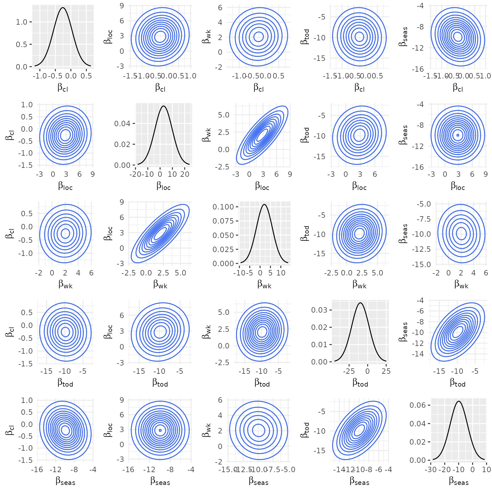
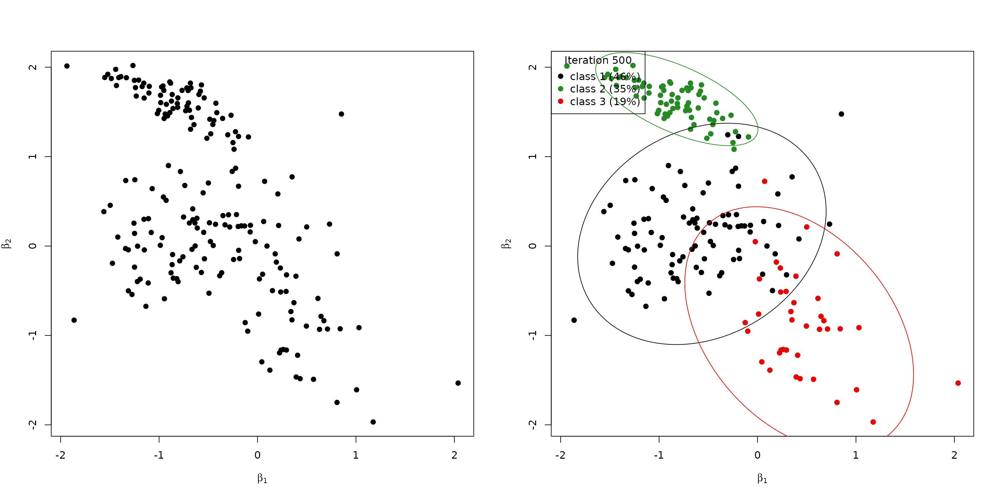

# Modeling heterogeneity

In the vignette on the model definition, we pointed out that the probit
model can capture choice behavior heterogeneity by imposing a mixing
distribution on the coefficient vector. The implementation in
[RprobitB](https://loelschlaeger.de/RprobitB/) is explained in this
vignette[^1].

## Estimating a joint normal mixing distribution

The [mlogit](https://cran.r-project.org/package=mlogit) package
([Croissant 2020](#ref-Croissant2020)) contains the data set
`Electricity`, in which residential electricity customers were asked to
decide between four hypothetical electricity suppliers. The suppliers
differed in 6 characteristics:

1.  their fixed price `pf` per kWh,
2.  their contract length `cf`,
3.  an indicator `loc` whether the supplier is a local company,
4.  an indicator `wk` whether the supplier is a well known company,
5.  an indicator `tod` whether the supplier offers a time-of-day
    electricity price (which is higher during the day and lower during
    the night), and
6.  an indicator `seas` whether the supplier’s price is seasonal
    dependent.

This constitutes a choice situation where choice behaviour heterogeneity
is expected: some customers might prefer a time-of-day electricity price
(because they may be not at home during the day), while others can have
the opposite preference. Ideally these differences in preferences should
be modelled using characteristics of the deciders. In many cases (as in
this data set) we do not have adequate information. Instead these
differences in taste can be captured by means of a mixing distribution
for the `tod` coefficient. This corresponds to the assumption of a
random coefficient from the underlying mixing distribution to be drawn
for each decider. We can use the estimated mixing distribution to
determine for example the share of deciders that have a positive versus
negative preference towards time-of-day electricity prices.

Additionally, we expect correlations between the random coefficients to
certain covariates, for example a positive correlation between the
influence of `loc` and `wk`: deciders that prefer local suppliers might
also prefer well known companies due to recommendations and past
experiences, although they might be more expensive than unknown
suppliers. The fitted multivariate normal distribution will reveal these
correlations.

The following lines prepare the `Electricity` data set for estimation.
We use the helper function
[`as_cov_names()`](https://loelschlaeger.de/RprobitB/reference/as_cov_names.md)
that relabels the data columns for alternative specific covariates into
the required format “`<covariate>_<alternative>`”, compare to the
vignette on choice data. Via the `re` argument, we specify that we want
to model random effects for all but the price coefficient, which we will
fix to `-1` to interpret the other estimates as monetary values.

``` r

data("Electricity", package = "mlogit")
Electricity <- as_cov_names(
  Electricity, c("pf", "cl", "loc", "wk", "tod", "seas"), 1:4
)
data <- prepare_data(
  form = choice ~ pf + cl + loc + wk + tod + seas | 0,
  choice_data = Electricity,
  re = c("cl", "loc", "wk", "tod", "seas")
)
model_elec <- fit_model(data, scale = "pf := -1", R = 1000)
```

Calling the [`coef()`](https://rdrr.io/r/stats/coef.html) method on the
estimated model also returns the estimated (marginal) variances of the
mixing distribution besides the average mean effects:

``` r

coef(model_elec)
#>         Estimate   (sd) Variance   (sd)
#> 1   pf     -1.00 (0.00)       NA   (NA)
#> 2   cl     -0.26 (0.03)     0.30 (0.04)
#> 3  loc      2.82 (0.21)     7.03 (0.93)
#> 4   wk      2.05 (0.14)     3.83 (0.63)
#> 5  tod     -9.83 (0.20)    11.67 (1.33)
#> 6 seas     -9.92 (0.18)     6.20 (0.93)
```

By the sign of the estimates we can for example deduce, that the
existence of the time-of-day electricity price `tod` in the contract has
a negative effect. However, the deciders are very heterogeneous here,
because the estimated variance of this coefficient is large. The same
holds for the contract length `cl`. In particular, the estimated share
of the population that prefers to have a longer contract length equals:

``` r

cl_mu <- coef(model_elec)["cl", "mean"]
cl_sd <- sqrt(coef(model_elec)["cl", "var"])
pnorm(cl_mu / cl_sd)
#> [1] 0.317279
```

The correlation between the covariates can be accessed as follows:[^2]

``` r

cov_mix(model_elec, cor = TRUE)
#>               cl         loc          wk         tod         seas
#> cl    1.00000000 0.077721396  0.04462012 -0.03169023 -0.122791071
#> loc   0.07772140 1.000000000  0.79003728  0.09679206  0.003348363
#> wk    0.04462012 0.790037276  1.00000000  0.09449239 -0.034341537
#> tod  -0.03169023 0.096792064  0.09449239  1.00000000  0.518190666
#> seas -0.12279107 0.003348363 -0.03434154  0.51819067  1.000000000
```

Here, we see the confirmation of our initial assumption about a high
correlation between `loc` and `wk`. The pairwise mixing distributions
can be visualized via calling the
[`plot()`](https://rdrr.io/r/graphics/plot.default.html) method with the
additional argument `type = mixture`:

``` r

plot(model_elec, type = "mixture")
```



## Estimating latent classes

More generally, [RprobitB](https://loelschlaeger.de/RprobitB/) allows to
specify a Gaussian mixture as the mixing distribution. In particular,

``` math
 \beta \sim \sum_{c=1}^C \text{MVN} (b_c,\Omega_c).
```
This specification allows for a) a better approximation of the true
underlying mixing distribution and b) a preference based classification
of the deciders.

To estimate a latent mixture, specify a named list `latent_classes` with
the following arguments and submit it to the estimation routine
`fit_model`:

- `C`, the fixed number (greater or equal 1) of latent classes, which is
  set to 1 per default, [^3]

- `weight_update`, a boolean, set to `TRUE` for a weight-based update of
  the latent classes, see below,

- `dp_update`, a boolean, set to `TRUE` for a Dirichlet process-based
  update of the latent classes, see below,

- `Cmax`, the maximum number of latent classes, set to `10` per default.

### Weight-based update of the latent classes

The following weight-based updating scheme is analogue to Bauer et al.
([2019](#ref-Bauer2019)) and executed within the burn-in period:

- We remove class $`c`$, if $`s_c<\varepsilon_{\text{min}}`$, i.e. if
  the class weight $`s_c`$ drops below some threshold
  $`\varepsilon_{\text{min}}`$. This case indicates that class $`c`$ has
  a negligible impact on the mixing distribution.

- We split class $`c`$ into two classes $`c_1`$ and $`c_2`$, if
  $`s_c>\varepsilon_\text{max}`$. This case indicates that class $`c`$
  has a high influence on the mixing distribution whose approximation
  can potentially be improved by increasing the resolution in directions
  of high variance. Therefore, the class means $`b_{c_1}`$ and
  $`b_{c_2}`$ of the new classes $`c_1`$ and $`c_2`$ are shifted in
  opposite directions from the class mean $`b_c`$ of the old class $`c`$
  in the direction of the highest variance.

- We join two classes $`c_1`$ and $`c_2`$ to one class $`c`$, if
  $`\lVert b_{c_1} - b_{c_2} \rVert<\delta_{\text{min}}`$, i.e. if the
  euclidean distance between the class means $`b_{c_1}`$ and $`b_{c_2}`$
  drops below some threshold $`\delta_{\text{min}}`$. This case
  indicates location redundancy which should be repealed. The parameters
  of $`c`$ are assigned by adding the values of $`s`$ from $`c_1`$ and
  $`c_2`$ and averaging the values for $`b`$ and $`\Omega`$.

These rules contain choices on the values for
$`\varepsilon_{\text{min}}`$, $`\varepsilon_{\text{max}}`$ and
$`\delta_{\text{min}}`$. The adequate value for $`\delta_{\text{min}}`$
depends on the scale of the parameters. Per default,
[RprobitB](https://loelschlaeger.de/RprobitB/) sets

- `epsmin = 0.01`,

- `epsmax = 0.7`, and

- `deltamin = 0.1`.

These values can be adapted through the `latent_class` argument.

### Dirichlet process-based update of the latent classes

As an alternative to the weight-based updating scheme to determine the
correct number $`C`$ of latent classes,
[RprobitB](https://loelschlaeger.de/RprobitB/) implements the Dirichlet
process.[^4] The method allows to add more mixture components to the
mixing distribution if needed for a better approximation, see Neal
([2000](#ref-Neal2000)) for a documentation of the general case. The
literature offers many representations of the method, including the
Chinese Restaurant Process ([Aldous 2006](#ref-Aldous1985)), the
stick-braking metaphor ([Sethuraman 1994](#ref-Sethuraman1994)), and the
Polya Urn model ([Blackwell and MacQueen 1973](#ref-Blackwell1973)).

In our case, we face the situation to find a distribution $`g`$ that
explains the decider-specific coefficients
$`(\beta_n)_{n = 1,\dots,N}`$, where $`g`$ is supposed to be a mixture
of an unknown number $`C`$ of Gaussian densities,
i.e. $`g = \sum_{c = 1,\dots,C} s_c \text{MVN}(b_c, \Omega_c)`$.

Let $`z_n \in \{1,\dots,C\}`$ denote the class membership of
$`\beta_n`$. A priori, the mixture weights $`(s_c)_c`$ are given a
Dirichlet prior with concentration parameter $`\delta/C`$,
i.e. $`(s_c)_c \mid \delta \sim \text{D}_C(\delta/C,\dots,\delta/C)`$.
Rasmussen ([1999](#ref-Rasmussen1999)) shows that

``` math
 \Pr((z_n)_n\mid \delta) = \frac{\Gamma(\delta)}{\Gamma(N+\delta)} \prod_{c=1}^C \frac{\Gamma(m_c + \delta/C)}{\Gamma(\delta/C)}, 
```
where $`\Gamma(\cdot)`$ denotes the gamma function and
$`m_c = \#\{n:z_n = c\}`$ the number of elements that are currently
allocated to class $`c`$. Crucially, the last equation is independent of
the class weights $`(s_c)_c`$, yet it still depends on the finite number
$`C`$ of latent classes. However, Li et al. ([2019](#ref-Li2019)) shows
that

``` math
 \Pr(z_n = c \mid z_{-n}, \delta) = \frac{m_{c,-n} + \delta/C}{N-1+\delta},
```
where the notation $`-n`$ means excluding the $`n`$th element. We can
let $`C`$ approach infinity to derive:

``` math
 \Pr(z_n = c \mid z_{-n}, \delta) \to \frac{m_{c,-n}}{N-1+\delta}. 
```

Note that the allocation probabilities do not sum to 1, instead

``` math
 \sum_{c = 1}^C \frac{m_{c,-n}}{N-1+\delta} = \frac{N-1}{N-1+\delta}. 
```

The difference to 1 equals

``` math
 \Pr(z_n \neq z_m ~ \forall ~ m \neq n \mid z_{-n}, \delta) = \frac{\delta}{N-1+\delta} 
```

and constitutes the probability that a new cluster for observation $`n`$
is created. Neal ([2000](#ref-Neal2000)) points out that this
probability is proportional to the prior parameter $`\delta`$: A greater
value for $`\delta`$ encourages the creation of new clusters, a smaller
value for $`\delta`$ increases the probability of an allocation to an
already existing class.

In summary, the Dirichlet process updates the allocation of each
$`\beta`$ coefficient vector one at a time, dependent on the other
allocations. The number of clusters can theoretically rise to infinity,
however, as we delete unoccupied clusters, $`C`$ is bounded by $`N`$. As
a final step after the allocation update, we update the class means
$`b_c`$ and covariance matrices $`\Omega_c`$ by means of their posterior
predictive distribution. The mean and covariance matrix for a new
generated cluster is drawn from the prior predictive distribution. The
corresponding formulas are given in Li et al. ([2019](#ref-Li2019)).

The Dirichlet process directly integrates into our existing Gibbs
sampler. Given $`\beta`$ values, it updated the class means $`b_c`$ and
class covariance matrices $`\Omega_c`$. The Dirichlet process updating
scheme is implemented in the function
[`update_classes_dp()`](https://loelschlaeger.de/RprobitB/reference/update_classes_dp.md).
In the following, we give a small example in the bivariate case
`P_r = 2`. We sample true class means `b_true` and class covariance
matrices `Omega_true` for `C_true = 3` true latent classes.

``` r

set.seed(1)
P_r <- 2
C_true <- 3
N <- c(90, 70, 40)
(b_true <- matrix(replicate(C_true, rnorm(P_r)), nrow = P_r, ncol = C_true))
#>            [,1]       [,2]       [,3]
#> [1,] -0.6264538 -0.8356286  0.3295078
#> [2,]  0.1836433  1.5952808 -0.8204684
(Omega_true <- matrix(replicate(C_true, oeli::rwishart(P_r + 1, 0.1 * diag(P_r)), simplify = TRUE),
  nrow = P_r * P_r, ncol = C_true
))
#>           [,1]        [,2]       [,3]
#> [1,] 0.3093652  0.14358543  0.2734617
#> [2,] 0.1012729 -0.07444148 -0.1474941
#> [3,] 0.1012729 -0.07444148 -0.1474941
#> [4,] 0.2648235  0.05751780  0.2184029
beta <- c()
for (c in 1:C_true) for (n in 1:N[c]) {
  beta_n <- oeli::rmvnorm(
    mean = b_true[, c], 
    Sigma = matrix(Omega_true[, c, drop = F], ncol = P_r)
  )
  beta <- cbind(beta, beta_n)
}
```

We specify the following prior parameters (for their definition see the
vignette on model fitting):

``` r

delta <- 0.1
mu_b_0 <- numeric(P_r)
Sigma_b_0 <- diag(P_r)
n_Omega_0 <- P_r + 2
V_Omega_0 <- diag(P_r)
```

Initially, we start with `C = 1` latent classes. The class mean `b` is
set to zero, the covariance matrix `Omega` to the identity matrix:

``` r

z <- rep(1, ncol(beta))
C <- 1
b <- matrix(0, nrow = P_r, ncol = C)
Omega <- matrix(rep(diag(P_r), C), nrow = P_r * P_r, ncol = C)
```

The following call to
[`update_classes_dp()`](https://loelschlaeger.de/RprobitB/reference/update_classes_dp.md)
updates the latent classes in `100` iterations. Note that we specify the
arguments `Cmax` and `identify_classes`. The former denotes the maximum
number of latent classes. This specification is not a requirement for
the Dirichlet process per se, but rather for its implementation. Knowing
the maximum possible class number, we can allocate the required memory
space, which leads to a speed improvement. We later can verify that we
won’t exceed the number of `Cmax = 10` latent classes at any point of
the Dirichlet process. Setting `identify_classes = TRUE` ensures that
the classes are ordered by their weights in a descending order to ensure
identifiability.

``` r

set.seed(1)
R <- 500
C_seq <- numeric(R)
for (r in seq_len(R)) {
  dp <- update_classes_dp(
    beta = beta, z = z, b = b, Omega = Omega, 
    delta = delta, mu_b_0 = mu_b_0, Sigma_b_0 = Sigma_b_0, 
    n_Omega_0 = n_Omega_0, V_Omega_0 = V_Omega_0, 
    identify_classes = TRUE, Cmax = 10
  )
  z <- dp$z
  b <- dp$b
  Omega <- dp$Omega
  C_seq[r] <- dp$C
}
table(C_seq)
#> C_seq
#>   1   2   3   4   5   6 
#>  60  59 262 101  16   2
```

The following visualizes the true `beta` values (left) and the class
allocation in the final iteration (right):

``` r

par(mfrow = c(1, 2))
plot(t(beta), xlab = bquote(beta[1]), ylab = bquote(beta[2]), pch = 19)
plot_class_allocation(beta, z, b, Omega, r = R, perc = 0.95)
```



## References

Aldous, D. J. 2006. “Exchangeability and Related Topics.” In *École
d’Été de Probabilités de Saint-Flour XIII—1983*, edited by P. L.
Hennequin. Springer.

Bauer, D., S. Büscher, and M. Batram. 2019. “Non-Parameteric Estiation
of Mixed Discrete Choice Models.” *Second International Choice Modelling
Conference in Kobe*.

Blackwell, D., and J. MacQueen. 1973. “Ferguson Distributions via Polya
Urn Schemes.” *The Annals of Statistics* 1.

Burda, M., M. Harding, and J. Hausman. 2008. “A Bayesian Mixed
Logit–Probit Model for Multinomial Choice.” *Journal of Econometrics*
147 (2).

Croissant, Y. 2020. “Estimation of Random Utility Models in R: The
Mlogit Package.” *Journal of Statistical Software* 95 (11).

Li, Y., E. Schofield, and M. Gönen. 2019. “A Tutorial on Dirichlet
Process Mixture Modeling.” *Journal of Mathematical Psychology* 91.

Neal, R. M. 2000. “Markov Chain Sampling Methods for Dirichlet Process
Mixture Models.” *Journal of Computational and Graphical Statistics* 9
(2).

Rasmussen, C. 1999. “The Infinite Gaussian Mixture Model.” *Advances in
Neural Information Processing Systems* 12.

Sethuraman, J. 1994. “A Constructive Definition of Dirichlet Priors.”
*Statistica Sinica* 4 (2).

[^1]: This vignette is built using R 4.6.1 with the
    [RprobitB](https://loelschlaeger.de/RprobitB/) 1.2.0.9000 package.

[^2]: Setting `cor = FALSE` instead returns the estimated covariance
    matrix.

[^3]: If either `weight_update = TRUE` or `dp_update = TRUE`, `C` equals
    the initial number of latent classes.

[^4]: A similar approach in the context of discrete choice can be found
    in Burda et al. ([2008](#ref-Burda2008)), where the Dirichlet
    process is applied to estimate a mixed logit-probit model.
