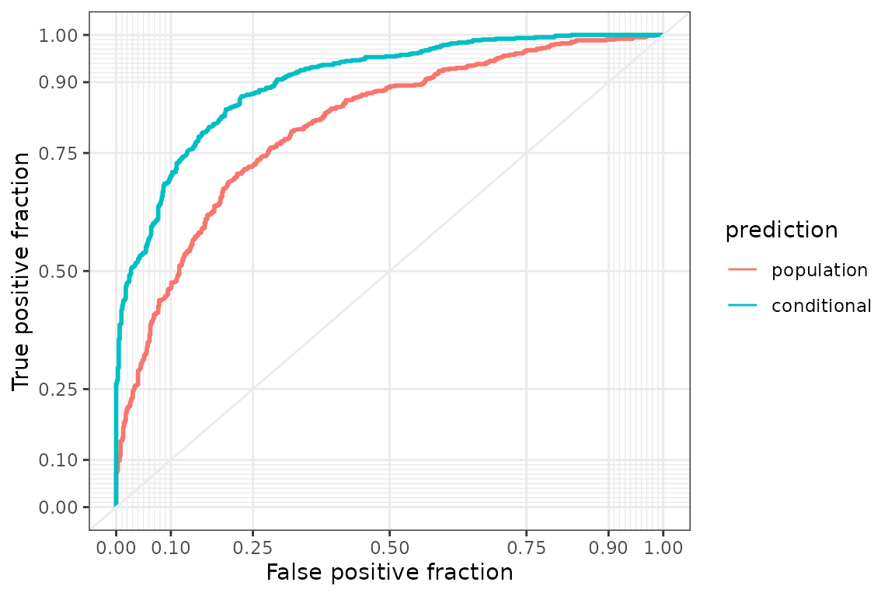

# Posterior prediction

A fitted choice model answers questions about choice probabilities:
which of two train trips a traveler is likely to book, how the support
for a wind-power project changes with the compensation, and how well the
model predicts the choices of deciders that were not used for
estimation. In the probit model introduced in the vignette [Get started
with
RprobitB](https://loelschlaeger.de/RprobitB/articles/v01_get_started.html),
the choice probability of an alternative is the probability that its
latent utility exceeds the utilities of the other alternatives, and it
depends on the covariates of the occasion and on the parameters.
[`predict()`](https://rdrr.io/r/stats/predict.html) evaluates these
probabilities under every retained posterior draw and averages them, so
that the predictions account for the posterior uncertainty about the
parameters ([Gelman et al. 1996](#ref-Gelman1996)). This vignette covers
predictions for the population and for individual deciders, scenarios,
out-of-sample prediction, residuals, and marginal effects. The examples
use data sets of the **mlogit** package ([Croissant
2020](#ref-Croissant2020)), the **choicedata** package ([Oelschläger
2026](#ref-Oelschlaeger2026a)), and the **MASS** package ([Venables and
Ripley 2002](#ref-VenablesRipley2002)).

## A random price coefficient

The `Train` data of the **mlogit** package contain about a dozen choices
by each of 235 Dutch travelers between two hypothetical train trips that
differ in price, travel time, number of changes, and comfort class
([Ben-Akiva et al. 1993](#ref-BenAkiva1993)). As in the vignette [Get
started with
RprobitB](https://loelschlaeger.de/RprobitB/articles/v01_get_started.html),
the prices are converted to euro and the travel times to hours. That
vignette fits one price coefficient for all travelers. Here the price
coefficient is a normal random effect, as introduced in the vignette
[Modeling preference
heterogeneity](https://loelschlaeger.de/RprobitB/articles/v03_heterogeneity.html):
every traveler has an individual price coefficient, drawn from a normal
population distribution whose mean and variance are estimated. The
individual draws are saved because the conditional predictions below use
them. Thinning keeps 50 of the 750 post-warmup draws of each chain, 100
draws in total, which is enough for stable posterior means and keeps the
predictions below fast.

``` r

library(RprobitB)
set.seed(1)
data("Train", package = "mlogit")
Train$price_A <- Train$price_A / 100 / 2.20371
Train$price_B <- Train$price_B / 100 / 2.20371
Train$time_A <- Train$time_A / 60
Train$time_B <- Train$time_B / 60
model <- fit(
  choice ~ price + time + change + factor(comfort) | 0,
  data = Train,
  random_effects = "price",
  column_decider = "id",
  column_occasion = "choiceid",
  iterations = 1500,
  warmup = 750,
  thin = 15,
  chains = 2,
  save_individual_draws = TRUE,
  progress = FALSE
)
summary(model)
#> Bayesian probit choice model
#> Formula: choice ~ price + time + change + factor(comfort) | 0 | 0 
#> Samples: 50 retained per chain, 2 chains
#> 
#>                variable    mean    mode     sd  rhat ess_bulk
#>              beta[time] -1.7814 -1.7580 0.1205 1.093     92.5
#>            beta[change] -0.3376 -0.3500 0.0427 0.988     91.8
#>  beta[factor(comfort)1] -0.6803 -0.6775 0.0540 1.002    130.6
#>  beta[factor(comfort)2] -1.9188 -1.9416 0.0993 0.997     81.0
#>               mu[price] -0.3923 -0.3941 0.0278 1.045     48.7
#>      Omega[price,price]  0.0966  0.0931 0.0154 1.078     26.9
```

`mu[price]` and `Omega[price,price]` are the mean and the variance of
the price coefficient across the population. The square root of the
posterior mean of the variance is 0.311, against a posterior mean of
-0.392 for `mu[price]`: price sensitivity differs between travelers,
which the predictions below take into account.

## Population predictions

By default, [`predict()`](https://rdrr.io/r/stats/predict.html) returns
one row per choice occasion with the identifiers, the most probable
alternative in `.prediction`, and the posterior mean probability of
every alternative. These population predictions integrate over the
estimated population distribution of the random coefficient, so they
apply to any traveler from the population, not only to those in the
data.

``` r

population <- predict(model)
head(population)
#>   id choiceid .prediction probability_A probability_B
#> 1  1        1           A     0.8758825     0.1241175
#> 2  1        2           A     0.7089943     0.2910057
#> 3  1        3           A     0.8103538     0.1896462
#> 4  1        4           B     0.1584512     0.8415488
#> 5  1        5           A     0.6889428     0.3110572
#> 6  1        6           B     0.1649000     0.8351000
```

`uncertainty = TRUE` adds the posterior standard deviation and an
equal-tailed credible interval of every probability, here at the 90%
level. The intervals reflect the posterior uncertainty about the
parameters, not the randomness of the choice.

``` r

head(predict(model, uncertainty = TRUE, level = 0.9))
#>   id choiceid .prediction probability_A probability_B       sd_A       sd_B
#> 1  1        1           A     0.8758825     0.1241175 0.01820053 0.01820053
#> 2  1        2           A     0.7089943     0.2910057 0.02078762 0.02078762
#> 3  1        3           A     0.8103538     0.1896462 0.02204639 0.02204639
#> 4  1        4           B     0.1584512     0.8415488 0.01807750 0.01807750
#> 5  1        5           A     0.6889428     0.3110572 0.02306812 0.02306812
#> 6  1        6           B     0.1649000     0.8351000 0.02045077 0.02045077
#>     lower_A    lower_B   upper_A   upper_B
#> 1 0.8458549 0.09741844 0.9025816 0.1541451
#> 2 0.6738162 0.25751461 0.7424854 0.3261838
#> 3 0.7753907 0.15454084 0.8454592 0.2246093
#> 4 0.1319420 0.80994462 0.1900554 0.8680580
#> 5 0.6537258 0.27240732 0.7275927 0.3462742
#> 6 0.1305137 0.80171684 0.1982832 0.8694863
```

## Conditional predictions for fitted deciders

The dozen choices of a traveler are informative about their individual
price coefficient. `coef(level = "individual")` returns the posterior
mean of every traveler’s coefficient, and
`predict(type = "conditional")` uses the individual draws instead of the
population distribution. Conditional predictions exist only for the
deciders in the fitted data, and they are usually sharper because they
use the decider’s own choices. This partial pooling is the main argument
for hierarchical Bayesian choice models ([Allenby and Rossi
1998](#ref-Allenby1998); [Huber and Train 2001](#ref-Huber2001)).

``` r

head(coef(model, level = "individual"))
#>         price
#> 1 -0.26940692
#> 2 -0.75192882
#> 3 -0.63361658
#> 4 -0.42940736
#> 5 -0.01203728
#> 6 -0.06736097
conditional <- predict(model, type = "conditional")
head(conditional)
#>   id choiceid .prediction probability_A probability_B
#> 1  1        1           A     0.9472914    0.05270857
#> 2  1        2           A     0.6403897    0.35961026
#> 3  1        3           A     0.8512142    0.14878583
#> 4  1        4           B     0.1582555    0.84174454
#> 5  1        5           A     0.6095824    0.39041762
#> 6  1        6           B     0.1071964    0.89280359
```

The hit rate, the share of correctly predicted choices in the fitted
data, is one measure of the gain:

``` r

observed <- model.frame(model)$choice
hit_rate <- c(
  population = mean(population$.prediction == observed, na.rm = TRUE),
  conditional = mean(conditional$.prediction == observed, na.rm = TRUE)
)
hit_rate
#>  population conditional 
#>   0.7108228   0.7869580
```

The traveler’s own choices raise the hit rate from 0.71 to 0.79. The hit
rate evaluates the predictions at a single threshold, a probability of
one half. A ROC curve compares them at every threshold: as the threshold
for predicting trip `B` decreases from one to zero, the curve plots the
share of `B` choices predicted correctly against the share of `A`
choices wrongly predicted as `B`. The area under the curve is the
probability that a randomly chosen `B` occasion receives a higher `B`
probability than a randomly chosen `A` occasion. The **plotROC** package
([Sachs 2017](#ref-Sachs2017)) draws the curves with **ggplot2**
([Wickham 2016](#ref-Wickham2016)).

``` r

library(ggplot2)
library(plotROC)
roc_data <- rbind(
  data.frame(
    prediction = "population", chose_B = as.integer(observed == "B"),
    probability = population$probability_B
  ),
  data.frame(
    prediction = "conditional", chose_B = as.integer(observed == "B"),
    probability = conditional$probability_B
  )
)
roc_data$prediction <- factor(
  roc_data$prediction, levels = c("population", "conditional")
)
roc_plot <- ggplot(
  roc_data, aes(d = chose_B, m = probability, color = prediction)
) +
  geom_roc(n.cuts = 0) +
  style_roc()
roc_plot
```



The conditional curve lies above the population curve, and the area
under the curve rises from 0.77 to 0.87.

## Scenario analysis in a stated choice experiment

A scenario predicts the choice probabilities for modified attributes,
the typical use of a stated choice experiment. Near Setskog in Norway,
308 residents were asked six times to choose between two plans for a
proposed wind-power project and the status quo without the project,
alternative `1` ([Dugstad et al. 2024](#ref-Dugstad2024)). The plans
varied the number and height of the turbines, the routing of the power
line, and an annual reduction in municipal taxes offered as
compensation. The study also measured each respondent’s collective
psychological ownership of the affected area, a standardized score of
how strongly they feel that the landscape belongs to the residents. The
score does not vary across alternatives and therefore enters the second
part of the formula, which gives it one coefficient per plan relative to
the status quo:

``` r

wind_formula <- choice ~ turbines + height + powerline + compensation |
  psychological_ownership
```

``` r

data("wind_power_choice", package = "choicedata")
wind <- fit(
  formula = wind_formula,
  data = wind_power_choice,
  column_decider = "respondent",
  column_occasion = "occasion",
  iterations = 10000,
  warmup = 5000,
  thin = 5,
  chains = 2,
  progress = FALSE
)
coef(wind)[c("beta[compensation]", "beta[psychological_ownership_2]")]
#>              beta[compensation] beta[psychological_ownership_2] 
#>                     0.000903575                    -0.444736414
```

The posterior probability that the compensation coefficient is positive
is 1.00, and that the ownership coefficient of the first plan is
negative 1.00: compensation makes a plan more attractive, and residents
with a stronger feeling of ownership are less willing to leave the
status quo. What would happen if the municipality doubled the
compensation? `newdata` accepts a data frame in the layout of the fitted
data, with or without the response column. The scenario below doubles
the compensation of both plans in the first four choice tasks and
compares the probability of the status quo before and after.

``` r

scenario <- model.frame(wind)[1:4, ]
scenario$choice <- NULL
scenario$compensation_2 <- 2 * scenario$compensation_2
scenario$compensation_3 <- 2 * scenario$compensation_3
status_quo <- cbind(
  before = predict(wind)$probability_1[1:4],
  after = predict(wind, newdata = scenario)$probability_1
)
status_quo
#>         before     after
#> [1,] 0.4102958 0.2813607
#> [2,] 0.3766450 0.2881957
#> [3,] 0.3695948 0.3047741
#> [4,] 0.4362146 0.3807199
```

The status quo loses between 6 and 13 percentage points in the four
tasks. Compensation matters, but it is not the only factor in the
residents’ acceptance.

## Out-of-sample prediction and calibration

Predictive performance is best judged on deciders that were not used for
estimation ([Vehtari et al. 2017](#ref-Vehtari2017)). In an arena
tournament on the chess server Lichess, a player may go Berserk at the
start of a game: the clock is halved, and a win earns one extra
tournament point. Players on a winning streak collect double points, so
a loss is more costly for them. The `lichess_berserk_choice` data of the
**choicedata** package record this decision for 5852 players in the
Lichess Yearly Rapid Arena of April 2026, game by game, together with
the playing color, the player’s rating, the rating difference to the
opponent, the remaining tournament time, and whether the player was on a
streak. All covariates describe the game and are constant across the two
alternatives, so they enter the second part of the formula, which gives
each of them one coefficient for the alternative `TRUE` relative to
`FALSE`, for example `beta[rating_TRUE]`. Logical covariates appear as
dummy variables such as `streakTRUE`.

``` r

berserk_formula <- berserk ~ 0 | white + rating + ratingDifference +
  minutesRemaining + streak
```

The fit uses the games of the first 300 players.
[`train_test()`](https://loelschlaeger.de/choicedata/reference/train_test.html),
which **RprobitB** re-exports from **choicedata**, splits them by
decider, not by row: `test_number = 60` puts all games of 60 players
into the test set and the games of the other players into the training
set, so no player contributes to both.

``` r

data("lichess_berserk_choice", package = "choicedata")
players <- unique(lichess_berserk_choice$deciderID)
first_players <- lichess_berserk_choice$deciderID %in% players[1:300]
split <- train_test(lichess_berserk_choice[first_players, ], test_number = 60)
berserk <- fit(
  formula = berserk_formula,
  data = split$train,
  column_occasion = "occasionID",
  iterations = 1000,
  warmup = 500,
  chains = 2,
  progress = FALSE
)
coef(berserk)
#>        beta[whiteTRUE_TRUE]           beta[rating_TRUE] 
#>                2.961391e-02                1.510856e-03 
#> beta[ratingDifference_TRUE] beta[minutesRemaining_TRUE] 
#>                5.454093e-05               -1.800991e-04 
#>       beta[streakTRUE_TRUE]              beta[ASC_TRUE] 
#>               -7.983852e-02               -3.271449e+00
```

The posterior probability that the rating coefficient is positive is
1.00, that the streak coefficient is negative 0.80, and that the
coefficient of the remaining time is negative 0.72: stronger players go
Berserk more often, players on a streak less often, and all players more
often towards the end of the tournament. How well does the model predict
the games of the 60 players in the test set? `newdata` takes the test
set as it is, and the predicted alternative is compared with the
observed one.

``` r

holdout_prediction <- predict(berserk, newdata = split$test)
holdout_choice <- as.character(split$test$berserk)
holdout_accuracy <- c(
  accuracy = mean(holdout_prediction$.prediction == holdout_choice),
  share_berserk = mean(split$test$berserk)
)
holdout_accuracy
#>      accuracy share_berserk 
#>     0.6810700     0.3497942
```

The hit rate is 68 percent, but the rule that never predicts Berserk
would already reach 65 percent, so the hit rate alone is a weak
criterion for an unbalanced binary response. A calibration analysis
assesses the predicted probabilities instead. It groups the hold-out
games by predicted Berserk probability in intervals of width 0.1 and
compares the mean predicted probability with the observed Berserk rate
in each group; groups with fewer than 50 games are dropped.

``` r

predicted <- holdout_prediction$probability_TRUE
bins <- cut(predicted, breaks = seq(0, 1, by = 0.1))
calibration <- data.frame(
  games = as.vector(table(bins)),
  predicted = as.vector(tapply(predicted, bins, mean)),
  observed = as.vector(tapply(split$test$berserk, bins, mean)),
  row.names = levels(bins)
)
large <- calibration[calibration$games >= 50, ]
round(large, 2)
#>           games predicted observed
#> (0.1,0.2]    56      0.14     0.18
#> (0.2,0.3]   199      0.25     0.26
#> (0.3,0.4]    75      0.35     0.33
#> (0.4,0.5]    83      0.43     0.57
```

The calibration plot shows the same table. Points on the diagonal mean
that the predicted probability equals the observed rate, and the point
sizes are proportional to the number of games in a group.

``` r

plot(
  large$predicted, large$observed,
  xlim = c(0, 1), ylim = c(0, 1), pch = 19,
  cex = 0.5 + 2 * large$games / max(large$games),
  xlab = "predicted Berserk probability",
  ylab = "observed Berserk rate"
)
abline(0, 1, lwd = 2, col = "grey50")
```


From the group with the lowest predictions to the group with the
highest, the mean predicted probability rises from 14 to 43 percent and
the observed rate from 18 to 57 percent. The observed rate rises from
every group to the next, so the model orders the games by their Berserk
rate. The largest gap between the observed rate and the predicted
probability, 14 percentage points, occurs in the group (0.4,0.5\], where
the model underpredicts Berserk.

## Residuals

[`residuals()`](https://rdrr.io/r/stats/residuals.html) returns the
observed choice indicators minus the posterior mean probabilities, one
row per choice occasion and one column per alternative. The rows of
observed occasions sum to zero, and occasions with a missing response
yield `NA`. A single residual is uninformative, because the indicator is
zero or one while the probability lies in between, so the residuals are
averaged over groups of occasions. The average residual per traveler
shows whose choices the model reproduces:

``` r

model_residuals <- residuals(model)
head(model_residuals)
#>              A          B
#> 1:1  0.1241175 -0.1241175
#> 1:2  0.2910057 -0.2910057
#> 1:3  0.1896462 -0.1896462
#> 1:4 -0.1584512  0.1584512
#> 1:5 -0.6889428  0.6889428
#> 1:6 -0.1649000  0.1649000
by_decider <- tapply(
  model_residuals[, "A"], model.frame(model)$id, mean, na.rm = TRUE
)
decider_quantiles <- quantile(by_decider, c(0, 0.25, 0.5, 0.75, 1))
round(decider_quantiles, 3)
#>     0%    25%    50%    75%   100% 
#> -0.337 -0.070  0.001  0.088  0.347
```

Half of the travelers have an average residual between -0.07 and 0.09,
and the extremes are -0.34 and 0.35: for these travelers the model
predicts trip `A` too often or too rarely across all their questions.
Grouping by a covariate checks the functional form instead, here by the
price of trip `A` in four groups of equal size:

``` r

price_group <- cut(
  model.frame(model)$price_A,
  breaks = quantile(model.frame(model)$price_A, seq(0, 1, 0.25)),
  include.lowest = TRUE
)
price_residuals <- tapply(
  model_residuals[, "A"], price_group, mean, na.rm = TRUE
)
round(price_residuals, 3)
#> [0.454,11.3]  (11.3,14.7]  (14.7,18.2]  (18.2,56.7] 
#>        0.008        0.004       -0.011        0.017
```

The group averages lie between -0.011 and 0.017. A systematic pattern,
for example positive residuals at both ends, would indicate a nonlinear
price effect or an unmodeled preference class.

## Marginal effects

How much does one euro more change the probability of booking a trip?
The coefficients do not answer this directly, because the probit link is
nonlinear: the same change of a covariate moves the probability most
where the alternatives are close in utility and little where one
alternative dominates.
[`interpret()`](https://loelschlaeger.de/RprobitB/reference/interpret.md)
therefore differentiates the predicted probabilities numerically.
`type = "mea"` evaluates the derivative for one occasion whose
covariates equal the observed averages, reported in the column `at`.
`type = "ame"` evaluates the derivative for every observed occasion and
averages, which weights the occasions as they occur in the data and is
usually the more relevant summary. Both use every posterior draw and
therefore come with credible intervals.

``` r

interpret(model, type = "mea")
#> Marginal effects at the average covariate values
#> Change in the probability of the alternative per unit of the covariate, with 95% interval 
#>  covariate alternative     at   mean     sd  lower  upper
#>       time           A  2.125 -0.711 0.0481 -0.799 -0.595
#>       time           B  2.119 -0.711 0.0481 -0.799 -0.595
#>     change           A  0.664 -0.135 0.0170 -0.167 -0.100
#>     change           B  0.681 -0.135 0.0170 -0.167 -0.100
#>      price           A 15.283 -0.156 0.0111 -0.178 -0.136
#>      price           B 15.280 -0.156 0.0111 -0.178 -0.136
average_effects <- interpret(model, type = "ame")
average_effects
#> Average marginal effects on the choice probabilities
#> Change in the probability of the alternative per unit of the covariate, with 95% interval 
#>  covariate alternative    mean      sd   lower   upper
#>       time           A -0.4347 0.02632 -0.4763 -0.3683
#>       time           B -0.4347 0.02632 -0.4763 -0.3683
#>     change           A -0.0824 0.01006 -0.1023 -0.0613
#>     change           B -0.0824 0.01006 -0.1023 -0.0613
#>      price           A -0.0813 0.00391 -0.0879 -0.0737
#>      price           B -0.0813 0.00391 -0.0879 -0.0737
```

With two alternatives, a change in the attributes of one trip shifts
probability to the other, so the two rows of each covariate have equal
size and opposite signs. Averaged over the observed occasions, one euro
more lowers the probability of a trip by about 8 percentage points and
one hour more by about 43 percentage points. The `at` argument replaces
the averages of selected covariates. A much cheaper trip `B` moves its
probability close to one, where one euro more changes it only
marginally:

``` r

interpret(model, type = "mea", at = c(price_A = 30, price_B = 10))
#> Marginal effects at the given covariate values
#> Change in the probability of the alternative per unit of the covariate, with 95% interval 
#>  covariate alternative     at      mean       sd     lower     upper
#>       time           A  2.125 -0.051552 0.005575 -0.061439 -0.040998
#>       time           B  2.119 -0.051552 0.005575 -0.061439 -0.040998
#>     change           A  0.664 -0.009766 0.001483 -0.012510 -0.007030
#>     change           B  0.681 -0.009766 0.001483 -0.012510 -0.007030
#>      price           A 30.000 -0.000284 0.000037 -0.000362 -0.000219
#>      price           B 10.000 -0.000284 0.000037 -0.000362 -0.000219
```

## Predictions for ordered responses

An ordered model compares one latent utility per occasion with
increasing thresholds that partition it into the levels of the response,
as the vignette [Model specification and
variants](https://loelschlaeger.de/RprobitB/articles/v02_model_variants.html)
describes. For such a model,
[`predict()`](https://rdrr.io/r/stats/predict.html) returns the
probability of every level. The smoking model of that vignette predicts
how often a student smokes from their age and exercise habits.

``` r

data("survey", package = "MASS")
smoking <- fit(
  Smoke ~ Age + Exer | 0,
  data = survey,
  alternatives = c("Never", "Occas", "Regul", "Heavy"),
  choice_type = "ordered",
  column_decider = NULL,
  iterations = 1500,
  warmup = 750,
  chains = 2,
  progress = FALSE
)
smoking_prediction <- predict(smoking)
head(smoking_prediction)
#>   deciderID .prediction probability_Never probability_Occas probability_Regul
#> 1         1       Never         0.8392239        0.07204511        0.05614407
#> 2         2       Never         0.7527884        0.09583825        0.08622349
#> 3         3       Never         0.7467756        0.09736055        0.08826398
#> 4         4       Never         0.7767584        0.08946511        0.07800041
#> 5         5       Never         0.8745686        0.05939572        0.04338494
#> 6         6       Never         0.8579448        0.06550893        0.04939381
#>   probability_Heavy
#> 1        0.03258692
#> 2        0.06514990
#> 3        0.06759988
#> 4        0.05577611
#> 5        0.02265073
#> 6        0.02715244
```

Every row has four probabilities that sum to one, and `.prediction`
names the most probable level. Because 80 percent of the students never
smoke, this level is the most probable for every one of the 237
students, and the probabilities are more informative than the predicted
level. A scenario works as before. Ten more years of age shift the
probability of never smoking of the first three students:

``` r

students <- model.frame(smoking)[1:3, ]
students$Smoke <- NULL
older <- students
older$Age <- older$Age + 10
age_scenario <- cbind(
  before = predict(smoking, newdata = students)$probability_Never,
  after = predict(smoking, newdata = older)$probability_Never
)
age_scenario
#>         before     after
#> [1,] 0.8392239 0.8997050
#> [2,] 0.7527884 0.8329323
#> [3,] 0.7467756 0.8282103
```

The probability rises by 6 to 8 percentage points, in the direction
implied by the negative age coefficient.

## Further reading

Predictions describe what a model expects, not whether it is better than
another model. That comparison, on the same decider-level scale as the
hold-out check here, is the subject of the vignette [Bayesian model
evaluation](https://loelschlaeger.de/RprobitB/articles/v05_model_evaluation.html).

## References

Allenby, Greg M., and Peter E. Rossi. 1998. “Marketing Models of
Consumer Heterogeneity.” *Journal of Econometrics* 89 (1-2): 57–78.
<https://doi.org/10.1016/S0304-4076(98)00055-4>.

Ben-Akiva, Moshe, Denis Bolduc, and Mark Bradley. 1993. “Estimation of
Travel Choice Models with Randomly Distributed Values of Time.”
*Transportation Research Record* 1413: 88–97.
<https://trid.trb.org/View/385096>.

Croissant, Yves. 2020. “Estimation of Random Utility Models in R: The
mlogit Package.” *Journal of Statistical Software* 95 (11): 1–41.
<https://doi.org/10.18637/jss.v095.i11>.

Dugstad, Anders, Roy Brouwer, Kristine Grimsrud, Gorm Kipperberg, Henrik
Lindhjem, and Ståle Navrud. 2024. “Nature Is Ours! Psychological
Ownership and Preferences for Wind Energy.” *Energy Economics* 129:
107239. <https://doi.org/10.1016/j.eneco.2023.107239>.

Gelman, Andrew, Xiao-Li Meng, and Hal Stern. 1996. “Posterior Predictive
Assessment of Model Fitness via Realized Discrepancies.” *Statistica
Sinica* 6 (4): 733–807.
<https://www3.stat.sinica.edu.tw/statistica/j6n4/j6n41/j6n41.htm>.

Huber, Joel, and Kenneth Train. 2001. “On the Similarity of Classical
and Bayesian Estimates of Individual Mean Partworths.” *Marketing
Letters* 12 (3): 259–69. <https://doi.org/10.1023/A:1011120928698>.

Oelschläger, Lennart. 2026. *choicedata: Working with Choice Data*.
<https://github.com/loelschlaeger/choicedata>.

Sachs, Michael C. 2017. “plotROC: A Tool for Plotting ROC Curves.”
*Journal of Statistical Software, Code Snippets* 79 (2): 1–19.
<https://doi.org/10.18637/jss.v079.c02>.

Vehtari, Aki, Andrew Gelman, and Jonah Gabry. 2017. “Practical Bayesian
Model Evaluation Using Leave-One-Out Cross-Validation and WAIC.”
*Statistics and Computing* 27 (5): 1413–32.
<https://doi.org/10.1007/s11222-016-9696-4>.

Venables, William N., and Brian D. Ripley. 2002. *Modern Applied
Statistics with s*. 4th ed. Springer.

Wickham, Hadley. 2016. *Ggplot2: Elegant Graphics for Data Analysis*.
Springer. <https://doi.org/10.1007/978-3-319-24277-4>.
