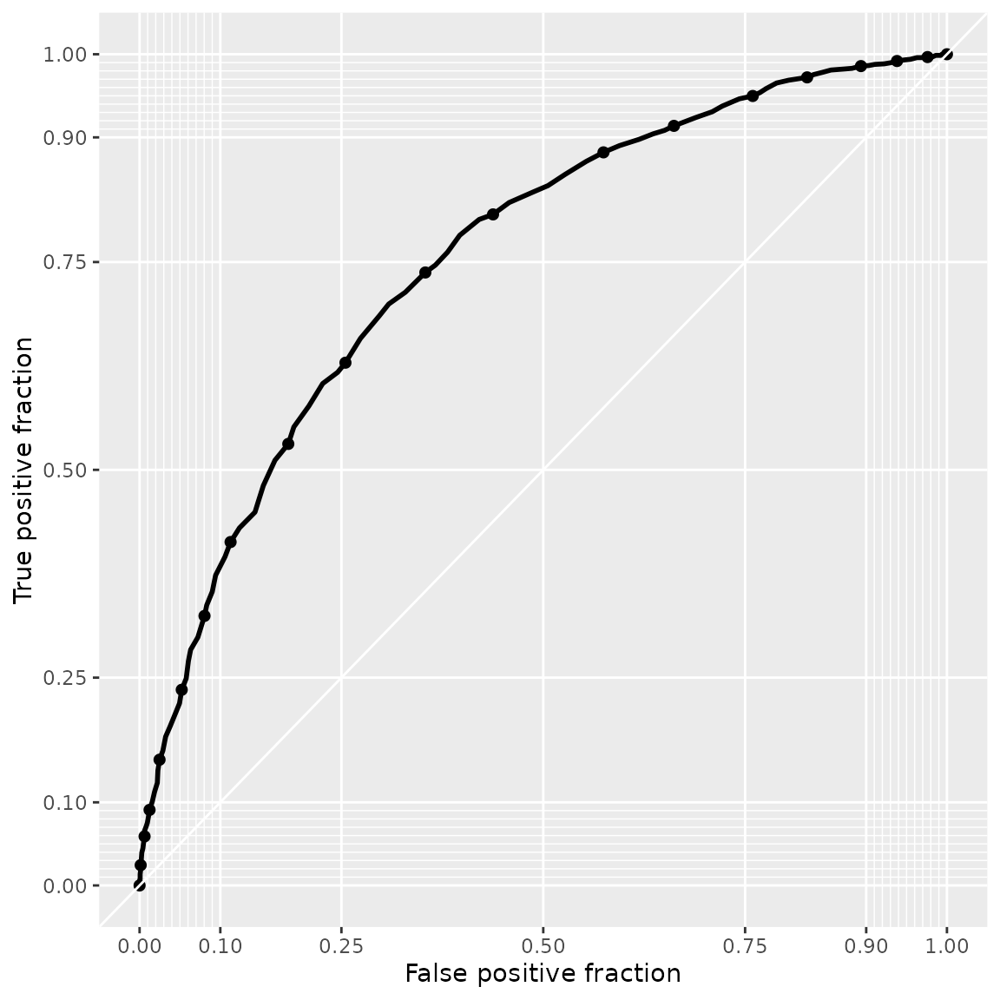

# Choice prediction

This vignette[^1] discusses in-sample and out-of-sample prediction
within [RprobitB](https://loelschlaeger.de/RprobitB/). The former case
refers to reproducing the observed choices on the basis of the
covariates and the fitted model and subsequently using the deviations
between prediction and reality as an indicator for the model
performance. The latter means forecasting choice behavior for changes in
the choice attributes.

For illustration, we revisit the probit model of travelers deciding
between two fictional train route alternatives from [the vignette on
model
fitting](https://loelschlaeger.de/RprobitB/articles/v03_model_fitting.html):

``` r

form <- choice ~ price + time + change + comfort | 0
data <- prepare_data(form = form, choice_data = train_choice, id = "deciderID", idc = "occasionID")
model_train <- fit_model(
  data = data,
  scale = "price := -1"
)
```

## Reproducing the observed choices

[RprobitB](https://loelschlaeger.de/RprobitB/) provides a
[`predict()`](https://rdrr.io/r/stats/predict.html) method for
`RprobitB_fit` objects. Per default, the method returns a confusion
matrix, which gives an overview of the in-sample prediction performance:

``` r

predict(model_train)
#>     predicted
#> true    A    B
#>    A 1035  439
#>    B  448 1007
```

By setting the argument `overview = FALSE`, the method instead returns
predictions on the level of individual choice occasions:

``` r

pred <- predict(model_train, overview = FALSE)
head(pred, n = 10)
#>    deciderID occasionID    A    B true predicted correct
#> 1          1          1 0.91 0.09    A         A    TRUE
#> 2          1          2 0.64 0.36    A         A    TRUE
#> 3          1          3 0.79 0.21    A         A    TRUE
#> 4          1          4 0.18 0.82    B         B    TRUE
#> 5          1          5 0.55 0.45    B         A   FALSE
#> 6          1          6 0.13 0.87    B         B    TRUE
#> 7          1          7 0.54 0.46    B         A   FALSE
#> 8          1          8 0.76 0.24    B         A   FALSE
#> 9          1          9 0.55 0.45    A         A    TRUE
#> 10         1         10 0.59 0.41    A         A    TRUE
```

Among the three incorrect predictions shown here, the one for decider
`id = 1` in choice occasion `idc = 8` is the most outstanding.
Alternative `B` was chosen although the model predicts a probability of
76% for alternative `A`. We can use the helper function
[`get_cov()`](https://loelschlaeger.de/RprobitB/reference/get_cov.md) to
extract the characteristics of this particular choice situation:

``` r

get_cov(model_train, id = 1, idc = 8)
#>   deciderID occasionID choice  price_A   time_A change_A comfort_A  price_B
#> 8         1          8      B 52.88904 1.916667        0         1 70.51872
#>   time_B change_B comfort_B
#> 8    2.5        0         0
```

The trip option `A` was 20€ cheaper and 30 minutes faster, which by our
model outweighs the better comfort class for alternative `B`, recall the
estimated effects:

``` r

coef(model_train)
#>            Estimate   (sd)
#> 1   price     -1.00 (0.00)
#> 2    time    -25.94 (2.20)
#> 3  change     -4.96 (0.85)
#> 4 comfort    -14.50 (0.91)
```

The misclassification can be explained by preferences that differ from
the average decider (choice behaviour heterogeneity), or by unobserved
factors that influenced the choice. Indeed, the variance of the error
term was estimated high:

``` r

point_estimates(model_train)$Sigma
#>          [,1]
#> [1,] 660.3985
#> attr(,"names")
#> [1] "1,1"
```

Apart from the prediction accuracy, the model performance can be
evaluated more nuanced in terms of sensitivity and specificity. The
following snippet exemplary shows how to visualize these measures by
means of a receiver operating characteristic (ROC) curve ([Fawcett
2006](#ref-Fawcett2006)), comparing the prediction performance to a
model that only uses the price as explanatory variable:

``` r

model_train_basic <- update(model_train, form = choice ~ price | 0)
plot_roc(model_train, model_train_basic)
```



The prediction performance of `model_train` is better, because its ROC
curve lies above.

## Forecasting choice behavior

The [`predict()`](https://rdrr.io/r/stats/predict.html) method has an
additional `data` argument. Per default, `data = NULL`, which results
into the in-sample case outlined above. Alternatively, `data` can be
either

- an `RprobitB_data` object (for example the test subsample derived from
  the
  [`train_test()`](https://loelschlaeger.de/RprobitB/reference/train_test.md)
  function, see [the vignette on choice
  data](https://loelschlaeger.de/RprobitB/articles/v02_choice_data.html)),

- or a data frame of custom choice characteristics.

We demonstrate the second case in the following. Assume that a train
company wants to anticipate the effect of a price increase on their
market share. By our model, increasing the ticket price from 100€ to
110€ (ceteris paribus) draws 15% of the customers to the competitor who
does not increase their prices.

``` r

predict(
  model_train,
  data = data.frame(
    "price_A" = c(100, 110),
    "price_B" = c(100, 100)
  ),
  overview = FALSE
)
#>   deciderID occasionID    A    B prediction
#> 1         1          1 0.50 0.50          A
#> 2         2          1 0.35 0.65          B
```

However, offering a better comfort class compensates for the higher
price and even results in a gain of 7% market share:

``` r

predict(
  model_train,
  data = data.frame(
    "price_A" = c(100, 110),
    "comfort_A" = c(1, 0),
    "price_B" = c(100, 100),
    "comfort_B" = c(1, 1)
  ),
  overview = FALSE
)
#>   deciderID occasionID    A    B prediction
#> 1         1          1 0.50 0.50          A
#> 2         2          1 0.57 0.43          A
```

## References

Fawcett, T. 2006. “An Introduction to ROC Analysis.” *Pattern
Recognition Letters* 27 (8).

[^1]: This vignette is built using R 4.6.1 with the
    [RprobitB](https://loelschlaeger.de/RprobitB/) 1.2.0.9000 package.
