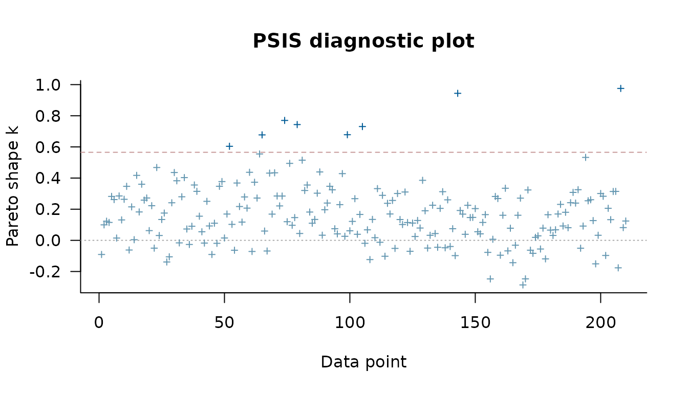

# Bayesian model evaluation

This vignette describes how to compare competing model specifications.
**RprobitB** provides three criteria for this purpose: the widely
applicable information criterion (WAIC), Pareto-smoothed importance
sampling leave-one-out cross-validation (PSIS-LOO), and Bayes factors.
WAIC and PSIS-LOO estimate the expected predictive accuracy of a model
for new data from the pointwise log-likelihood of the posterior draws
([Watanabe 2010](#ref-Watanabe2010); [Vehtari et al.
2017](#ref-Vehtari2017)). A Bayes factor is the ratio of the marginal
likelihoods of two models, that is, of the likelihood averaged over the
prior of each model ([Kass and Raftery 1995](#ref-Kass1995)). In panel
data, the pointwise log-likelihood is evaluated per decider, so WAIC and
PSIS-LOO estimate the accuracy of predicting the choices of new
deciders. The examples use data sets of the **AER** package ([Kleiber
and Zeileis 2008](#ref-Kleiber2008)), the **mlogit** package ([Croissant
2020](#ref-Croissant2020)), and the **MASS** package ([Venables and
Ripley 2002](#ref-VenablesRipley2002)). The vignette [Get started with
RprobitB](https://loelschlaeger.de/RprobitB/articles/v01_get_started.html)
explains how to fit and read a model, and the vignettes [Model
specification and
variants](https://loelschlaeger.de/RprobitB/articles/v02_model_variants.html)
and [Modeling preference
heterogeneity](https://loelschlaeger.de/RprobitB/articles/v03_heterogeneity.html)
cover the specifications compared here.

``` r

library(RprobitB)
set.seed(1)
```

## A nested model comparison for travel mode choices

The `TravelMode` data of the **AER** package record which of four modes
210 travelers between Sydney and Melbourne had taken: air, train, bus,
or car. The vignette [Model specification and
variants](https://loelschlaeger.de/RprobitB/articles/v02_model_variants.html)
fits a model in which terminal waiting time, in-vehicle cost, and travel
time vary across modes, while household income and the size of the
traveling party shift the utilities of the modes relative to air, the
base alternative.

Does income change the mode choice beyond cost and time? The reduced
model below omits the two traveler characteristics and the
alternative-specific constants.
[`update()`](https://rdrr.io/r/stats/update.html) rebuilds the call of
the full model with the formula changed part by part:
`. ~ wait + vcost + travel | 0` keeps the first part and empties the
second.

``` r

data("TravelMode", package = "AER")
TravelMode$choice <- TravelMode$choice == "yes"
TravelMode$vcost <- TravelMode$vcost / 1.6196
TravelMode$income <- TravelMode$income / 1.6196
full_model <- fit(
  choice ~ wait + vcost + travel | income + size,
  data = TravelMode,
  format = "long",
  column_decider = "individual",
  column_alternative = "mode",
  iterations = 20000,
  warmup = 10000,
  thin = 20,
  chains = 2,
  progress = FALSE
)
reduced_model <- update(full_model, . ~ wait + vcost + travel | 0)
```

[`logLik()`](https://rdrr.io/r/stats/logLik.html) evaluates the
log-likelihood at the posterior means of the parameters. Its `df`
attribute counts the free parameters, without the error variance that is
fixed to identify the utility scale, and its `nobs` attribute counts the
independent likelihood units, here the 210 travelers with one choice
each.

``` r

logLik(full_model)
#> 'log Lik.' -175.6099 (df=17)
logLik(reduced_model)
#> 'log Lik.' -236.754 (df=8)
```

The log-likelihood values can be used to compute AIC and BIC, but it
ignores the posterior uncertainty about the parameters. WAIC and
PSIS-LOO instead use all posterior draws and are the primary criteria.

## WAIC and PSIS-LOO

[`WAIC()`](https://loelschlaeger.de/RprobitB/reference/WAIC.md) and
[`loo()`](https://loelschlaeger.de/RprobitB/reference/loo.RprobitB_fit.md)
return objects of the **loo** package ([Vehtari et al.
2026](#ref-Vehtari2026)). Both report the expected log predictive
density `elpd`, an effective number of parameters, and the criterion on
the deviance scale. Lower `waic` and `looic`, or equivalently higher
`elpd`, mean better predictive accuracy. Watanabe
([2010](#ref-Watanabe2010)) introduced WAIC and showed that it
asymptotically approximates Bayesian cross-validation; Vehtari et al.
([2017](#ref-Vehtari2017)) and Vehtari et al. ([2024](#ref-Vehtari2024))
developed the PSIS-LOO approximation and its diagnostics.

``` r

WAIC(full_model)
#> Warning: 
#> 9 (4.3%) p_waic estimates greater than 0.4. We recommend trying loo instead.
#> 
#> Computed from 1000 by 210 log-likelihood matrix.
#> 
#>           Estimate   SE
#> elpd_waic   -193.8 15.9
#> p_waic        19.2  3.5
#> waic         387.7 31.7
#> 
#> 9 (4.3%) p_waic estimates greater than 0.4. We recommend trying loo instead.
WAIC(reduced_model)
#> Warning: 
#> 8 (3.8%) p_waic estimates greater than 0.4. We recommend trying loo instead.
#> 
#> Computed from 1000 by 210 log-likelihood matrix.
#> 
#>           Estimate   SE
#> elpd_waic   -241.8  9.2
#> p_waic        12.6  1.9
#> waic         483.7 18.3
#> 
#> 8 (3.8%) p_waic estimates greater than 0.4. We recommend trying loo instead.
```

The **loo** package warns when the contribution of a decider to `p_waic`
exceeds 0.4, the level above which Vehtari et al.
([2017](#ref-Vehtari2017)) consider the WAIC approximation unreliable;
here this concerns a few travelers. PSIS-LOO is preferable in this
situation, because it comes with a diagnostic per traveler: a Pareto-k
value below the printed threshold means that the importance sampling for
that traveler is reliable, and larger values usually belong to travelers
whose choices have low probability under the model ([Vehtari et al.
2024](#ref-Vehtari2024)).

``` r

loo_full <- loo(full_model)
#> Warning: Some Pareto k diagnostic values are too high. See help('pareto-k-diagnostic') for details.
loo_reduced <- loo(reduced_model)
#> Warning: Some Pareto k diagnostic values are too high. See help('pareto-k-diagnostic') for details.
loo_full
#> 
#> Computed from 1000 by 210 log-likelihood matrix.
#> 
#>          Estimate   SE
#> elpd_loo   -194.7 16.1
#> p_loo        20.1  3.8
#> looic       389.4 32.2
#> ------
#> MCSE of elpd_loo is NA.
#> MCSE and ESS estimates assume independent draws (r_eff=1).
#> 
#> Pareto k diagnostic values:
#>                           Count Pct.    Min. ESS
#> (-Inf, 0.67]   (good)     207   98.6%   127     
#>    (0.67, 1]   (bad)        3    1.4%   <NA>    
#>     (1, Inf)   (very bad)   0    0.0%   <NA>    
#> See help('pareto-k-diagnostic') for details.
```

The **loo** package plots the Pareto-k values per traveler. Points above
the dashed line mark the travelers whose choices are hardest to predict
from the choices of the other travelers.

``` r

plot(loo_full)
```



[`loo::loo_compare()`](https://mc-stan.org/loo/reference/loo_compare.html)
ranks the models by `elpd` and reports the difference to the best model
with its standard error.

``` r

loo::loo_compare(loo_full, loo_reduced)
#>   model elpd_diff se_diff p_worse diag_diff       diag_elpd
#>  model1       0.0     0.0      NA           3 k_psis > 0.67
#>  model2     -47.3    10.9    1.00           1 k_psis > 0.67
#> 
#> Diagnostic flags present.
#> See ?`loo-glossary` (sections `diag_diff` and `diag_elpd`)
#> or https://mc-stan.org/loo/reference/loo-glossary.html.
```

The models are named in the order of the arguments, so `model1` is the
full model. It ranks first, and the reduced model falls short by several
standard errors of the difference: income and party size improve the
prediction of the mode choice.

## Bayes factors

[`bayes_factor()`](https://loelschlaeger.de/RprobitB/reference/bayes_factor.md)
estimates the marginal likelihood of each model with the
**bridgesampling** package ([Gronau et al. 2020](#ref-Gronau2020); [Meng
and Wong 1996](#ref-Meng1996)) and returns their ratio; values above one
favor the first model.

``` r

set.seed(1)
bayes_factor(full_model, reduced_model, log = TRUE)
#> Estimated log Bayes factor in favor of model1 over model2: 23.19522
```

The large positive log Bayes factor also favors the full model.

## Models with random coefficients

Does a random price coefficient improve the train model of the vignette
[Get started with
RprobitB](https://loelschlaeger.de/RprobitB/articles/v01_get_started.html)?
The fixed model is fitted first, and
[`update()`](https://rdrr.io/r/stats/update.html) gives the price
coefficient a normal random effect, as in the vignette [Posterior
prediction](https://loelschlaeger.de/RprobitB/articles/v04_prediction.html).

``` r

data("Train", package = "mlogit")
Train$price_A <- Train$price_A / 100 / 2.20371
Train$price_B <- Train$price_B / 100 / 2.20371
Train$time_A <- Train$time_A / 60
Train$time_B <- Train$time_B / 60
train_fixed <- fit(
  choice ~ price + time + change + factor(comfort) | 0,
  data = Train,
  column_decider = "id",
  column_occasion = "choiceid",
  iterations = 6000,
  warmup = 3000,
  thin = 60,
  chains = 2,
  progress = FALSE
)
train_random <- update(train_fixed, random_effects = c(price = "n"))
loo_fixed <- loo(train_fixed, progress = FALSE)
#> Warning: Some Pareto k diagnostic values are too high. See help('pareto-k-diagnostic') for details.
loo_random <- loo(train_random, progress = FALSE)
#> Warning: Some Pareto k diagnostic values are too high. See help('pareto-k-diagnostic') for details.
loo::loo_compare(loo_fixed, loo_random)
#>   model elpd_diff se_diff p_worse diag_diff      diag_elpd
#>  model2       0.0     0.0      NA           7 k_psis > 0.5
#>  model1    -157.7    25.2    1.00           7 k_psis > 0.5
#> 
#> Diagnostic flags present.
#> See ?`loo-glossary` (sections `diag_diff` and `diag_elpd`)
#> or https://mc-stan.org/loo/reference/loo-glossary.html.
```

The model with the random price coefficient, `model2`, ranks first, and
the fixed model falls short by several standard errors of the
difference. Letting the price sensitivity vary between travelers thus
improves the prediction of a traveler’s choices.

## Ordered and ranked responses

The criteria are not specific to unordered choices. The ordered model of
the vignette [Model specification and
variants](https://loelschlaeger.de/RprobitB/articles/v02_model_variants.html)
asked whether older students smoke less; the comparison below asks
whether the exercise dummies improve the prediction.

``` r

data("survey", package = "MASS")
smoking_full <- fit(
  Smoke ~ Age + Exer | 0,
  data = survey,
  alternatives = c("Never", "Occas", "Regul", "Heavy"),
  choice_type = "ordered",
  column_decider = NULL,
  iterations = 2000,
  warmup = 1000,
  chains = 2,
  progress = FALSE
)
smoking_age <- update(smoking_full, . ~ Age | 0)
loo::loo_compare(
  loo(smoking_full, progress = FALSE), loo(smoking_age, progress = FALSE)
)
#>   model elpd_diff se_diff p_worse       diag_diff diag_elpd
#>  model1       0.0     0.0      NA                          
#>  model2      -1.0     2.7    0.64 |elpd_diff| < 4
#> 
#> Diagnostic flags present.
#> See ?`loo-glossary` (sections `diag_diff` and `diag_elpd`)
#> or https://mc-stan.org/loo/reference/loo-glossary.html.
```

The difference is smaller than its standard error, so the exercise
dummies appear to not improve the prediction of how much a student
smokes.

## Further reading

The vignette [Posterior
prediction](https://loelschlaeger.de/RprobitB/articles/v04_prediction.html)
computes choice probabilities and marginal effects from a fitted model,
and the vignette [Modeling preference
heterogeneity](https://loelschlaeger.de/RprobitB/articles/v03_heterogeneity.html)
describes the random coefficient and latent class specifications that
the criteria above can compare.

## References

Croissant, Yves. 2020. “Estimation of Random Utility Models in R: The
mlogit Package.” *Journal of Statistical Software* 95 (11): 1–41.
<https://doi.org/10.18637/jss.v095.i11>.

Gronau, Quentin F., Henrik Singmann, and Eric-Jan Wagenmakers. 2020.
“bridgesampling: An R Package for Estimating Normalizing Constants.”
*Journal of Statistical Software* 92 (10): 1–29.
<https://doi.org/10.18637/jss.v092.i10>.

Kass, Robert E., and Adrian E. Raftery. 1995. “Bayes Factors.” *Journal
of the American Statistical Association* 90 (430): 773–95.
<https://doi.org/10.1080/01621459.1995.10476572>.

Kleiber, Christian, and Achim Zeileis. 2008. *Applied Econometrics with
R*. Springer. <https://doi.org/10.1007/978-0-387-77318-6>.

Meng, Xiao-Li, and Wing Hung Wong. 1996. “Simulating Ratios of
Normalizing Constants via a Simple Identity: A Theoretical Exploration.”
*Statistica Sinica* 6 (4): 831–60.
<https://www3.stat.sinica.edu.tw/statistica/j6n4/j6n43/j6n43.htm>.

Vehtari, Aki, Jonah Gabry, Måns Magnusson, et al. 2026. *loo: Efficient
Leave-One-Out Cross-Validation and WAIC for Bayesian Models*.
<https://mc-stan.org/loo/>.

Vehtari, Aki, Andrew Gelman, and Jonah Gabry. 2017. “Practical Bayesian
Model Evaluation Using Leave-One-Out Cross-Validation and WAIC.”
*Statistics and Computing* 27 (5): 1413–32.
<https://doi.org/10.1007/s11222-016-9696-4>.

Vehtari, Aki, Daniel Simpson, Andrew Gelman, Yuling Yao, and Jonah
Gabry. 2024. “Pareto Smoothed Importance Sampling.” *Journal of Machine
Learning Research* 25 (72): 1–58.
<https://www.jmlr.org/papers/v25/19-556.html>.

Venables, William N., and Brian D. Ripley. 2002. *Modern Applied
Statistics with s*. 4th ed. Springer.

Watanabe, Sumio. 2010. “Asymptotic Equivalence of Bayes Cross Validation
and Widely Applicable Information Criterion in Singular Learning
Theory.” *Journal of Machine Learning Research* 11: 3571–94.
<https://www.jmlr.org/papers/v11/watanabe10a.html>.
