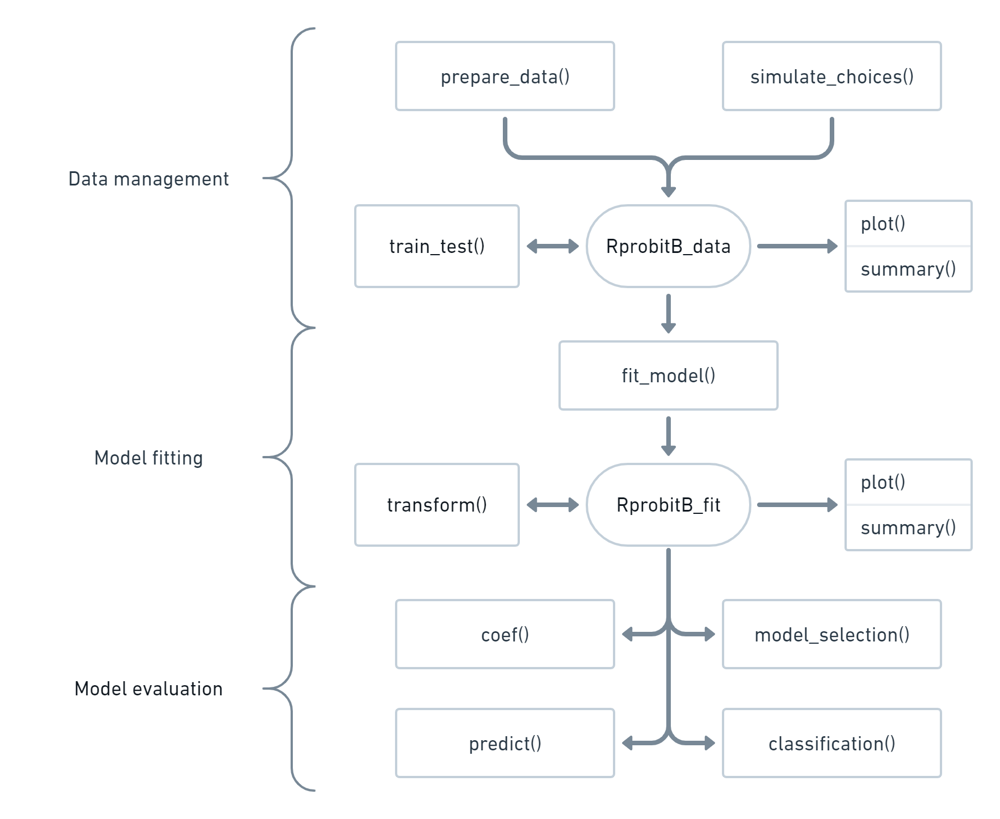

```{r, include = FALSE}
knitr::opts_chunk$set(
  collapse = TRUE,
  comment = "#>"
)
```

Welcome to {RprobitB}^[The package name is a portmanteau, combining **R** (the programming language), **probit** (the model class) and **B** (for Bayes, the estimation method).], an R package for Bayesian estimation of [the probit model](https://loelschlaeger.de/RprobitB/articles/v01_model_definition.html).

## The package purpose

1. With {RprobitB}, you can model the choices made by deciders among a discrete set of alternatives. For example, think of tourists that want to book a flight to their holiday destination. The knowledge why they prefer a certain route over another is of great value for airlines, especially the customer's willingness to pay for say a faster or more comfortable flight alternative.

2. Different deciders value different choice attributes differently. For example, it is imaginable that business people place a higher value on flight time and are willing to pay more for a faster route alternative than vacationers. Such choice behavior heterogeneity can be addressed by {RprobitB}. Furthermore, the package enables to identify groups of deciders that share similar preferences.

3. Finally, the package enables prediction of choice behavior when certain choice attributes change, for example the proportion of customers who will choose the competitor's product in the event of a price increase.

## The workflow

The functions of {RprobitB} can be grouped into ones for data management, model fitting, and model evaluation, see the flowchart below. A typical workflow is as follows:

1. Prepare a choice data set via the `prepare_data()` function or simulate data via `simulate_choices()`. Both functions return an `RprobitB_data` object that can be fed into the estimation routine. See [the vignette on choice data](https://loelschlaeger.de/RprobitB/articles/v02_choice_data.html) for details.

2. The estimation routine is called `mcmc()` and returns an `RprobitB_fit` object. See the vignettes [on model fitting](https://loelschlaeger.de/RprobitB/articles/v03_model_fitting.html) and [on modeling heterogeneity](https://loelschlaeger.de/RprobitB/articles/v04_modeling_heterogeneity.html). 

3. The `RprobitB_fit` object can be fed into `coef()` to show the covariate effects on the choices and into `predict()` to compute choice probabilities and forecast choice behavior if choice characteristics would change, see [the vignette on choice prediction](https://loelschlaeger.de/RprobitB/articles/v05_choice_prediction.html).
   
4. The function `model_selection()` compares arbitrary many competing `RprobitB_fit` objects by computing different model selection criteria, see [the vignette on model selection](https://loelschlaeger.de/RprobitB/articles/v06_model_selection.html).

{width=80%}

